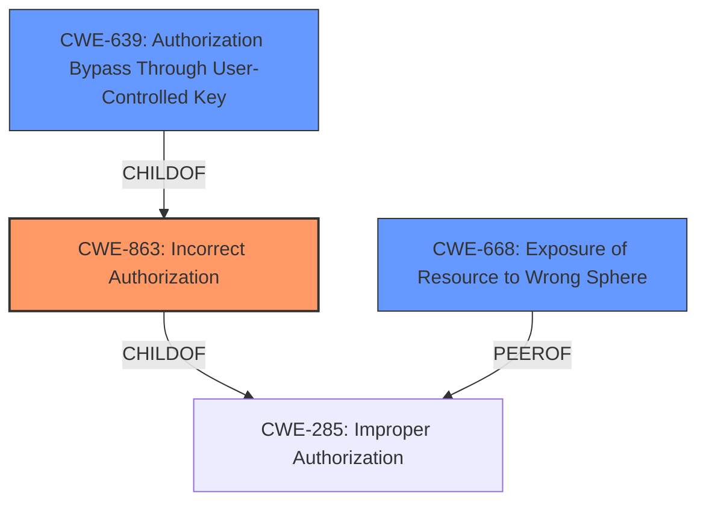

# Analysis for CVE-2021-22865

# Summary
| CWE ID | CWE Name | Confidence | CWE Abstraction Level | CWE Vulnerability Mapping Label | CWE-Vulnerability Mapping Notes |
|---|---|---|---|---|---|
| CWE-863 | Incorrect Authorization | 0.9 | Class | Primary | Allowed-with-Review |
| CWE-639 | Authorization Bypass Through User-Controlled Key | 0.7 | Base | Secondary | Allowed |
| CWE-668 | Exposure of Resource to Wrong Sphere | 0.6 | Class | Secondary | Discouraged |

## Evidence and Confidence

*   **Confidence Score:** 0.8
*   **Evidence Strength:** HIGH

## Relationship Analysis
The primary CWE is CWE-863, Incorrect Authorization, which is a class-level CWE. CWE-639, Authorization Bypass Through User-Controlled Key, is a child of CWE-863 and represents a more specific case of authorization failure. CWE-668, Exposure of Resource to Wrong Sphere, is a broader classification and is a peer of CWE-285 which is a parent of CWE-863. While potentially relevant, CWE-668 is discouraged due to its high-level nature and potential for misuse. The relationship analysis supports selecting CWE-863 as the primary weakness due to its direct relevance to the vulnerability description.

## Vulnerability Chain
The vulnerability chain starts with **improper access control**, leading to the ability to read private repository metadata.
  - Root Cause: **Improper access control** allows unauthorized access tokens to be generated.
  - Weakness: The access token, despite lacking appropriate permissions, is able to read private repository metadata.
  - Impact: Exposure of private repository metadata.

## Summary of Analysis
The initial assessment identified **improper access control** as the root cause, which aligns with the concept of authorization issues. The retriever results further confirmed this by listing CWE-285 (Improper Authorization) and CWE-863 (Incorrect Authorization) as top matches. Given the evidence, the best fit is CWE-863 because the application *attempts* to perform an authorization check, but that check is performed incorrectly. The vulnerability allows access tokens generated from GitHub Apps web authentication flow to read private repository metadata via the REST API without having been granted the appropriate permissions. This is a clear case of incorrect authorization rather than a complete lack of authorization.

CWE-639 (Authorization Bypass Through User-Controlled Key) was also considered, as the vulnerability involves using a key (access token) to access resources. However, the core issue is not the user's ability to directly control the key, but rather the **incorrect authorization** check associated with that key.

CWE-668 (Exposure of Resource to Wrong Sphere) is too broad and doesn't capture the specific authorization flaw.

The final decision is based on the evidence from the vulnerability description, which highlights the **improper access control** leading to unauthorized access to private repository metadata.

Relevant evidence: "An **improper access control** vulnerability... allowed access tokens generated from a GitHub Apps web authentication flow to read private repository metadata via the REST API without having been granted the appropriate permissions."

CWE-863 is selected because it directly addresses the **incorrect authorization** mechanism. The abstraction level is appropriate as it represents a class of authorization flaws, and a more specific base CWE is not clearly applicable.