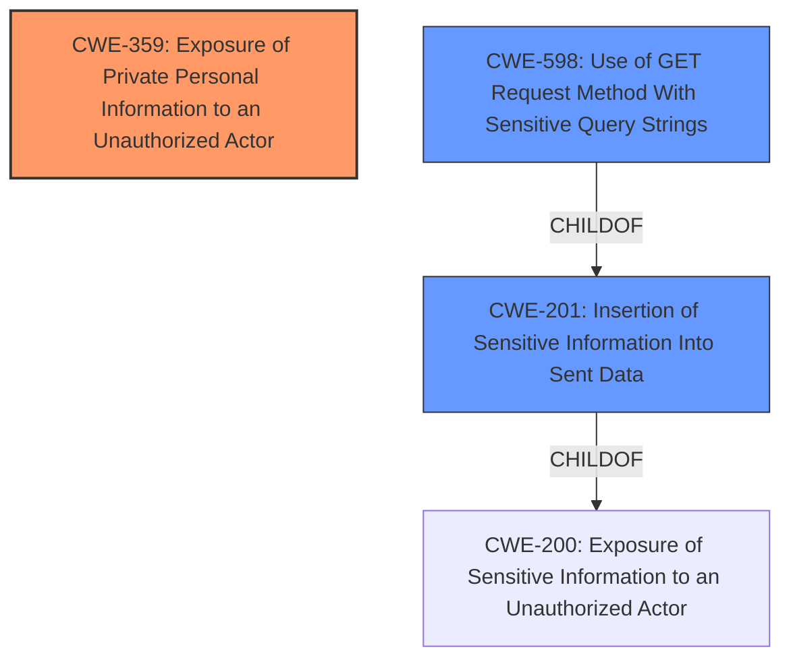

# Raw Analyzer Response for CVE-2021-22876

# Summary
| CWE ID  | CWE Name                                                                | Confidence | CWE Abstraction Level | CWE Vulnerability Mapping Label | CWE-Vulnerability Mapping Notes |
| :-------- | :---------------------------------------------------------------------- | :--------- | :-------------------- | :------------------------------ | :------------------------------ |
| CWE-359   | Exposure of Private Personal Information to an Unauthorized Actor       | 1          | Base                  | Primary                         | Allowed                       |
| CWE-201   | Insertion of Sensitive Information Into Sent Data                   | 0.7        | Base                  | Secondary                       | Allowed                       |
| CWE-598 | Use of GET Request Method With Sensitive Query Strings | 0.6        | Variant                  | Secondary                       | Allowed                       |

## Evidence and Confidence

*   **Confidence Score:** 0.8
*   **Evidence Strength:** HIGH

## Relationship Analysis
The primary relationship is between CWE-359, CWE-201 and CWE-598. CWE-201 is a child of CWE-200. CWE-598 is also a child of CWE-201. The chosen CWEs are at the Base and Variant levels, providing a good balance between specificity and accuracy.

## Vulnerability Chain
The vulnerability chain starts with **libcurl not stripping off user credentials from the URL when automatically populating the Referer HTTP request header field in outgoing HTTP requests**. This leads to **leaking credentials in the HTTP Referer header**, ultimately resulting in the **Exposure of Private Personal Information to an Unauthorized Actor**.

## Summary of Analysis
Initially, the analysis focused on identifying the root cause and impact of the vulnerability. The key piece of evidence is: "**libcurl does not strip off user credentials from the URL when automatically populating the Referer HTTP request header field in outgoing HTTP requests**". This directly leads to credentials being leaked.

The Retriever Results and Complete CWE Specifications were then reviewed. CWE-359, CWE-201, and CWE-598 were strong candidates.

CWE-359 (Exposure of Private Personal Information to an Unauthorized Actor) was selected as the primary CWE because the vulnerability's core issue is the exposure of credentials. The description of CWE-359 aligns well: "The product does not properly prevent a person's private, personal information from being accessed by actors who either (1) are not explicitly authorized to access the information or (2) do not have the implicit consent of the person about whom the information is collected."

CWE-201 (Insertion of Sensitive Information Into Sent Data) was selected as a secondary CWE because the credentials are being inserted into the Referer header. The description aligns with this: "The code transmits data to another actor, but a portion of the data includes sensitive information that should not be accessible to that actor."

CWE-598 (Use of GET Request Method With Sensitive Query Strings) was considered because the credentials are in the URL. While the Referer header isn't strictly a "GET request," the principle of sensitive information being exposed in a URL is relevant.

CWE-200 was considered but not used as the primary CWE. While the vulnerability results in exposure of sensitive information, CWE-200 is too high-level. The mapping guidance discourages its use as a primary CWE when more specific options are available. The child CWEs like CWE-201 and CWE-359 were more specific.

CWE-113 and CWE-93 were also considered, but they are focused on CRLF injection, which is not the primary issue in this vulnerability.

The selected CWEs are at the optimal level of specificity because they directly address the root cause (failure to strip credentials) and the resulting impact (exposure of personal information).