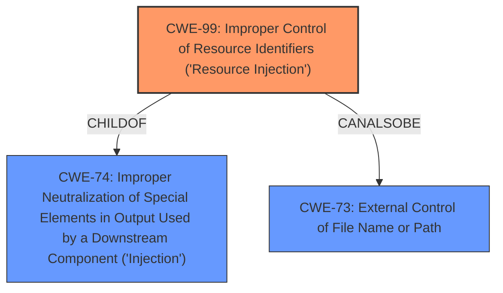

# Analysis for CVE-2021-22879

# Summary
| CWE ID | CWE Name | Confidence | CWE Abstraction Level | CWE Vulnerability Mapping Label | CWE-Vulnerability Mapping Notes |
|---|---|---|---|---|---|
| CWE-99 | Improper Control of Resource Identifiers ('Resource Injection') | 0.9 | Class | Allowed-with-Review | Primary CWE |
| CWE-20 | Improper Input Validation | 0.7 | Class | Discouraged | Secondary Candidate |

## Evidence and Confidence

*   **Confidence Score:** 0.8
*   **Evidence Strength:** HIGH

## Relationship Analysis
The primary CWE is CWE-99, which is a Class-level CWE. While it would be better to have a Base or Variant CWE, there isn't sufficient evidence to go to a lower level. CWE-99 is related to CWE-74 (Improper Neutralization of Special Elements in Output Used by a Downstream Component ('Injection')) as a ChildOf, and to CWE-73 (External Control of File Name or Path) as a CanAlsoBe relationship.

## Vulnerability Chain
The chain of events is as follows:

1.  **Root Cause:** **Missing validation of URLs** (no specific CWE, but leads to CWE-20).
2.  **Weakness:** **Resource injection** (CWE-99).
3.  **Impact:** Execute remote commands.

The vulnerability starts with the **missing validation of URLs**, which allows a malicious server to inject arbitrary resource identifiers. This leads to remote command execution.

## Summary of Analysis
Initially, the vulnerability description points to **resource injection** due to **missing validation of URLs**. The CVE Reference Links Content Summary section confirms that the Nextcloud Desktop Client lacked proper validation for URLs. Specifically, it did not restrict URL schemes to only `http://` or `https://`, allowing other schemes to trigger arbitrary command execution.

Based on the provided evidence and the Retriever Results, CWE-99 (Improper Control of Resource Identifiers ('Resource Injection')) appears to be the most appropriate primary CWE. The vulnerability allows an attacker to specify a resource identifier (the URL scheme) to gain a capability that would not otherwise be permitted (remote command execution).

CWE-20 (Improper Input Validation) is considered as a secondary CWE, since the **missing validation of URLs** is a form of improper input validation. However, CWE-20 is discouraged, and there are more specific types of improper validation that apply.

The final decision is to use CWE-99 as the primary CWE because it best captures the **resource injection** aspect of the vulnerability, where the attacker controls the resource identifier (URL) to execute commands.

Relevant CWE Information:

# Enhanced Context (25 CWEs)

## CWE-99: Improper Control of Resource Identifiers ('Resource Injection')
**Abstraction Level**: Class
**Similarity Score**: 8054.61
**Source**: sparse

**Description**:
The product receives input from an upstream component, but it does not restrict or incorrectly restricts the input before it is used as an identifier for a resource that may be outside the intended sphere of control.

**Mapping Guidance**:
- Usage: Allowed-with-Review
- Rationale: This CWE entry is a Class and might have Base-level children that would be more appropriate

The vulnerability description directly mentions **resource injection**, and the missing URL validation allows an attacker to control the resource identifier.

## CWE-20: Improper Input Validation
**Abstraction Level**: Class
**Similarity Score**: 0.244
**Source**: sparse

**Description**:
The product receives input or data, but it does
        not validate or incorrectly validates that the input has the
        properties that are required to process the data safely and
        correctly.

**Mapping Guidance**:
- Usage: Discouraged
- Rationale: CWE-20 is commonly misused in low-information vulnerability reports when lower-level CWEs could be used instead, or when more details about the vulnerability are available [REF-1287]. It is not useful for trend analysis. It is also a level-1 Class (i.e., a child of a Pillar).
**Comments:** Consider lower-level children such as Improper Use of Validation Framework (CWE-1173) or improper validation involving specific types or properties of input such as Specified Quantity (CWE-1284); Specified Index, Position, or Offset (CWE-1285); Syntactic Correctness (CWE-1286); Specified Type (CWE-1287); Consistency within Input (CWE-1288); or Unsafe Equivalence (CWE-1289).

The **missing validation of URLs** falls under the umbrella of improper input validation. However, the guidance discourages the use of CWE-20 when more specific CWEs are available. In this case, CWE-99 is more specific and better captures the essence of the vulnerability.