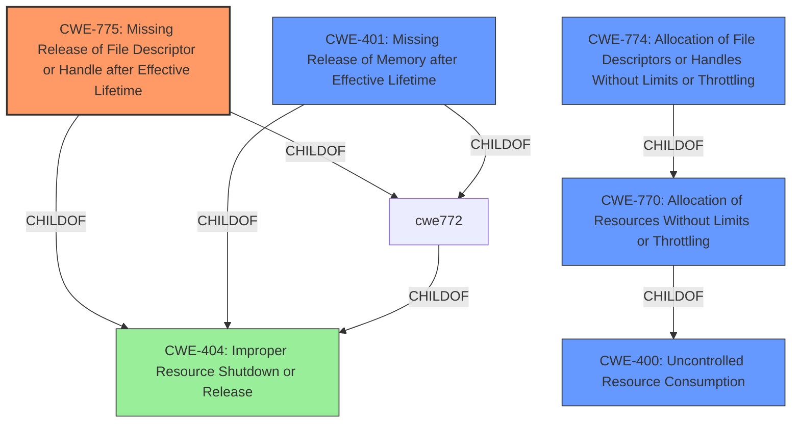

# Analysis Report for CVE-2021-22883

# Vulnerability Analysis Report: CVE-2021-22883

## Description


## Analysis (with Relationship Data)

# Summary
| CWE ID | CWE Name | Confidence | CWE Abstraction Level | CWE Vulnerability Mapping Label | CWE-Vulnerability Mapping Notes |
|---|---|---|---|---|---|
| CWE-775 | Missing Release of File Descriptor or Handle after Effective Lifetime | 0.9 | Variant | Allowed | Primary CWE |
| CWE-400 | Uncontrolled Resource Consumption | 0.7 | Class | Discouraged | Secondary Candidate |

## Evidence and Confidence

*   **Confidence Score:** 0.8
*   **Evidence Strength:** HIGH

## Relationship Analysis
The primary relationship that influenced the decision was the child-of relationship where CWE-775 and CWE-401 are children of CWE-404, and CWE-770 and CWE-774 are children of CWE-400. These hierarchical relationships helped to refine the selection to a more specific CWE.
The vulnerability chain helped to identify the initial cause and the resulting impact.



## Vulnerability Chain
The vulnerability chain starts with the **uncontrolled allocation of file descriptors** due to numerous connection attempts with an unknown protocol. This leads to the **missing release of file descriptors**, which results in resource exhaustion and ultimately a denial of service.

## Summary of Analysis
The initial assessment identified several potential CWEs, including CWE-775, CWE-770, and CWE-400. The analysis focused on determining the most accurate representation of the vulnerability's root cause based on the provided evidence.

The vulnerability description and CVE reference links clearly indicate a **file descriptor leak** due to a flaw in the HTTP2 implementation. This directly aligns with CWE-775 (Missing Release of File Descriptor or Handle after Effective Lifetime), which describes a scenario where a product does not release file descriptors after their effective lifetime.

The analysis also considered CWE-400 (Uncontrolled Resource Consumption), which is a broader category. While the vulnerability does lead to resource exhaustion, the root cause is specifically the **failure to release file descriptors**. Therefore, CWE-775 is the more specific and appropriate choice.

The decision to select CWE-775 is based on the following evidence:

*   Vulnerability Description Key Phrases: "impact: denial of service"
*   CVE Reference Links Content Summary: "weaknesses: [Resource exhaustion, File descriptor leak]"
*   CVE Reference Links Content Summary: "root_cause: The vulnerability is caused by a flaw in the HTTP2 implementation where a large number of connections with an 'unknownProtocol' can lead to a leak of file descriptors."

The selection of CWE-775 is at the optimal level of specificity because it directly addresses the **root cause** of the vulnerability. Other CWEs, such as CWE-400, are more general and do not capture the specific nature of the file descriptor leak.

CWE-770 (Allocation of Resources Without Limits or Throttling) and CWE-774 (Allocation of File Descriptors or Handles Without Limits or Throttling) were considered but deemed less appropriate because the primary issue is not the allocation without limits, but the **failure to release allocated resources**.
CWE-401 (Missing Release of Memory after Effective Lifetime) was considered but deemed inappropriate because the resource that is not being released is a file descriptor, not memory.

Relevant CWE Information:
CWE-775: Missing Release of File Descriptor or Handle after Effective Lifetime - The product does not release a file descriptor or handle after its effective lifetime has ended, i.e., after the file descriptor/handle is no longer needed.
CWE-400: Uncontrolled Resource Consumption - The product does not properly control the allocation and maintenance of a limited resource, thereby enabling an actor to influence the amount of resources consumed, eventually leading to the exhaustion of available resources.


## CWE Relationship Analysis

Current CWEs represent these abstraction levels: .


### Vulnerability Chain Analysis

**Chain starting from CWE-404:**
- 404 (Improper Resource Shutdown or Release) - ROOT


**Chain starting from CWE-774:**
- 774 (Allocation of File Descriptors or Handles Without Limits or Throttling) - ROOT


### CWE Relationship Diagram

```mermaid
graph TD
    classDef primary fill:#f96,stroke:#333,stroke-width:2px
    classDef secondary fill:#69f,stroke:#333
    classDef tertiary fill:#9e9,stroke:#333
```


*Report generated on 2025-04-02 08:02:42*
