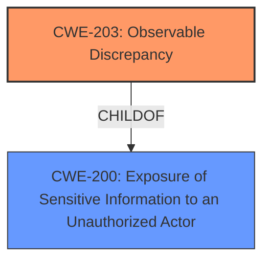

# Analysis for CVE-2021-22892

# Summary
| CWE ID | CWE Name | Confidence | CWE Abstraction Level | CWE Vulnerability Mapping Label | CWE-Vulnerability Mapping Notes |
|---|---|---|---|---|---|
| CWE-203 | Observable Discrepancy | 0.8 | Base | Allowed | Primary CWE |
| CWE-200 | Exposure of Sensitive Information to an Unauthorized Actor | 0.5 | Class | Discouraged | Secondary CWE |

## Evidence and Confidence

*   **Confidence Score:** 0.7
*   **Evidence Strength:** MEDIUM

## Relationship Analysis
The primary relationship that influenced the CWE selection was the ChildOf relationship between CWE-203 and CWE-200. CWE-203 is a more specific, base-level weakness that falls under the broader class of CWE-200. The Observable Discrepancy (CWE-203) accurately captures the vulnerability where the server's different responses reveal internal state, leading to information exposure. The choice of CWE-203 over CWE-200 was based on the principle of selecting the most specific CWE that fits the vulnerability description.

## Vulnerability Chain
The vulnerability chain involves the following steps:
1.  The server uses different responses based on whether an email address is valid.
2.  An attacker can observe these response discrepancies.
3.  This allows the attacker to enumerate and validate email addresses, leading to information disclosure.
The root cause is the observable discrepancy, leading to the impact of information disclosure.

## Summary of Analysis
The initial analysis focused on identifying the root cause of the information disclosure vulnerability. The key phrase "allowed email addresses to be disclosed by enumeration and validation checks" points to a weakness where different responses reveal information about the validity of email addresses.

The Retriever Results suggested several CWEs, including CWE-204 (Observable Response Discrepancy) and CWE-200 (Exposure of Sensitive Information to an Unauthorized Actor). While CWE-200 is a common choice for information disclosure vulnerabilities, it is often misused and represents a technical impact rather than a root cause. The MITRE mapping guidance discourages using CWE-200 when more specific options are available.

CWE-203 (Observable Discrepancy) was selected as the primary CWE because it directly addresses the root cause: the server's different responses reveal internal state information to unauthorized actors. This aligns with the vulnerability description, which states that email addresses are disclosed through enumeration and validation checks based on these discrepancies.

The decision to use CWE-203 is based on the following evidence:
*   The vulnerability description explicitly mentions "enumeration and validation checks," indicating an attempt to determine the validity of email addresses.
*   The different responses from the server based on the validity of email addresses fit the definition of "observable discrepancy."
*   CWE-203 is a base-level CWE, which is preferred for mapping to root causes.
The confidence level is high (0.8) because the evidence directly supports the selection of CWE-203. CWE-200 is included as a secondary CWE with a lower confidence (0.5) because it represents the impact of the vulnerability, but is not the primary root cause.

Relevant CWE Information:

# Enhanced Context (25 CWEs)
The following CWEs were identified as potentially relevant to this vulnerability:

## CWE-204: Observable Response Discrepancy
**Abstraction:** Base
**Similarity Score**: 0.085
**Source**: sparse

**Description**:
The product provides different responses to incoming requests in a way that reveals internal state information to an unauthorized actor outside of the intended control sphere.

**Mapping Guidance**:
**Usage:** Allowed

## CWE-1390: Weak Authentication
**Abstraction:** Class
**Similarity Score**: 0.065
**Source**: sparse

**Description**:
The product uses an authentication mechanism to restrict access to specific users or identities, but the mechanism does not sufficiently prove that the claimed identity is correct.

**Mapping Guidance**:
**Usage:** Allowed-with-Review

## CWE-116: Improper Encoding or Escaping of Output
**Abstraction:** Class
**Similarity Score**: 0.064
**Source**: sparse

**Description**:
The product prepares a structured message for communication with another component, but encoding or escaping of the data is either missing or done incorrectly. As a result, the intended structure of the message is not preserved.

**Mapping Guidance**:
**Usage:** Allowed-with-Review

## CWE-306: Missing Authentication for Critical Function
**Abstraction:** Base
**Similarity Score**: 0.063
**Source**: sparse

**Description**:
The product does not perform any authentication for functionality that requires a provable user identity or consumes a significant amount of resources.

**Mapping Guidance**:
**Usage:** Allowed

## CWE-200: Exposure of Sensitive Information to an Unauthorized Actor
**Abstraction:** Class
**Similarity Score**: 0.061
**Source**: sparse

**Description**:
The product exposes sensitive information to an actor that is not explicitly authorized to have access to that information.

**Mapping Guidance**:
**Usage:** Discouraged

## CWE-359: Exposure of Private Personal Information to an Unauthorized Actor
**Abstraction:** Base
**Similarity Score**: 0.596
**Source**: dense

**Description**:
The product does not properly prevent a person's private, personal information from being accessed by actors who either (1) are not explicitly authorized to access the information or (2) do not have the implicit consent of the person about whom the information is collected.

**Mapping Guidance**:
**Usage:** Allowed