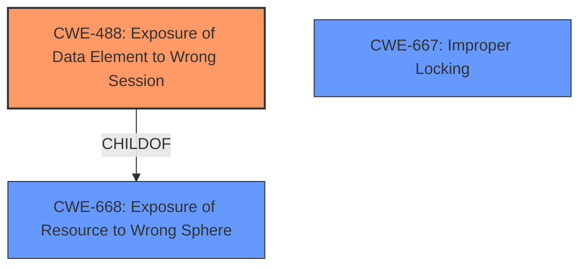

# Analysis for CVE-2021-22897

# Summary
| CWE ID | CWE Name | Confidence | CWE Abstraction Level | CWE Vulnerability Mapping Label | CWE-Vulnerability Mapping Notes |
|---|---|---|---|---|---|
| CWE-488 | Exposure of Data Element to Wrong Session | 0.9 | Base | Allowed | Primary CWE |
| CWE-667 | Improper Locking | 0.6 | Class | Allowed-with-Review | Secondary Candidate |

## Evidence and Confidence

*   **Confidence Score:** 0.8
*   **Evidence Strength:** HIGH

## Relationship Analysis
The primary relationship that influenced the selection was the ChildOf relationship between CWE-488 and CWE-668. CWE-488 is a Base CWE and a child of CWE-668 which is a Class CWE. The analysis leaned towards the more specific CWE-488 due to the details of the vulnerability.



## Vulnerability Chain
The vulnerability chain starts with a **mistake in the code** specifically related to how `CURLOPT_SSL_CIPHER_LIST` is handled when libcurl is built with the Schannel TLS library. This leads to the **exposure of a data element to the wrong session**, potentially weakening transport security.

## Summary of Analysis
The initial analysis strongly points towards CWE-488 (Exposure of Data Element to Wrong Session) as the primary CWE. This is supported by the vulnerability description, which states that the **mistake in the code** leads to "exposure of data element to wrong session." The "CVE Reference Links Content Summary" also confirms this, with multiple sources explicitly mentioning the exposure of data to the wrong session as a key weakness.

The relationship analysis shows that CWE-488 is a child of CWE-668 (Exposure of Resource to Wrong Sphere). While CWE-668 is a broader category, the specifics of the vulnerability description align more closely with CWE-488, which focuses on session-related data exposure.

The retriever results also support this conclusion, with CWE-488 having the highest relevance score.

The decision to select CWE-488 is based on direct evidence from the vulnerability description and supporting evidence from the CVE reference links. It is also the most specific CWE that accurately represents the weakness.

Relevant CWE Information:

# Enhanced Context (25 CWEs)
The following CWEs were identified as potentially relevant to this vulnerability:

## CWE-407: Inefficient Algorithmic Complexity
**Abstraction Level**: Class
**Similarity Score**: 0.77
**Source**: dense

**Description**:
An algorithm in a product has an inefficient worst-case computational complexity that may be detrimental to system performance and can be triggered by an attacker, typically using crafted manipulations that ensure that the worst case is being reached.

**Mapping Guidance**:
- Usage: Allowed-with-Review
- Rationale: This CWE entry is a Class and might have Base-level children that would be more appropriate

## CWE-1240: Use of a Cryptographic Primitive with a Risky Implementation
**Abstraction Level**: Base
**Similarity Score**: 0.77
**Source**: dense

**Description**:
To fulfill the need for a cryptographic primitive, the product implements a cryptographic algorithm using a non-standard, unproven, or disallowed/non-compliant cryptographic implementation.

**Mapping Guidance**:
- Usage: Allowed
- Rationale: This CWE entry is at the Base level of abstraction, which is a preferred level of abstraction for mapping to the root causes of vulnerabilities.

## CWE-226: Sensitive Information in Resource Not Removed Before Reuse
**Abstraction Level**: Base
**Similarity Score**: 0.75
**Source**: dense

**Description**:
The product releases a resource such as memory or a file so that it can be made available for reuse, but it does not clear or "zeroize" the information contained in the resource before the product performs a critical state transition or makes the resource available for reuse by other entities.

**Mapping Guidance**:
- Usage: Allowed
- Rationale: This CWE entry is at the Base level of abstraction, which is a preferred level of abstraction for mapping to the root causes of vulnerabilities.

## CWE-330: Use of Insufficiently Random Values
**Abstraction Level**: Class
**Similarity Score**: 0.74
**Source**: dense

**Description**:
The product uses insufficiently random numbers or values in a security context that depends on unpredictable numbers.

**Mapping Guidance**:
- Usage: Discouraged
- Rationale: This CWE entry is a level-1 Class (i.e., a child of a Pillar). It might have lower-level children that would be more appropriate

## CWE-345: Insufficient Verification of Data Authenticity
**Abstraction Level**: Class
**Similarity Score**: 0.74
**Source**: dense

**Description**:
The product does not sufficiently verify the origin or authenticity of data, in a way that causes it to accept invalid data.

**Mapping Guidance**:
- Usage: Discouraged
- Rationale: This CWE entry is a level-1 Class (i.e., a child of a Pillar). It might have lower-level children that would be more appropriate

## CWE-203: Observable Discrepancy
**Abstraction Level**: Base
**Similarity Score**: 0.74
**Source**: dense

**Description**:
The product behaves differently or sends different responses under different circumstances in a way that is observable to an unauthorized actor, which exposes security-relevant information about the state of the product, such as whether a particular operation was successful or not.

**Mapping Guidance**:
- Usage: Allowed
- Rationale: This CWE entry is at the Base level of abstraction, which is a preferred level of abstraction for mapping to the root causes of vulnerabilities.

## CWE-668: Exposure of Resource to Wrong Sphere
**Abstraction Level**: Class
**Similarity Score**: 0.74
**Source**: dense

**Description**:
The product exposes a resource to the wrong control sphere, providing unintended actors with inappropriate access to the resource.

**Mapping Guidance**:
- Usage: Discouraged
- Rationale: CWE-668 is high-level and is often misused as a catch-all when lower-level CWE IDs might be applicable. It is sometimes used for low-information vulnerability reports [REF-1287]. It is a level-1 Class (i.e., a child of a Pillar). It is not useful for trend analysis.

## CWE-667: Improper Locking
**Abstraction Level**: Class
**Similarity Score**: 0.74
**Source**: dense

**Description**:
The product does not properly acquire or release a lock on a resource, leading to unexpected resource state changes and behaviors.

**Mapping Guidance**:
- Usage: Allowed-with-Review
- Rationale: This CWE entry is a Class and might have Base-level children that would be more appropriate

## CWE-405: Asymmetric Resource Consumption (Amplification)
**Abstraction Level**: Class
**Similarity Score**: 0.74
**Source**: dense

**Description**:
The product does not properly control situations in which an adversary can cause the product to consume or produce excessive resources without requiring the adversary to invest equivalent work or otherwise prove authorization, i.e., the adversary's influence is "asymmetric."

**Mapping Guidance**:
- Usage: Allowed-with-Review
- Rationale: This CWE entry is a Class and might have Base-level children that would be more appropriate

## CWE-754: Improper Check for Unusual or Exceptional Conditions
**Abstraction Level**: Class
**Similarity Score**: 0.73
**Source**: dense

**Description**:
The product does not check or incorrectly checks for unusual or exceptional conditions that are not expected to occur frequently during day to day operation of the product.

**Mapping Guidance**:
- Usage: Allowed-with-Review
- Rationale: This CWE entry is a Class and might have Base-level children that would be more appropriate

## CWE-1240: Use of a Cryptographic Primitive with a Risky Implementation
**Abstraction Level**: Base
**Similarity Score**: 8801.80
**Source**: sparse

**Description**:
To fulfill the need for a cryptographic primitive, the product implements a cryptographic algorithm using a non-standard, unproven, or disallowed/non-compliant cryptographic implementation.

**Mapping Guidance**:
- Usage: Allowed
- Rationale: This CWE entry is at the Base level of abstraction, which is a preferred level of abstraction for mapping to the root causes of vulnerabilities.

## CWE-327: Use of a Broken or Risky Cryptographic Algorithm
**Abstraction Level**: Class
**Similarity Score**: 7771.32

# Enhanced Query for CVE-2021-22897

## Vulnerability Description
curl 7.61.0 through 7.76.1 suffers from exposure of data element to wrong session due to a **mistake in the code for CURLOPT_SSL_CIPHER_LIST** when libcurl is built to use the Schannel TLS library. The selected cipher set was stored in a single static variable in the library, which has the surprising side-effect that if an application sets up multiple concurrent transfers, the last one that sets the ciphers will accidentally control the set used by all transfers. In a worst-case scenario, this weakens transport security significantly.

### Vulnerability Description Key Phrases
- **rootcause:** **mistake in the code for CURLOPT_SSL_CIPHER_LIST**
- **impact:** exposure of data element to wrong session
- **product:** curl
- **version:** 7.61.0 through 7.76.1

## CVE Reference Links Content Summary
```
{
  "guidelines": [
    "1. First verify if the content relates to the CVE specified based on the official description",
    "2. If the content does not relate to this CVE, respond with \"UNRELATED\"",
    "3. If no useful vulnerability information is found, respond with \"NOINFO\"",
    "4. For relevant content, extract:",
    "   - Root cause of vulnerability",
    "   - Weaknesses/vulnerabilities present",
    "   - Impact of exploitation",
    "   - Attack vectors",
    "   - Required attacker capabilities/position",
     "Additional instructions:",
    " - Preserve original technical details and descriptions",
     " - Remove unrelated content",
    " - Translate non-English content to English",
     " - Note if the content provides more detail than the official CVE description"
  ],
  "analyzed_content": [
    {
      "source": "www.oracle.com_0b164f06_20250115_222850.html",
      "is_related": true,
      "vulnerability": {
        "root_cause": "A mistake in the code for `CURLOPT_SSL_CIPHER_LIST` when libcurl is built to use the Schannel TLS library. The selected cipher set was stored in a single \"static\" variable.",
        "weaknesses": [
          "Exposure of Data Element to Wrong Session"
        ],
        "impact": "The last transfer that sets the ciphers will accidentally control the set used by all transfers, potentially weakening transport security significantly.",
        "attack_vectors": [
          "Network"
        ],
        "required_capabilities": "An application that sets up multiple concurrent transfers, and the last one that sets the ciphers accidentally controls the set used by all transfers."
      },
      "additional_notes": "This content provides details about the root cause, affected products, and mitigation strategies for the vulnerability."
    },
    {
      "source": "github.com_161e693c_20250115_222837.html",
      "is_related": true,
      "vulnerability": {
        "root_cause": "A mistake in the code for CURLOPT_SSL_CIPHER_LIST when libcurl is built to use the Schannel TLS library. The selected cipher set was stored in a single 'static' variable in the library.",
        "weaknesses": [
          "CWE-668"
        ],
        "impact": "Exposure of data element to wrong session. In a worst-case scenario, this weakens transport security significantly.",
        "attack_vectors": [
          "Network"
         ],
        "required_capabilities": "The last transfer that sets the ciphers will accidentally control the set used by all transfers."
      },
     "additional_notes": "This content provides additional details, a CVSS score, and links to related resources."
    },
    {
      "source": "curl.se_47ffe70b_20250115_222836.html",
       "is_related": true,
       "vulnerability": {
         "root_cause": "The cipher selection is stored in a single \"static\" variable, which causes the last transfer that sets the ciphers to control the set used by all transfers when Schannel is used.",
         "weaknesses": [
          "CWE-416: Use After Free"
        ],
         "impact": "A malicious server can potentially achieve remote code execution by crafting memory content in the correct place. However, clients may also crash or exhibit undefined behavior.",
         "attack_vectors": [
          "Network"
        ],
        "required_capabilities": "An application that has libcurl built to use OpenSSL (or one of its forks).  The server needs to know the heap address details in order to provide the appropriate payload. The application must also use a multi-interface, and HTTP/1.1 over TLS or concurrent HTTP/2 connections."
      },
      "additional_notes": "This content provides detailed steps for achieving remote code execution, affected and unaffected versions, and credit information."
    },
    {
      "source": "github.com_a1b59367_20250115_222848.html",
      "is_related": false,
      "vulnerability": {
          "root_cause": null,
          "weaknesses": [],
          "impact": null,
          "attack_vectors": [],
          "required_capabilities": null
        },
        "additional_notes": "UNRELATED: This content is about GitHub security features, not the specified CVE."
    },
    {
      "source": "security.netapp.com_41afbccf_20250115_093144.html",
      "is_related": true,
      "vulnerability": {
        "root_cause": "Multiple NetApp products incorporate curl/libcurl. Libcurl versions 7.61.0 through 7.76.1 are susceptible to vulnerabilities. This content refers to the same issue.",
        "weaknesses": [],
        "impact": "Successful exploitation of these vulnerabilities could lead to disclosure of sensitive information, addition or modification of data, or Denial of Service (DoS).",
        "attack_vectors": [],
        "required_capabilities": null
       },
       "additional_notes": "This content mentions CVE-2021-22897 and CVE-2021-22901 together, and is an advisory that does not provide specific details on root causes or attack vectors of the CVE-2021-22897."
    },
       {
        "source": "github.com_dba769c8_20250115_222850.html",
          "is_related": false,
          "vulnerability": {
              "root_cause": null,
              "weaknesses": [],
              "impact": null,
              "attack_vectors": [],
              "required_capabilities": null
            },
            "additional_notes": "UNRELATED: This content is about GitHub Copilot and its features."
         },
        {
            "source": "avatars.githubusercontent.com_5b62c064_20250115_222837.html",
               "is_related": false,
               "vulnerability": {
                   "root_cause": null,
                   "weaknesses": [],
                   "impact": null,
                   "attack_vectors": [],
                   "required_capabilities": null
                 },
                 "additional_notes": "NOINFO: This appears to be an image file, not providing any vulnerability information."
          },
      {
        "source": "www.oracle.com_f2d78ea9_20250115_222852.html",
        "is_related": false,
        "vulnerability": {
          "root_cause": null,
          "weaknesses": [],
          "impact": null,
          "attack_vectors": [],
          "required_capabilities": null
          },
          "additional_notes": "UNRELATED: This content is an Oracle Critical Patch Update Advisory - April 2022, and does not contain any information about CVE-2021-22897."
      },
      {
        "source": "github.com_016f1600_20250115_222854.html",
        "is_related": true,
        "vulnerability": {
          "root_cause": "Schannel cipher selection uses a static variable, causing a mistake in code implementation, that results in incorrect selection of ciphers",
          "weaknesses": [],
          "impact": "The selected ciphers can be overwritten by a concurrent transfer.",
          "attack_vectors": [],
           "required_capabilities": "An application must set up multiple concurrent transfers."
        },
        "additional_notes": "This content is a commit detail from curl, demonstrating the code fix for the CVE, and provides a link to the vulnerability description"
      },
        {
            "source": "cert-portal.siemens.com_3ea5bb4b_20250115_222853.html",
             "is_related": true,
             "vulnerability": {
               "root_cause": null,
               "weaknesses": [],
               "impact": null,
               "attack_vectors": [],
               "required_capabilities": null
              },
             "additional_notes": "This content lists CVE-2021-22897 and other CVEs as affecting SINEC INS, but provides no specific details on the root cause or attack vectors for CVE-2021-22897 itself."
        },
        {
            "source": "github.com_ab1fb86b_20250115_222838.html",
            "is_related": false,
            "vulnerability": {
              "root_cause": null,
              "weaknesses": [],
              "impact": null,
              "attack_vectors": [],
              "required_capabilities": null
             },
            "additional_notes": "UNRELATED: This content is about GitHub security features, and not the specified CVE."
         },
        {
            "source": "www.oracle.com_cd95aeb5_20250115_222901.html",
            "is_related": false,
            "vulnerability": {
                "root_cause": null,
                "weaknesses": [],
                "impact": null,
                "attack_vectors": [],
                "required_capabilities": null
            },
            "additional_notes":"UNRELATED: This content is an Oracle Critical Patch Update Advisory - January 2022, and does not contain information about CVE-2021-22897"
        }
  ]
}
```

## Retriever Results

### Top Combined Results

| Rank | CWE ID | Name | Abstraction | Usage  | Retrievers | Individual Scores |
|------|--------|------|-------------|-------|------------|-------------------|
| 1 | 488 | Exposure of Data Element to Wrong Session | Base | Allowed | sparse | 1.081 |
| 2 | 1204 | Generation of Weak Initialization Vector (IV) | Base | Allowed | sparse | 0.482 |
| 3 | 201 | Insertion of Sensitive Information Into Sent Data | Base | Allowed | sparse | 0.479 |
| 4 | 327 | Use of a Broken or Risky Cryptographic Algorithm | Class | Allowed-with-Review | sparse | 0.476 |
| 5 | 1240 | Use of a Cryptographic Primitive with a Risky Implementation | Base | Allowed | sparse | 0.468 |
| 6 | 614 | Sensitive Cookie in HTTPS Session Without 'Secure' Attribute | Variant | Allowed | dense | 0.550 |
| 7 | 226 | Sensitive Information in Resource Not Removed Before Reuse | Base | Allowed | graph | 0.002 |
| 8 | 923 | Improper Restriction of Communication Channel to Intended Endpoints | Class | Allowed-with-Review | sparse | 0.464 |
| 9 | 347 | Improper Verification of Cryptographic Signature | Base | Allowed | sparse | 0.464 |
| 10 | 407 | Inefficient Algorithmic Complexity | Class | Allowed-with-Review | sparse | 0.464 |


# Complete CWE Specifications


## CWE-488: Exposure of Data Element to Wrong Session
**Abstraction:** Base
**Status:** Draft

### Description
The product does not sufficiently enforce boundaries between the states of different sessions, causing data to be provided to, or used by, the wrong session.

### Extended Description


Data can "bleed" from one session to another through member variables of singleton objects, such as Servlets, and objects from a shared pool.


In the case of Servlets, developers sometimes do not understand that, unless a Servlet implements the SingleThreadModel interface, the Servlet is a singleton; there is only one instance of the Servlet, and that single instance is used and re-used to handle multiple requests that are processed simultaneously by different threads. A common result is that developers use Servlet member fields in such a way that one user may inadvertently see another user's data. In other words, storing user data in Servlet member fields introduces a data access race condition.


### Alternative Terms
None

### Relationships
ChildOf -> CWE-668

### Mapping Guidance
**Usage:** Allowed
**Rationale:** This CWE entry is at the Base level of abstraction, which is a preferred level of abstraction for mapping to the root causes of vulnerabilities.
**Comments:** Carefully read both the name and description to ensure that this mapping is an appropriate fit. Do not try to 'force' a mapping to a lower-level Base/Variant simply to comply with this preferred level of abstraction.
**Reasons:**
- Acceptable-Use


## CWE-1204: Generation of Weak Initialization Vector (IV)
**Abstraction:** Base
**Status:** Incomplete

### Description
The product uses a cryptographic primitive that uses an Initialization
			Vector (IV), but the product does not generate IVs that are
			sufficiently unpredictable or unique according to the expected
			cryptographic requirements for that primitive.
			

### Extended Description
By design, some cryptographic primitives (such as block ciphers) require that IVs must have certain properties for the uniqueness and/or unpredictability of an IV. Primitives may vary in how important these properties are. If these properties are not maintained, e.g. by a bug in the code, then the cryptography may be weakened or broken by attacking the IVs themselves.

### Alternative Terms
None

### Relationships
ChildOf -> CWE-330

### Mapping Guidance
**Usage:** Allowed
**Rationale:** This CWE entry is at the Base level of abstraction, which is a preferred level of abstraction for mapping to the root causes of vulnerabilities.
**Comments:** Carefully read both the name and description to ensure that this mapping is an appropriate fit. Do not try to 'force' a mapping to a lower-level Base/Variant simply to comply with this preferred level of abstraction.
**Reasons:**
- Acceptable-Use


### Additional Notes
**[Maintenance]** As of CWE 4.5, terminology related to randomness, entropy, and predictability can vary widely. Within the developer and other communities, "randomness" is used heavily. However, within cryptography, "entropy" is distinct, typically implied as a measurement. There are no commonly-used definitions, even within standards documents and cryptography papers. Future versions of CWE will attempt to define these terms and, if necessary, distinguish between them in ways that are appropriate for different communities but do not reduce the usability of CWE for mapping, understanding, or other scenarios.


### Observed Examples
- **CVE-2020-1472:** ZeroLogon vulnerability - use of a static IV of all zeroes in AES-CFB8 mode
- **CVE-2011-3389:** BEAST attack in SSL 3.0 / TLS 1.0. In CBC mode, chained initialization vectors are non-random, allowing decryption of HTTPS traffic using a chosen plaintext attack.
- **CVE-2001-0161:** wireless router does not use 6 of the 24 bits for WEP encryption, making it easier for attackers to decrypt traffic


## CWE-201: Insertion of Sensitive Information Into Sent Data
**Abstraction:** Base
**Status:** Draft

### Description
The code transmits data to another actor, but a portion of the data includes sensitive information that should not be accessible to that actor.

### Extended Description
Not provided

### Alternative Terms
None

### Relationships
ChildOf -> CWE-200
CanAlsoBe -> CWE-209
CanAlsoBe -> CWE-202

### Mapping Guidance
**Usage:** Allowed
**Rationale:** This CWE entry is at the Base level of abstraction, which is a preferred level of abstraction for mapping to the root causes of vulnerabilities.
**Comments:** Carefully read both the name and description to ensure that this mapping is an appropriate fit. Do not try to 'force' a mapping to a lower-level Base/Variant simply to comply with this preferred level of abstraction.
**Reasons:**
- Acceptable-Use


### Additional Notes
**[Other]** Sensitive information could include data that is sensitive in and of itself (such as credentials or private messages), or otherwise useful in the further exploitation of the system (such as internal file system structure).


### Observed Examples
- **CVE-2022-0708:** Collaboration platform does not clear team emails in a response, allowing leak of email addresses


## CWE-327: Use of a Broken or Risky Cryptographic Algorithm
**Abstraction:** Class
**Status:** Draft

### Description
The product uses a broken or risky cryptographic algorithm or protocol.

### Extended Description


Cryptographic algorithms are the methods by which data is scrambled to prevent observation or influence by unauthorized actors. Insecure cryptography can be exploited to expose sensitive information, modify data in unexpected ways, spoof identities of other users or devices, or other impacts.


It is very difficult to produce a secure algorithm, and even high-profile algorithms by accomplished cryptographic experts have been broken. Well-known techniques exist to break or weaken various kinds of cryptography. Accordingly, there are a small number of well-understood and heavily studied algorithms that should be used by most products. Using a non-standard or known-insecure algorithm is dangerous because a determined adversary may be able to break the algorithm and compromise whatever data has been protected.


Since the state of cryptography advances so rapidly, it is common for an algorithm to be considered "unsafe" even if it was once thought to be strong. This can happen when new attacks are discovered, or if computing power increases so much that the cryptographic algorithm no longer provides the amount of protection that was originally thought.


For a number of reasons, this weakness is even more challenging to manage with hardware deployment of cryptographic algorithms as opposed to software implementation. First, if a flaw is discovered with hardware-implemented cryptography, the flaw cannot be fixed in most cases without a recall of the product, because hardware is not easily replaceable like software. Second, because the hardware product is expected to work for years, the adversary's computing power will only increase over time.


### Alternative Terms
None

### Relationships
ChildOf -> CWE-693
PeerOf -> CWE-311

### Mapping Guidance
**Usage:** Allowed-with-Review
**Rationale:** This CWE entry is a Class and might have Base-level children that would be more appropriate
**Comments:** Examine children of this entry to see if there is a better fit
**Reasons:**
- Abstraction


### Additional Notes
**[Maintenance]** Since CWE 4.4, various cryptography-related entries, including CWE-327 and CWE-1240, have been slated for extensive research, analysis, and community consultation to define consistent terminology, improve relationships, and reduce overlap or duplication. As of CWE 4.6, this work is still ongoing.

**[Maintenance]** The Taxonomy_Mappings to ISA/IEC 62443 were added in CWE 4.10, but they are still under review and might change in future CWE versions. These draft mappings were performed by members of the "Mapping CWE to 62443" subgroup of the CWE-CAPEC ICS/OT Special Interest Group (SIG), and their work is incomplete as of CWE 4.10. The mappings are included to facilitate discussion and review by the broader ICS/OT community, and they are likely to change in future CWE versions.


### Observed Examples
- **CVE-2022-30273:** SCADA-based protocol supports a legacy encryption mode that uses Tiny Encryption Algorithm (TEA) in ECB mode, which leaks patterns in messages and cannot protect integrity
- **CVE-2022-30320:** Programmable Logic Controller (PLC) uses a protocol with a cryptographically insecure hashing algorithm for passwords.
- **CVE-2008-3775:** Product uses "ROT-25" to obfuscate the password in the registry.


## CWE-1240: Use of a Cryptographic Primitive with a Risky Implementation
**Abstraction:** Base
**Status:** Draft

### Description
To fulfill the need for a cryptographic primitive, the product implements a cryptographic algorithm using a non-standard, unproven, or disallowed/non-compliant cryptographic implementation.

### Extended Description


Cryptographic protocols and systems depend on cryptographic primitives (and associated algorithms) as their basic building blocks. Some common examples of primitives are digital signatures, one-way hash functions, ciphers, and public key cryptography; however, the notion of "primitive" can vary depending on point of view. See "Terminology Notes" for further explanation of some concepts.


Cryptographic primitives are defined to accomplish one very specific task in a precisely defined and mathematically reliable fashion. For example, suppose that for a specific cryptographic primitive (such as an encryption routine), the consensus is that the primitive can only be broken after trying out N different inputs (where the larger the value of N, the stronger the cryptography). For an encryption scheme like AES-256, one would expect N to be so large as to be infeasible to execute in a reasonable amount of time.


If a vulnerability is ever found that shows that one can break a cryptographic primitive in significantly less than the expected number of attempts, then that primitive is considered weakened (or sometimes in extreme cases, colloquially it is "broken"). As a result, anything using this cryptographic primitive would now be considered insecure or risky. Thus, even breaking or weakening a seemingly small cryptographic primitive has the potential to render the whole system vulnerable, due to its reliance on the primitive. A historical example can be found in TLS when using DES. One would colloquially call DES the cryptographic primitive for transport encryption in this version of TLS. In the past, DES was considered strong, because no weaknesses were found in it; importantly, DES has a key length of 56 bits. Trying N=2^56 keys was considered impractical for most actors. Unfortunately, attacking a system with 56-bit keys is now practical via brute force, which makes defeating DES encryption practical. It is now practical for an adversary to read any information sent under this version of TLS and use this information to attack the system. As a result, it can be claimed that this use of TLS is weak, and that any system depending on TLS with DES could potentially render the entire system vulnerable to attack.


Cryptographic primitives and associated algorithms are only considered safe after extensive research and review from experienced cryptographers from academia, industry, and government entities looking for any possible flaws. Furthermore, cryptographic primitives and associated algorithms are frequently reevaluated for safety when new mathematical and attack techniques are discovered. As a result and over time, even well-known cryptographic primitives can lose their compliance status with the discovery of novel attacks that might either defeat the algorithm or reduce its robustness significantly.


If ad-hoc cryptographic primitives are implemented, it is almost certain that the implementation will be vulnerable to attacks that are well understood by cryptographers, resulting in the exposure of sensitive information and other consequences.


This weakness is even more difficult to manage for hardware-implemented deployment of cryptographic algorithms. First, because hardware is not patchable as easily as software, any flaw discovered after release and production typically cannot be fixed without a recall of the product. Secondly, the hardware product is often expected to work for years, during which time computation power available to the attacker only increases. Therefore, for hardware implementations of cryptographic primitives, it is absolutely essential that only strong, proven cryptographic primitives are used.


### Alternative Terms
None

### Relationships
ChildOf -> CWE-327

### Mapping Guidance
**Usage:** Allowed
**Rationale:** This CWE entry is at the Base level of abstraction, which is a preferred level of abstraction for mapping to the root causes of vulnerabilities.
**Comments:** Carefully read both the name and description to ensure that this mapping is an appropriate fit. Do not try to 'force' a mapping to a lower-level Base/Variant simply to comply with this preferred level of abstraction.
**Reasons:**
- Acceptable-Use


### Additional Notes
**[Terminology]** 

 Terminology for cryptography varies widely, from informal and colloquial to mathematically-defined, with different precision and formalism depending on whether the stakeholder is a developer, cryptologist, etc. Yet there is a need for CWE to be self-consistent while remaining understandable and acceptable to multiple audiences.


As of CWE 4.6, CWE terminology around "primitives" and "algorithms" is emerging as shown by the following example, subject to future consultation and agreement within the CWE and cryptography communities. Suppose one wishes to send encrypted data using a CLI tool such as OpenSSL. One might choose to use AES with a 256-bit key and require tamper protection (GCM mode, for instance). For compatibility's sake, one might also choose the ciphertext to be formatted to the PKCS#5 standard. In this case, the "cryptographic system" would be AES-256-GCM with PKCS#5 formatting. The "cryptographic function" would be AES-256 in the GCM mode of operation, and the "algorithm" would be AES. Colloquially, one would say that AES (and sometimes AES-256) is the "cryptographic primitive," because it is the algorithm that realizes the concept of symmetric encryption (without modes of operation or other protocol related modifications). In practice, developers and architects typically refer to base cryptographic algorithms (AES, SHA, etc.) as cryptographic primitives.


**[Maintenance]** Since CWE 4.4, various cryptography-related entries, including CWE-327 and CWE-1240, have been slated for extensive research, analysis, and community consultation to define consistent terminology, improve relationships, and reduce overlap or duplication. As of CWE 4.6, this work is still ongoing.


### Observed Examples
- **CVE-2020-4778:** software uses MD5, which is less safe than the default SHA-256 used by related products
- **CVE-2005-2946:** Default configuration of product uses MD5 instead of stronger algorithms that are available, simplifying forgery of certificates.
- **CVE-2019-3907:** identity card uses MD5 hash of a salt and password


## CWE-614: Sensitive Cookie in HTTPS Session Without 'Secure' Attribute
**Abstraction:** Variant
**Status:** Draft

### Description
The Secure attribute for sensitive cookies in HTTPS sessions is not set, which could cause the user agent to send those cookies in plaintext over an HTTP session.

### Extended Description
Not provided

### Alternative Terms
None

### Relationships
ChildOf -> CWE-319

### Mapping Guidance
**Usage:** Allowed
**Rationale:** This CWE entry is at the Variant level of abstraction, which is a preferred level of abstraction for mapping to the root causes of vulnerabilities.
**Comments:** Carefully read both the name and description to ensure that this mapping is an appropriate fit. Do not try to 'force' a mapping to a lower-level Base/Variant simply to comply with this preferred level of abstraction.
**Reasons:**
- Acceptable-Use


### Observed Examples
- **CVE-2004-0462:** A product does not set the Secure attribute for sensitive cookies in HTTPS sessions, which could cause the user agent to send those cookies in plaintext over an HTTP session with the product.
- **CVE-2008-3663:** A product does not set the secure flag for the session cookie in an https session, which can cause the cookie to be sent in http requests and make it easier for remote attackers to capture this cookie.
- **CVE-2008-3662:** A product does not set the secure flag for the session cookie in an https session, which can cause the cookie to be sent in http requests and make it easier for remote attackers to capture this cookie.


## CWE-226: Sensitive Information in Resource Not Removed Before Reuse
**Abstraction:** Base
**Status:** Draft

### Description
The product releases a resource such as memory or a file so that it can be made available for reuse, but it does not clear or "zeroize" the information contained in the resource before the product performs a critical state transition or makes the resource available for reuse by other entities.

### Extended Description


When resources are released, they can be made available for reuse. For example, after memory is de-allocated, an operating system may make the memory available to another process, or disk space may be reallocated when a file is deleted. As removing information requires time and additional resources, operating systems do not usually clear the previously written information.


Even when the resource is reused by the same process, this weakness can arise when new data is not as large as the old data, which leaves portions of the old data still available. Equivalent errors can occur in other situations where the length of data is variable but the associated data structure is not. If memory is not cleared after use, the information may be read by less trustworthy parties when the memory is reallocated.


This weakness can apply in hardware, such as when a device or system switches between power, sleep, or debug states during normal operation, or when execution changes to different users or privilege levels.


### Alternative Terms
None

### Relationships
ChildOf -> CWE-459
ChildOf -> CWE-212
CanPrecede -> CWE-201

### Mapping Guidance
**Usage:** Allowed
**Rationale:** This CWE entry is at the Base level of abstraction, which is a preferred level of abstraction for mapping to the root causes of vulnerabilities.
**Comments:** Carefully read both the name and description to ensure that this mapping is an appropriate fit. Do not try to 'force' a mapping to a lower-level Base/Variant simply to comply with this preferred level of abstraction.
**Reasons:**
- Acceptable-Use


### Additional Notes
**[Relationship]** There is a close association between CWE-226 and CWE-212. The difference is partially that of perspective. CWE-226 is geared towards the final stage of the resource lifecycle, in which the resource is deleted, eliminated, expired, or otherwise released for reuse. Technically, this involves a transfer to a different control sphere, in which the original contents of the resource are no longer relevant. CWE-212, however, is intended for sensitive data in resources that are intentionally shared with others, so they are still active. This distinction is useful from the perspective of the CWE research view (CWE-1000).

**[Maintenance]** This entry needs modification to clarify the differences with CWE-212. The description also combines two problems that are distinct from the CWE research perspective: the inadvertent transfer of information to another sphere, and improper initialization/shutdown. Some of the associated taxonomy mappings reflect these different uses.

**[Research Gap]** This is frequently found for network packets, but it can also exist in local memory allocation, files, etc.


### Observed Examples
- **CVE-2019-3733:** Cryptography library does not clear heap memory before release
- **CVE-2003-0001:** Ethernet NIC drivers do not pad frames with null bytes, leading to infoleak from malformed packets.
- **CVE-2003-0291:** router does not clear information from DHCP packets that have been previously used


## CWE-923: Improper Restriction of Communication Channel to Intended Endpoints
**Abstraction:** Class
**Status:** Incomplete

### Description
The product establishes a communication channel to (or from) an endpoint for privileged or protected operations, but it does not properly ensure that it is communicating with the correct endpoint.

### Extended Description


Attackers might be able to spoof the intended endpoint from a different system or process, thus gaining the same level of access as the intended endpoint.


While this issue frequently involves authentication between network-based clients and servers, other types of communication channels and endpoints can have this weakness.


### Alternative Terms
None

### Relationships
ChildOf -> CWE-284

### Mapping Guidance
**Usage:** Allowed-with-Review
**Rationale:** This CWE entry is a Class and might have Base-level children that would be more appropriate
**Comments:** Examine children of this entry to see if there is a better fit
**Reasons:**
- Abstraction


### Observed Examples
- **CVE-2022-30319:** S-bus functionality in a home automation product performs access control using an IP allowlist, which can be bypassed by a forged IP address.
- **CVE-2022-22547:** A troubleshooting tool exposes a web server on a random port between 9000-65535 that could be used for information gathering
- **CVE-2022-4390:** A WAN interface on a router has firewall restrictions enabled for IPv4, but it does not for IPv6, which is enabled by default


## CWE-347: Improper Verification of Cryptographic Signature
**Abstraction:** Base
**Status:** Draft

### Description
The product does not verify, or incorrectly verifies, the cryptographic signature for data.

### Extended Description
Not provided

### Alternative Terms
None

### Relationships
ChildOf -> CWE-345
ChildOf -> CWE-345

### Mapping Guidance
**Usage:** Allowed
**Rationale:** This CWE entry is at the Base level of abstraction, which is a preferred level of abstraction for mapping to the root causes of vulnerabilities.
**Comments:** Carefully read both the name and description to ensure that this mapping is an appropriate fit. Do not try to 'force' a mapping to a lower-level Base/Variant simply to comply with this preferred level of abstraction.
**Reasons:**
- Acceptable-Use


### Observed Examples
- **CVE-2002-1796:** Does not properly verify signatures for "trusted" entities.
- **CVE-2005-2181:** Insufficient verification allows spoofing.
- **CVE-2005-2182:** Insufficient verification allows spoofing.


## CWE-407: Inefficient Algorithmic Complexity
**Abstraction:** Class
**Status:** Incomplete

### Description
An algorithm in a product has an inefficient worst-case computational complexity that may be detrimental to system performance and can be triggered by an attacker, typically using crafted manipulations that ensure that the worst case is being reached.

### Extended Description
Not provided

### Alternative Terms
Quadratic Complexity: Used when the algorithmic complexity is related to the square of the number of inputs (N^2)

### Relationships
ChildOf -> CWE-405

### Mapping Guidance
**Usage:** Allowed-with-Review
**Rationale:** This CWE entry is a Class and might have Base-level children that would be more appropriate
**Comments:** Examine children of this entry to see if there is a better fit
**Reasons:**
- Abstraction


### Observed Examples
- **CVE-2021-32617:** C++ library for image metadata has "quadratic complexity" issue with unnecessarily repetitive parsing each time an invalid character is encountered
- **CVE-2020-10735:** Python has "quadratic complexity" issue when converting string to int with many digits in unexpected bases
- **CVE-2020-5243:** server allows ReDOS with crafted User-Agent strings, due to overlapping capture groups that cause excessive backtracking.

