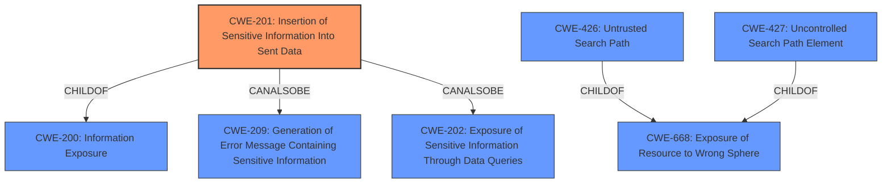

# Enhanced Analysis for CVE-2021-22912

# Summary
| CWE ID    | CWE Name                                                     | Confidence | CWE Abstraction Level | CWE Vulnerability Mapping Label | CWE-Vulnerability Mapping Notes |
| --------- | ------------------------------------------------------------ | ---------- | ----------------------- | ------------------------------- | ------------------------------- |
| CWE-201   | Insertion of Sensitive Information Into Sent Data            | 0.85       | Base                    | Primary                         | Allowed                       |
| CWE-668   | Exposure of Resource to Wrong Sphere                         | 0.60       | Class                   | Secondary                       | Discouraged                    |

## Evidence and Confidence

*   **Confidence Score:** 0.80
*   **Evidence Strength:** HIGH

## Relationship Analysis
The primary CWE selected, CWE-201 (Insertion of Sensitive Information Into Sent Data), is a base-level CWE. It has a hierarchical relationship with CWE-200 (Information Exposure), being a child of it. It also has peer relationships (CanAlsoBe) with CWE-209 (Generation of Error Message Containing Sensitive Information) and CWE-202 (Exposure of Sensitive Information Through Data Queries). The secondary CWE, CWE-668 (Exposure of Resource to Wrong Sphere), is a higher-level class CWE and a parent of CWE-426, CWE-427.



## Vulnerability Chain
The vulnerability chain involves the **improper configuration** of the Nextcloud iOS app, which leads to user search queries being sent to a lookup server, resulting in **information disclosure**.

## Summary of Analysis
The initial analysis focused on identifying the root cause of the information disclosure vulnerability in Nextcloud iOS. The vulnerability description and CVE reference links content summary clearly point to the unintended transmission of user search queries to a third-party lookup server.

The selection of CWE-201 (Insertion of Sensitive Information Into Sent Data) as the primary CWE is based on the fact that the Nextcloud iOS app **inserts sensitive information** (user search queries) into data that is sent to an external server (the lookup server). This directly matches the CWE's description: "The code transmits data to another actor, but a portion of the data includes sensitive information that should not be accessible to that actor." The CVE Reference Links Content Summary states, "The application unintentionally leaks user search queries to a lookup server. This violates the user's expectation that searches would be confined to their local server."

CWE-668 (Exposure of Resource to Wrong Sphere) was considered as a secondary CWE because the vulnerability involves exposing user search queries to a lookup server that should not have access to this information. However, CWE-668 is discouraged, as it's a higher-level class and lower-level CWE IDs might be applicable.

The retriever results also support this assessment. CWE-201 is ranked highly, further reinforcing its suitability. Other considered CWEs include CWE-427, CWE-295, CWE-639, CWE-209 and CWE-202, but these do not align as closely with the vulnerability as CWE-201. The final decision is based on the evidence from the vulnerability description and the retriever results, ensuring the selected CWE is at the optimal level of specificity.

Relevant CWE Information:

# Enhanced Context (25 CWEs)
The following CWEs were identified as potentially relevant to this vulnerability:

## CWE-639: Authorization Bypass Through User-Controlled Key
**Abstraction Level**: Base
**Similarity Score**: 0.78
**Source**: dense

**Description**:
The system's authorization functionality does not prevent one user from gaining access to another user's data or record by modifying the key value identifying the data.

**Mapping Guidance**:
- Usage: Allowed
- Rationale: This CWE entry is at the Base level of abstraction, which is a preferred level of abstraction for mapping to the root causes of vulnerabilities.

## CWE-1390: Weak Authentication
**Abstraction Level**: Class
**Similarity Score**: 0.78
**Source**: dense

**Description**:
The product uses an authentication mechanism to restrict access to specific users or identities, but the mechanism does not sufficiently prove that the claimed identity is correct.

**Mapping Guidance**:
- Usage: Allowed-with-Review
- Rationale: This CWE entry is a Class and might have Base-level children that would be more appropriate

## CWE-807: Reliance on Untrusted Inputs in a Security Decision
**Abstraction Level**: Base
**Similarity Score**: 0.78
**Source**: dense

**Description**:
The product uses a protection mechanism that relies on the existence or values of an input, but the input can be modified by an untrusted actor in a way that bypasses the protection mechanism.

**Mapping Guidance**:
- Usage: Allowed
- Rationale: This CWE entry is at the Base level of abstraction, which is a preferred level of abstraction for mapping to the root causes of vulnerabilities.

## CWE-668: Exposure of Resource to Wrong Sphere
**Abstraction Level**: Class
**Similarity Score**: 0.78
**Source**: dense

**Description**:
The product exposes a resource to the wrong control sphere, providing unintended actors with inappropriate access to the resource.

**Mapping Guidance**:
- Usage: Discouraged
- Rationale: CWE-668 is high-level and is often misused as a catch-all when lower-level CWE IDs might be applicable. It is sometimes used for low-information vulnerability reports [REF-1287]. It is a level-1 Class (i.e., a child of a Pillar). It is not useful for trend analysis.

## CWE-303: Incorrect Implementation of Authentication Algorithm
**Abstraction Level**: Base
**Similarity Score**: 0.77
**Source**: dense

**Description**:
The requirements for the product dictate the use of an established authentication algorithm, but the implementation of the algorithm is incorrect.

**Mapping Guidance**:
- Usage: Allowed
- Rationale: This CWE entry is at the Base level of abstraction, which is a preferred level of abstraction for mapping to the root causes of vulnerabilities.

## CWE-1391: Use of Weak Credentials
**Abstraction Level**: Class
**Similarity Score**: 0.77
**Source**: dense

**Description**:
The product uses weak credentials (such as a default key or hard-coded password) that can be calculated, derived, reused, or guessed by an attacker.

**Mapping Guidance**:
- Usage: Allowed-with-Review
- Rationale: This CWE entry is a Class and might have Base-level children that would be more appropriate

## CWE-41: Improper Resolution of Path Equivalence
**Abstraction Level**: Base
**Similarity Score**: 0.77
**Source**: dense

**Description**:
The product is vulnerable to file system contents disclosure through path equivalence. Path equivalence involves the use of special characters in file and directory names. The associated manipulations are intended to generate multiple names for the same object.

**Mapping Guidance**:
- Usage: Allowed
- Rationale: This CWE entry is at the Base level of abstraction, which is a preferred level of abstraction for mapping to the root causes of vulnerabilities.

## CWE-1289: Improper Validation of Unsafe Equivalence in Input
**Abstraction Level**: Base
**Similarity Score**: 0.77
**Source**: dense

**Description**:
The product receives an input value that is used as a resource identifier or other type of reference, but it does not validate or incorrectly validates that the input is equivalent to a potentially-unsafe value.

**Mapping Guidance**:
- Usage: Allowed
- Rationale: This CWE entry is at the Base level of abstraction, which is a preferred level of abstraction for mapping to the root causes of vulnerabilities.

## CWE-754: Improper Check for Unusual or Exceptional Conditions
**Abstraction Level**: Class
**Similarity Score**: 0.77
**Source


## CWE Relationship Analysis

Current CWEs represent these abstraction levels: .


### Vulnerability Chain Analysis

**Chain starting from CWE-754:**
- 754 (Improper Check for Unusual or Exceptional Conditions) - ROOT


**Chain starting from CWE-303:**
- 303 (Incorrect Implementation of Authentication Algorithm) - ROOT


### CWE Relationship Diagram

```mermaid
graph TD
    classDef primary fill:#f96,stroke:#333,stroke-width:2px
    classDef secondary fill:#69f,stroke:#333
    classDef tertiary fill:#9e9,stroke:#333
```