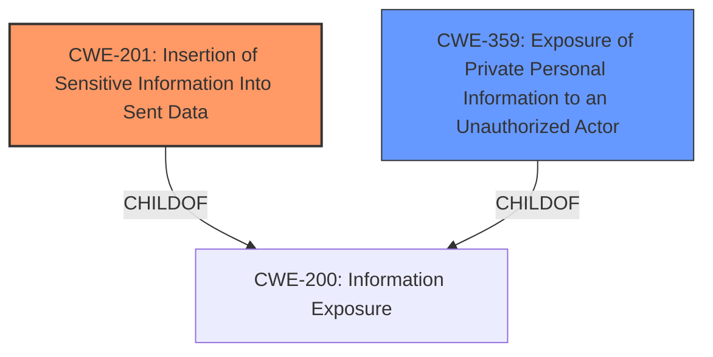

# Analysis Report for CVE-2021-22913

# Vulnerability Analysis Report: CVE-2021-22913

## Description


## Analysis (with Relationship Data)

# Summary

| CWE ID | CWE Name | Confidence | CWE Abstraction Level | CWE Vulnerability Mapping Label | CWE-Vulnerability Mapping Notes |
|---|---|---|---|---|---|
| CWE-201 | Insertion of Sensitive Information Into Sent Data | 0.8 | Base | Allowed | Primary CWE. The application sends user search queries to a lookup server, which constitutes sensitive information being sent to an unintended recipient. |
| CWE-359 | Exposure of Private Personal Information to an Unauthorized Actor | 0.6 | Base | Allowed | Secondary Candidate. The queries sent to the lookup server contain personal information, and this information is exposed to an unauthorized actor. |

## Evidence and Confidence

*   **Confidence Score:** 0.7
*   **Evidence Strength:** MEDIUM

## Relationship Analysis
The primary CWE, CWE-201, is a child of CWE-200 (Information Exposure). CWE-359, a secondary candidate, is also a child of CWE-200. This hierarchical relationship indicates that both CWEs are specializations of the broader information exposure issue.



## Vulnerability Chain
The vulnerability chain is as follows:
1.  The application **incorrectly defaults** to sending share recipient search queries to a lookup server.
2.  This results in the **insertion of sensitive information** (user search queries) into sent data (CWE-201).
3.  This can lead to the **exposure of private personal information** to an unauthorized actor (CWE-359).

## Summary of Analysis
Initially, the vulnerability was assessed based on the description that Nextcloud Deck suffers from an information disclosure vulnerability when searches for sharees utilize the lookup server by default.

The primary factor influencing the assessment was the "CVE Reference Links Content Summary" section, specifically:

*   "**Root cause of vulnerability**: The Nextcloud Deck app, prior to versions 1.2.7 and 1.4.2, performs searches for share recipients on the lookup server by default, instead of only on the local Nextcloud server."
*   "**Weaknesses/vulnerabilities present**: Information Exposure due to the default behavior of sending share recipient search queries to a lookup server, potentially revealing user information unintentionally."
*   "**Impact of exploitation**: User's search queries for share recipients are leaked to the lookup server, which may not be intended or expected."

The retriever results also played a role, specifically the suggested CWEs: CWE-201 (Insertion of Sensitive Information Into Sent Data), CWE-359 (Exposure of Private Personal Information to an Unauthorized Actor).

CWE-201 is chosen as the primary CWE because the application **inserts sensitive information into sent data**. The sensitive information is the user's search query, and the data is sent to the lookup server. This aligns directly with the description of CWE-201: "The code transmits data to another actor, but a portion of the data includes sensitive information that should not be accessible to that actor."

CWE-359 is considered as a secondary CWE because it captures the nature of the information being exposed. The search queries often contain personal information, and this information is exposed to an unauthorized actor (the lookup server).

Both CWE-201 and CWE-359 are at the Base level of abstraction, which is the preferred level.

Relevant CWE Information:

# Enhanced Context (25 CWEs)

## CWE-917: Improper Neutralization of Special Elements used in an Expression Language Statement ('Expression Language Injection')
Not used. This CWE is not relevant as the vulnerability is not due to expression language injection.

## CWE-74: Improper Neutralization of Special Elements in Output Used by a Downstream Component ('Injection')
Not used. The vulnerability does not involve injection of special elements.

## CWE-668: Exposure of Resource to Wrong Sphere
Not used. While information is exposed, CWE-201 and CWE-359 provide a more specific description of the vulnerability.

## CWE-639: Authorization Bypass Through User-Controlled Key
Not used. Authorization bypass is not the root cause.

## CWE-209: Generation of Error Message Containing Sensitive Information
Not used. Sensitive information is not exposed through error messages.

## CWE-538: Insertion of Sensitive Information into Externally-Accessible File or Directory
Not used. This CWE is not applicable as the sensitive information is not inserted into a file or directory.

## CWE-497: Exposure of Sensitive System Information to an Unauthorized Control Sphere
Not used. The exposed information is not system-level information.

## CWE-41: Improper Resolution of Path Equivalence
Not used. Path equivalence is not involved.

## CWE-807: Reliance on Untrusted Inputs in a Security Decision
Not used. The application does not rely on untrusted inputs in a security decision.

## CWE-212: Improper Removal of Sensitive Information Before Storage or Transfer
Not used. Sensitive information is not being stored.

## CWE-427: Uncontrolled Search Path Element
Not used. The vulnerability is not related to search paths.

## CWE-201: Insertion of Sensitive Information Into Sent Data
Used as the primary CWE. The application sends user search queries to a lookup server, which constitutes sensitive information being sent to an unintended recipient.

## CWE-923: Improper Restriction of Communication Channel to Intended Endpoints
Not used. The vulnerability is not due to improper restriction of a communication channel.

## CWE-756: Missing Custom Error Page
Not used. The vulnerability is not related to missing custom error pages.

## CWE-22: Improper Limitation of a Pathname to a Restricted Directory ('Path Traversal')
Not used. Path traversal is not involved.

## CWE-202: Exposure of Sensitive Information Through Data Queries
Not used. While there is a data query, the more specific CWE-201 is a better fit.

## CWE-426: Untrusted Search Path
Not used. This is similar to CWE-427, and is not relevant.

## CWE-1336: Improper Neutralization of Special Elements Used in a Template Engine
Not used. This is not a template engine vulnerability.

## CWE-98: Improper Control of Filename for Include/Require Statement in PHP Program ('PHP Remote File Inclusion')
Not used. This is specific to PHP file inclusion.

## CWE-89: Improper Neutralization of Special Elements used in an SQL Command ('SQL Injection')
Not used. This is SQL injection, which is not relevant to the vulnerability.


## CWE Relationship Analysis

Current CWEs represent these abstraction levels: .


### Vulnerability Chain Analysis

**Chain starting from CWE-359:**
- 359 (Exposure of Private Personal Information to an Unauthorized Actor) - ROOT


**Chain starting from CWE-639:**
- 639 (Authorization Bypass Through User-Controlled Key) - ROOT


### CWE Relationship Diagram

```mermaid
graph TD
    classDef primary fill:#f96,stroke:#333,stroke-width:2px
    classDef secondary fill:#69f,stroke:#333
    classDef tertiary fill:#9e9,stroke:#333
```


*Report generated on 2025-04-01 23:26:48*
