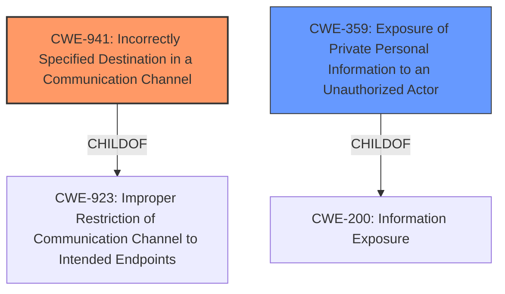

# Raw Analyzer Response for CVE-2021-22916

# Summary
| CWE ID | CWE Name | Confidence | CWE Abstraction Level | CWE Vulnerability Mapping Label | CWE-Vulnerability Mapping Notes |
|---|---|---|---|---|---|
| CWE-941 | Incorrectly Specified Destination in a Communication Channel | 0.9 | Base | Primary | Allowed |
| CWE-359 | Exposure of Private Personal Information to an Unauthorized Actor | 0.7 | Base | Secondary | Allowed |

## Evidence and Confidence

*   **Confidence Score:** 0.8
*   **Evidence Strength:** MEDIUM

## Relationship Analysis
The primary CWE selected, CWE-941, is a Base level CWE and a child of the Class level CWE-923. The vulnerability involves the CNAME adblocking feature using the system DNS settings instead of the extension's proxy settings. This directly relates to incorrectly specifying the destination of the communication channel. The secondary CWE, CWE-359, Exposure of Private Personal Information to an Unauthorized Actor, is also a Base level CWE, and a child of CWE-200, Information Exposure. It relates to the potential information disclosure resulting from the incorrectly specified destination.

## Vulnerability Chain
The vulnerability chain starts with the **incorrect specification of the destination** in the communication channel (CWE-941). This leads to DNS requests being routed through the system DNS settings instead of the intended extension's proxy settings. Consequently, this results in the **information disclosure** (CWE-359).

## Summary of Analysis
The analysis is primarily based on the vulnerability description, which clearly states that the CNAME adblocking feature uses the system DNS settings instead of the extension's proxy settings when adblocking is enabled and a proxy browser extension is installed. This **incorrect specification** of the destination for the DNS requests directly aligns with CWE-941. The potential **information disclosure** is a consequence of this **incorrect specification**, making CWE-359 a secondary consideration.

The following is the relevant information from the vulnerability description:
"In Brave Desktop between versions 1.17 and 1.26.60, when adblocking is enabled and a proxy browser extension is installed, the CNAME adblocking feature issues DNS requests that used the system DNS settings instead of the extensions proxy settings, resulting in possible **information disclosure**."

CWE-941 is the most specific and appropriate choice because it precisely describes the **root cause** of the vulnerability: the **incorrect specification of the destination** in the communication channel. This base level CWE accurately represents the weakness, and the potential for **information disclosure** (CWE-359) is a direct consequence of this weakness.

CWEs considered but not used:

*   CWE-923: Improper Restriction of Communication Channel to Intended Endpoints - This is a Class level CWE and a parent of CWE-941. While relevant, CWE-941 provides a more specific description of the vulnerability.
*   CWE-201: Insertion of Sensitive Information Into Sent Data - This is a base level CWE that is similar to CWE-359. It was not selected because CWE-359 more specifically addresses the exposure of private personal information.
*   CWE-350: Reliance on Reverse DNS Resolution for a Security-Critical Action - Although DNS is involved, the vulnerability's core issue is not related to reverse DNS resolution but to using the wrong DNS settings.
*   CWE-863: Incorrect Authorization - The vulnerability is not related to authorization, but to DNS settings.