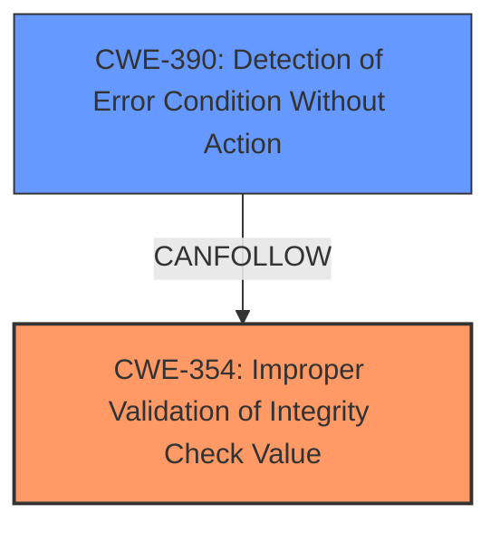

# Enhanced Analysis for CVE-2021-22922

# Summary
| CWE ID  | CWE Name                                                                    | Confidence | CWE Abstraction Level | CWE Vulnerability Mapping Label | CWE-Vulnerability Mapping Notes |
| :-------- | :-------------------------------------------------------------------------- | :--------- | :---------------------- | :------------------------------ | :------------------------------ |
| CWE-354 | Improper Validation of Integrity Check Value                               | 0.95      | Base                    | Primary                        | Allowed                        |
| CWE-390 | Detection of Error Condition Without Action                               | 0.75      | Base                    | Secondary                       | Allowed                        |

## Evidence and Confidence

*   **Confidence Score:** 0.85
*   **Evidence Strength:** HIGH

## Relationship Analysis
The primary CWE, CWE-354, is a Base-level weakness specifically addressing the improper handling of integrity check values. CWE-390, a secondary consideration, represents the lack of action taken despite detecting an error condition (the hash mismatch). There isn't a direct hierarchical relationship between CWE-354 and CWE-390 but CWE-390 could follow CWE-354. The evidence strongly supports CWE-354 as the root cause, while CWE-390 highlights a contributing factor in the vulnerability.



## Vulnerability Chain
The vulnerability chain starts with the potential compromise of a server hosting content specified in the Metalink file.

1.  **Compromised Server:** An attacker replaces a legitimate file with a malicious version.
2.  **Download via Curl:** `curl` downloads the malicious file.
3.  **CWE-354: Improper Validation of Integrity Check Value:** `curl` detects a hash mismatch, indicating a corrupted or malicious file, but **does not properly validate the integrity** because it **does not discard the content.**
4.  **CWE-390: Detection of Error Condition Without Action:** Curl reports in text the hash mismatch, but **takes no action** to discard the file or try another URL.
5.  **Impact:** The malicious file is kept on disk, potentially leading to the execution of malicious code.

## Summary of Analysis
Initially, the description highlights that `curl` downloads a potentially malicious file despite a hash mismatch. The **weakness** is the **download of malicious content**. The root cause is that curl **does not discard the content** after detecting a hash mismatch.

The CVE reference link content summary confirms that the **root cause** is **improper input validation**, where `curl` **does not properly validate the integrity of downloaded content**. It also states that the issue is identified as CWE-354, which is "Improper Validation of Integrity Check Value." The description also mentions a **lack of automatic fallback** where curl **stops after receiving the first file**, instead of discarding the file and attempting download from other URLs in the Metalink file.

The Retriever Results show several candidate CWEs. CWE-354 is not listed in the Retriever Results; however, the CVE reference link content summary states, "The issue is identified as CWE-354, which is "Improper Validation of Integrity Check Value."

CWE-390 "Detection of Error Condition Without Action" is the top CWE in the Retriever Results, which is relevant because curl detects a hash mismatch, but takes no action to discard the potentially malicious file.

CWE-319 "Cleartext Transmission of Sensitive Information" is not relevant.

CWE-451 "User Interface (UI) Misrepresentation of Critical Information" is not relevant because the vulnerability is not directly related to misrepresentation of critical information in the UI. However, the user might miss the hash mismatch message and believe that the file is correct, so there is an indirect relationship.

CWE-79 "Improper Neutralization of Input During Web Page Generation ('Cross-site Scripting')" is not relevant.

CWE-201 "Insertion of Sensitive Information Into Sent Data" is not relevant.

CWE-494 "Download of Code Without Integrity Check" is similar to CWE-354; however, since the hash is present and being checked, albeit improperly, CWE-354 is more appropriate.

CWE-226 "Sensitive Information in Resource Not Removed Before Reuse" is not relevant.

CWE-522 "Insufficiently Protected Credentials" is not relevant.

CWE-88 "Improper Neutralization of Argument Delimiters in a Command ('Argument Injection')" is not relevant.

CWE-347 "Improper Verification of Cryptographic Signature" is similar to CWE-354; however, CWE-354 is more appropriate.

The final decision is based on the detailed analysis of the vulnerability description and CVE reference link content summary, which points directly to CWE-354, and the secondary contribution of CWE-390. Both are at the Base level of abstraction.

Relevant CWE Information:

# Enhanced Context (25 CWEs)

## CWE-345: Insufficient Verification of Data Authenticity
**Abstraction Level**: Class
**Similarity Score**: 0.77
**Source**: dense

**Description**:
The product does not sufficiently verify the origin or authenticity of data, in a way that causes it to accept invalid data.

**Mapping Guidance**:
- Usage: Discouraged
- Rationale: This CWE entry is a level-1 Class (i.e., a child of a Pillar). It might have lower-level children that would be more appropriate

## CWE-1289: Improper Validation of Unsafe Equivalence in Input
**Abstraction Level**: Base
**Similarity Score**: 0.76
**Source**: dense

**Description**:
The product receives an input value that is used as a resource identifier or other type of reference, but it does not validate or incorrectly validates that the input is equivalent to a potentially-unsafe value.

**Mapping Guidance**:
- Usage: Allowed
- Rationale: This CWE entry is at the Base level of abstraction, which is a preferred level of abstraction for mapping to the root causes of vulnerabilities.

## CWE-212: Improper Removal of Sensitive Information Before Storage or Transfer
**Abstraction Level**: Base
**Similarity Score**: 0.75
**Source**: dense

**Description**:
The product stores, transfers, or shares a resource that contains sensitive information, but it does not properly remove that information before the product makes the resource available to unauthorized actors.

**Mapping Guidance**:
- Usage: Allowed
- Rationale: This CWE entry is at the Base level of abstraction, which is a preferred level of abstraction for mapping to the root causes of vulnerabilities.

## CWE-451: User Interface (UI) Misrepresentation of Critical Information
**Abstraction Level**: Class
**Similarity Score**: 0.75
**Source**: dense

**Description**:
The user interface (UI) does not properly represent critical information to the user, allowing the information - or its source - to be obscured or spoofed. This is often a component in phishing attacks.

**Mapping Guidance**:
- Usage: Allowed-with-Review
- Rationale: This CWE entry is a Class and might have Base-level children that would be more appropriate

## CWE-807: Reliance on Untrusted Inputs in a Security Decision
**Abstraction Level**: Base
**Similarity Score**: 0.75
**Source**: dense

**Description**:
The product uses a protection mechanism that relies on the existence or values of an input, but the input can be modified by an untrusted actor in a way that bypasses the protection mechanism.

**Mapping Guidance**:
- Usage: Allowed
- Rationale: This CWE entry is at the Base level of abstraction, which is a preferred level of abstraction for mapping to the root causes of vulnerabilities.

## CWE-668: Exposure of Resource to Wrong Sphere
**Abstraction Level**: Class
**Similarity Score**: 0.75
**Source**: dense

**Description**:
The product exposes a resource to the wrong control sphere, providing unintended actors with inappropriate access to the resource.

**Mapping Guidance**:
- Usage: Discouraged
- Rationale: CWE-668 is high-level and is often misused as a catch-all when lower-level CWE IDs might be applicable. It is sometimes used for low-information vulnerability reports [REF-1287]. It is a level-1 Class (i.e., a child of a Pillar). It is not useful for trend analysis.

## CWE-319: Cleartext Transmission of Sensitive Information
**Abstraction Level**: Base
**Similarity Score**: 0.75
**Source**: dense

**Description**:
The product transmits sensitive or security-critical data in cleartext in a communication channel that can be sniffed by unauthorized actors.

**Mapping Guidance**:
- Usage: Allowed
- Rationale: This CWE entry is at the Base level of abstraction, which is a preferred level of abstraction for mapping to the root causes of vulnerabilities.

## CWE-7


## CWE Relationship Analysis

Current CWEs represent these abstraction levels: .


### Vulnerability Chain Analysis

**Chain starting from CWE-494:**
- 494 (Download of Code Without Integrity Check) - ROOT


**Chain starting from CWE-79:**
- 79 (Improper Neutralization of Input During Web Page Generation ('Cross-site Scripting')) - ROOT


### CWE Relationship Diagram

```mermaid
graph TD
    classDef primary fill:#f96,stroke:#333,stroke-width:2px
    classDef secondary fill:#69f,stroke:#333
    classDef tertiary fill:#9e9,stroke:#333
```