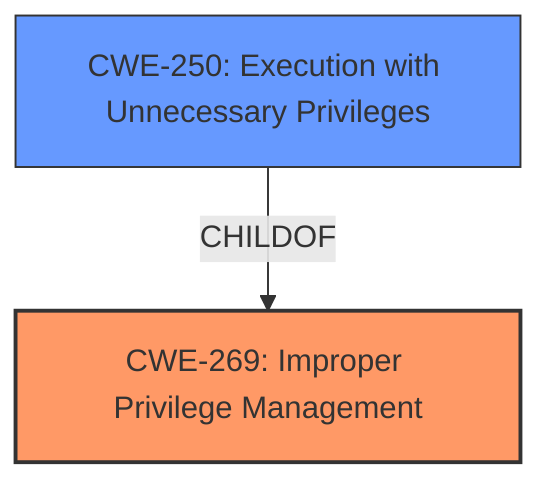

# Enhanced Analysis for CVE-2021-22928

# Summary
| CWE ID | CWE Name | Confidence | CWE Abstraction Level | CWE Vulnerability Mapping Label | CWE-Vulnerability Mapping Notes |
|---|---|---|---|---|---|
| CWE-269 | Improper Privilege Management | 0.75 | Class | Primary | Discouraged |
| CWE-250 | Execution with Unnecessary Privileges | 0.6 | Base | Secondary | Allowed |

## Evidence and Confidence

*   **Confidence Score:** 0.7
*   **Evidence Strength:** MEDIUM

## Relationship Analysis
The primary relationship influencing the selection is the ChildOf relationship between CWE-250 (Execution with Unnecessary Privileges) and CWE-269 (Improper Privilege Management). While the vulnerability description points to a privilege escalation issue, the provided information is not detailed enough to determine the exact mechanism that led to the escalation. Given that the vulnerability allows a user to **escalate their privilege level to SYSTEM**, CWE-269 seems appropriate as it describes "The product does not properly assign, modify, track, or check privileges for an actor, creating an unintended sphere of control for that actor." Also, because the product "Citrix Virtual Apps and Desktops" performs an operation at a higher privilege than required, this opens the door to CWE-250.



## Vulnerability Chain
The vulnerability chain involves the following:
1.  The Citrix Virtual Apps and Desktops product has an unspecified **weakness** related to privilege management.
2.  This **weakness** allows a user with limited privileges to **escalate their privilege level to SYSTEM**.
3.  The impact is that an attacker (user of a Windows VDA) can gain unauthorized control over the system.

## Summary of Analysis
The initial assessment focused on identifying the root cause of the privilege escalation vulnerability in Citrix Virtual Apps and Desktops. The primary indicator is that a user of a Windows VDA can **escalate their privilege level to SYSTEM**, which points to a flaw in privilege management.

The selection of CWE-269 is based on the description matching the vulnerability's impact. However, CWE-269 is discouraged for use as a primary CWE because it is often misused and too high-level. Based on the provided information, a user of Windows VDA can escalate their privilege level to SYSTEM due to the product "Citrix Virtual Apps and Desktops" performing an operation at a higher privilege than required. This leads to the classification of CWE-250 because it reflects the vulnerability description and the phrase "escalate their privilege level to SYSTEM."

Relevant CWE Information:

# Enhanced Context (25 CWEs)
The following CWEs were identified as potentially relevant to this vulnerability:

## CWE-269: Improper Privilege Management
**Abstraction Level**: Class
**Similarity Score**: 0.094 (sparse)
**Source**: sparse

**Description**:
The product does not properly assign, modify, track, or check privileges for an actor, creating an unintended sphere of control for that actor.

**Mapping Guidance**:
- Usage: Discouraged
- Rationale: CWE-269 is commonly misused. It can be conflated with "privilege escalation," which is a technical impact that is listed in many low-information vulnerability reports [REF-1287]. It is not useful for trend analysis.

## CWE-250: Execution with Unnecessary Privileges
**Abstraction Level**: Base
**Similarity Score**: 0.580 (dense)
**Source**: dense

**Description**:
The product performs an operation at a privilege level that is higher than the minimum level required, which creates new weaknesses or amplifies the consequences of other weaknesses.

**Mapping Guidance**:
- Usage: Allowed
- Rationale: This CWE entry is at the Base level of abstraction, which is a preferred level of abstraction for mapping to the root causes of vulnerabilities.

## CWE-284: Improper Access Control
**Abstraction Level**: Pillar
**Similarity Score**: 0.090 (sparse)
**Source**: sparse

**Description**:
The product does not restrict or incorrectly restricts access to a resource from an unauthorized actor.

**Mapping Guidance**:
- Usage: Discouraged
- Rationale: CWE-284 is extremely high-level, a Pillar. Its name, "Improper Access Control," is often misused in low-information vulnerability reports [REF-1287] or by active use of the OWASP Top Ten, such as "A01:2021-Broken Access Control". It is not useful for trend analysis.

## CWE-287: Improper Authentication
**Abstraction Level**: Class
**Similarity Score**: 0.082 (sparse)
**Source**: sparse

**Description**:
When an actor claims to have a given identity, the product does not prove or insufficiently proves that the claim is correct.

**Mapping Guidance**:
- Usage: Discouraged
- Rationale: This CWE entry might be misused when lower-level CWE entries are likely to be applicable. It is a level-1 Class (i.e., a child of a Pillar).

## CWE-732: Incorrect Permission Assignment for Critical Resource
**Abstraction Level**: Class
**Similarity Score**: 0.080 (sparse)
**Source**: sparse

**Description**:
The product specifies permissions for a security-critical resource in a way that allows that resource to be read or modified by unintended actors.

**Mapping Guidance**:
- Usage: Allowed-with-Review
- Rationale: While the name itself indicates an assignment of permissions for resources, this is often misused for vulnerabilities in which "permissions" are not checked, which is an "authorization" weakness (CWE-285 or descendants) within CWE's model [REF-1287].

## CWE-400: Uncontrolled Resource Consumption
**Abstraction Level**: Class
**Similarity Score**: 0.078 (sparse)
**Source**: sparse

**Description**:
The product does not properly control the allocation and maintenance of a limited resource, thereby enabling an actor to influence the amount of resources consumed, eventually leading to the exhaustion of available resources.

**Mapping Guidance**:
- Usage: Discouraged
- Rationale: CWE-400 is intended for incorrect behaviors in which the product is expected to track and restrict how many resources it consumes, but CWE-400 is often misused because it is conflated with the "technical impact" of vulnerabilities in which resource consumption occurs. It is sometimes used for low-information vulnerability reports. It is a level-1 Class (i.e., a child of a Pillar).


## CWE Relationship Analysis

Current CWEs represent these abstraction levels: .


### Vulnerability Chain Analysis

**Chain starting from CWE-732:**
- 732 (Incorrect Permission Assignment for Critical Resource) - ROOT


**Chain starting from CWE-284:**
- 284 (Improper Access Control) - ROOT


### CWE Relationship Diagram

```mermaid
graph TD
    classDef primary fill:#f96,stroke:#333,stroke-width:2px
    classDef secondary fill:#69f,stroke:#333
    classDef tertiary fill:#9e9,stroke:#333
```