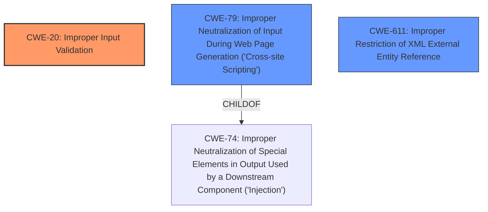

# Enhanced Analysis for CVE-2021-22931

# Summary
| CWE ID | CWE Name | Confidence | CWE Abstraction Level | CWE Vulnerability Mapping Label | CWE-Vulnerability Mapping Notes |
|---|---|---|---|---|---|
| CWE-20 | Improper Input Validation | 0.9 | Class | Discouraged | The vulnerability description explicitly states "missing input validation". While discouraged, it's the most direct match. |
| CWE-79 | Improper Neutralization of Input During Web Page Generation ('Cross-site Scripting') | 0.7 | Base | Allowed | Secondary candidate, given the mention of "injection vulnerabilities" which can include XSS. |
| CWE-611 | Improper Restriction of XML External Entity Reference | 0.5 | Base | Allowed | Secondary candidate, given the mention of "XXE" in the description. |

## Evidence and Confidence

*   **Confidence Score:** 0.8
*   **Evidence Strength:** MEDIUM

## Relationship Analysis
The analysis focuses on the relationships between CWE-20 **Improper Input Validation**, CWE-79 **Improper Neutralization of Input During Web Page Generation ('Cross-site Scripting')**, and CWE-611 **Improper Restriction of XML External Entity Reference**.

- CWE-20 is a Class-level CWE, and the guidance discourages its use when more specific CWEs are available. However, the description explicitly mentions "**missing input validation**", making it a relevant starting point.
- CWE-79 is a Base-level CWE and a child of CWE-74 (Improper Neutralization of Special Elements in Output Used by a Downstream Component ('Injection')). It is considered because the vulnerability description mentions "injection vulnerabilities," and XSS is a type of injection.
- CWE-611 is a Base-level CWE. It is considered because the vulnerability description mentions "**XXE**", making it a relevant candidate.



## Vulnerability Chain
The vulnerability chain starts with **missing input validation** (CWE-20), leading to potential XSS (CWE-79) and XXE (CWE-611).

CWE-20 (Improper Input Validation) -> CWE-79 (Improper Neutralization of Input During Web Page Generation ('Cross-site Scripting')) / CWE-611 (Improper Restriction of XML External Entity Reference).

## Summary of Analysis
The initial assessment focused on the explicit mention of "**missing input validation**" in the vulnerability description, leading to the primary candidate of CWE-20. The description also mentioned "injection vulnerabilities", which led to the consideration of CWE-79 (XSS) and "**XXE**" which led to consideration of CWE-611.

The graph relationships highlight that while CWE-20 is a general class, CWE-79 and CWE-611 are more specific base-level weaknesses that can result from improper input validation.

The final decision is to assign CWE-20 as the primary CWE because it is explicitly stated in the vulnerability description. CWE-79 and CWE-611 are secondary candidates because they are potential outcomes of the **missing input validation**. The selection is based on the provided evidence, and the confidence level is high due to the direct match with the vulnerability description. While CWE-20 is discouraged, the other CWEs are impacts.

Relevant CWE Information:
- CWE-20: Improper Input Validation
  - The product receives input or data, but it does not validate or incorrectly validates that the input has the properties that are required to process the data safely and correctly.
  - The vulnerability description explicitly states "**missing input validation**", which directly aligns with CWE-20's description.
- CWE-79: Improper Neutralization of Input During Web Page Generation ('Cross-site Scripting')
  - The product does not neutralize or incorrectly neutralizes user-controllable input before it is placed in output that is used as a web page that is served to other users.
  - The vulnerability mentions "injection vulnerabilities," which can include XSS.
- CWE-611: Improper Restriction of XML External Entity Reference
  - The product processes an XML document that can contain XML entities with URIs that resolve to documents outside of the intended sphere of control, causing the product to embed incorrect documents into its output.
  - The vulnerability mentions "**XXE**" as a weakness.

CWEs Considered but Not Used:
- Several other CWEs were considered based on the retriever results, such as CWE-295 (Improper Certificate Validation), CWE-1321 (Improperly Controlled Modification of Object Prototype Attributes ('Prototype Pollution')), CWE-1333 (Inefficient Regular Expression Complexity), and others. These were not selected because they did not directly align with the root cause described in the vulnerability description.


## CWE Relationship Analysis

Current CWEs represent these abstraction levels: .


### Vulnerability Chain Analysis

**Chain starting from CWE-79:**
- 79 (Improper Neutralization of Input During Web Page Generation ('Cross-site Scripting')) - ROOT


**Chain starting from CWE-1333:**
- 1333 (Inefficient Regular Expression Complexity) - ROOT


### CWE Relationship Diagram

```mermaid
graph TD
    classDef primary fill:#f96,stroke:#333,stroke-width:2px
    classDef secondary fill:#69f,stroke:#333
    classDef tertiary fill:#9e9,stroke:#333
```