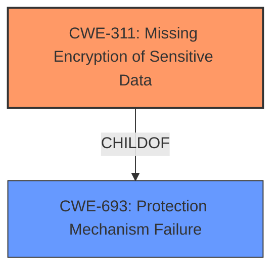

# Raw Analyzer Response for CVE-2021-22932

# Summary
| CWE ID | CWE Name | Confidence | CWE Abstraction Level | CWE Vulnerability Mapping Label | CWE-Vulnerability Mapping Notes |
|---|---|---|---|---|---|
| CWE-311 | Missing Encryption of Sensitive Data | 0.9 | Class | Primary CWE | Allowed-with-Review |

## Evidence and Confidence

*   **Confidence Score:** 0.9
*   **Evidence Strength:** HIGH

## Relationship Analysis
The primary relationship considered was the ChildOf relationship between CWE-311 and CWE-693 (Protection Mechanism Failure). This indicates that the missing encryption is a specific type of protection mechanism failure. The "Mapping Guidance" for CWE-311 advises that it is a Class level CWE and that more specific children should be considered. However, given the specific context, a more specific CWE is not needed.

## Vulnerability Chain
The vulnerability chain starts with the execution of the CTX269106 mitigation tool, which leads to the **disabling of the ShareFile file encryption option**. This **missing encryption** (CWE-311) exposes sensitive data.

## Summary of Analysis
The analysis is primarily based on the vulnerability description, which clearly states that the mitigation tool **disables the ShareFile file encryption option**.

The vulnerability description states "An issue has been identified in the CTX269106 mitigation tool for Citrix ShareFile storage zones controller which causes the ShareFile file encryption option to become disabled if it had previously been enabled." This clearly indicates a **lack of encryption** for sensitive data, directly corresponding to CWE-311: Missing Encryption of Sensitive Data.

The selection of CWE-311 is at an appropriate level of specificity. While more specific child CWEs exist, they describe particular encryption contexts (storage, transmission) that aren't explicitly detailed in the report.

Relevant CWE Information:

### CWE-538: Insertion of Sensitive Information into Externally-Accessible File or Directory
This CWE was considered, but the vulnerability does not involve writing sensitive information to a file or directory. It involves disabling encryption, which is different.

### CWE-312: Cleartext Storage of Sensitive Information
This is a potential child of CWE-311. However, the vulnerability description does not explicitly state that the files are being stored in cleartext, only that the encryption option is disabled.

### CWE-212: Improper Removal of Sensitive Information Before Storage or Transfer
This CWE does not fit because the issue is not about failing to remove sensitive information, but about disabling encryption.

### CWE-319: Cleartext Transmission of Sensitive Information
Similar to CWE-312, this could be a child of CWE-311, but there is no explicit mention of cleartext transmission.

### CWE-345: Insufficient Verification of Data Authenticity
This CWE is related to data authenticity, which is not the core issue here. The problem is the disabling of encryption.

### CWE-203: Observable Discrepancy
This CWE is about differences in behavior revealing information, which is not the case here.

### CWE-668: Exposure of Resource to Wrong Sphere
This CWE is too broad and does not accurately capture the specific issue of disabling encryption.

### CWE-226: Sensitive Information in Resource Not Removed Before Reuse
This CWE is about reusing resources without clearing sensitive information, which is not relevant to this vulnerability.

### CWE-778: Insufficient Logging
Logging is not relevant to this vulnerability.

### CWE-327: Use of a Broken or Risky Cryptographic Algorithm
This CWE is about using weak encryption algorithms, but the issue here is that encryption is disabled entirely.

### CWE-367: Time-of-check Time-of-use (TOCTOU) Race Condition
This CWE is about race conditions, which are not related to the vulnerability.

### CWE-1390: Weak Authentication
Authentication is not the primary issue. The problem is the **disabling of encryption**.

### CWE-863: Incorrect Authorization
Authorization is not the primary issue. The problem is the **disabling of encryption**.

### CWE-322: Key Exchange without Entity Authentication
Key exchange is not relevant to the vulnerability.

### CWE-1289: Improper Validation of Unsafe Equivalence in Input
Input validation is not relevant to the vulnerability.

### CWE-178: Improper Handling of Case Sensitivity
Case sensitivity is not relevant to the vulnerability.

### CWE-295: Improper Certificate Validation
Certificate validation is not relevant to the vulnerability.

### CWE-252: Unchecked Return Value
Return values are not relevant to the vulnerability.

### CWE-289: Authentication Bypass by Alternate Name
Authentication bypass is not relevant to the vulnerability.

### CWE-201: Insertion of Sensitive Information Into Sent Data
Sending sensitive data is not explicitly part of this vulnerability.

### CWE-208: Observable Timing Discrepancy
Timing discrepancies are not relevant to this vulnerability.

### CWE-1272: Sensitive Information Uncleared Before Debug/Power State Transition
This is not about a power state transition or debugging.

### CWE-923: Improper Restriction of Communication Channel to Intended Endpoints
This is not about restricting communication channels.

The "Retriever Results" suggested CWE-311 (Missing Encryption of Sensitive Data) as the top candidate. This aligns perfectly with the vulnerability description.

Given the evidence and analysis, CWE-311 is the most appropriate classification.