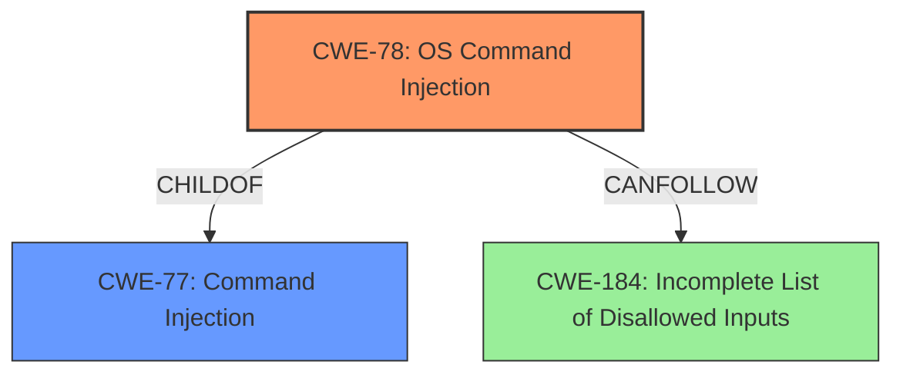

# Analysis for CVE-2021-22938

# Summary
| CWE ID | CWE Name | Confidence | CWE Abstraction Level | CWE Vulnerability Mapping Label | CWE-Vulnerability Mapping Notes |
|---|---|---|---|---|---|
| CWE-78 | Improper Neutralization of Special Elements used in an OS Command ('OS Command Injection') | 1.0 | Base | Allowed | Primary CWE |
| CWE-77 | Improper Neutralization of Special Elements used in a Command ('Command Injection') | 0.7 | Class | Allowed-with-Review | Secondary candidate |
| CWE-184 | Incomplete List of Disallowed Inputs | 0.5 | Base | Allowed | Secondary candidate |

## Evidence and Confidence

*   **Confidence Score:** 1.0
*   **Evidence Strength:** HIGH

## Relationship Analysis
The primary relationship that influenced the decision was the hierarchical relationship between CWE-77 (Class) and CWE-78 (Base), where CWE-78 is a child of CWE-77. Since the vulnerability specifically involves **command injection** in an OS command, CWE-78 is the more specific and appropriate choice. CWE-184 was considered due to its relationship with CWE-78, but the description doesn't explicitly mention an incomplete list of disallowed inputs. Therefore, it's considered a secondary candidate.

## Vulnerability Chain
The vulnerability chain involves the following:
1.  **Root Cause:** **Unsanitized web parameter** in the administrator web console.
2.  **Weakness:** Improper neutralization of special elements used in an OS Command (**Command Injection**).
3.  **Impact:** An authenticated administrator can perform **command injection**, potentially leading to unauthorized access or control of the system.

## Summary of Analysis
The initial analysis strongly points to **command injection** due to the presence of an **unsanitized web parameter**. The vulnerability description explicitly mentions **command injection**, making CWE-78 the most suitable choice. The description "A vulnerability in Pulse Connect Secure before 9.1R12 could allow an authenticated administrator to perform **command injection** via an **unsanitized web parameter** in the administrator web console." directly supports this assessment.

CWE-77 was considered but is a class-level CWE. CWE-78 is more specific, referring to OS command injection, and is therefore a better fit.

CWE-184 was considered because **command injection** vulnerabilities can often stem from an incomplete list of disallowed inputs. However, the description does not explicitly mention any attempts to filter disallowed input. Thus, it remains a secondary candidate but is not the primary weakness.

The final decision prioritizes the explicit mention of **command injection** and the root cause of an **unsanitized web parameter**, leading to the selection of CWE-78 as the primary weakness. This choice aligns with the principle of selecting the most specific CWE that accurately represents the vulnerability.

Relevant CWE Information:

# Enhanced Context (25 CWEs)
The following CWEs were identified as potentially relevant to this vulnerability:

## CWE-669: Incorrect Resource Transfer Between Spheres
**Abstraction Level**: Class
**Similarity Score**: 0.78
**Source**: dense

**Description**:
The product does not properly transfer a resource/behavior to another sphere, or improperly imports a resource/behavior from another sphere, in a manner that provides unintended control over that resource.

**Mapping Guidance**:
- Usage: Allowed-with-Review
- Rationale: This CWE entry is a Class and might have Base-level children that would be more appropriate

*This CWE is not applicable because the vulnerability does not involve incorrect resource transfer between spheres.*

## CWE-184: Incomplete List of Disallowed Inputs
**Abstraction Level**: Base
**Similarity Score**: 0.77
**Source**: dense

**Description**:
The product implements a protection mechanism that relies on a list of inputs (or properties of inputs) that are not allowed by policy or otherwise require other action to neutralize before additional processing takes place, but the list is incomplete.

**Mapping Guidance**:
- Usage: Allowed
- Rationale: This CWE entry is at the Base level of abstraction, which is a preferred level of abstraction for mapping to the root causes of vulnerabilities.

*This CWE is a possible secondary weakness if there was a filter that was not properly implemented*

## CWE-74: Improper Neutralization of Special Elements in Output Used by a Downstream Component ('Injection')
**Abstraction Level**: Class
**Similarity Score**: 0.76
**Source**: dense

**Description**:
The product constructs all or part of a command, data structure, or record using externally-influenced input from an upstream component, but it does not neutralize or incorrectly neutralizes special elements that could modify how it is parsed or interpreted when it is sent to a downstream component.

**Mapping Guidance**:
- Usage: Discouraged
- Rationale: CWE-74 is high-level and often misused when lower-level weaknesses are more appropriate.

*CWE-74 is a parent of CWE-78, but CWE-78 is a better fit.*

## CWE-668: Exposure of Resource to Wrong Sphere
**Abstraction Level**: Class
**Similarity Score**: 0.76
**Source**: dense

**Description**:
The product exposes a resource to the wrong control sphere, providing unintended actors with inappropriate access to the resource.

**Mapping Guidance**:
- Usage: Discouraged
- Rationale: CWE-668 is high-level and is often misused as a catch-all when lower-level CWE IDs might be applicable. It is sometimes used for low-information vulnerability reports [REF-1287]. It is a level-1 Class (i.e., a child of a Pillar). It is not useful for trend analysis.

*This CWE is not applicable because the vulnerability does not involve exposing a resource to the wrong sphere.*

## CWE-610: Externally Controlled Reference to a Resource in Another Sphere
**Abstraction Level**: Class
**Similarity Score**: 0.76
**Source**: dense

**Description**:
The product uses an externally controlled name or reference that resolves to a resource that is outside of the intended control sphere.

**Mapping Guidance**:
- Usage: Discouraged
- Rationale: This CWE entry is a level-1 Class (i.e., a child of a Pillar). It might have lower-level children that would be more appropriate

*This CWE is not applicable because the vulnerability does not involve externally controlled reference to a resource in another sphere.*

## CWE-404: Improper Resource Shutdown or Release
**Abstraction Level**: Class
**Similarity Score**: 0.76
**Source**: dense

**Description**:
The product does not release or incorrectly releases a resource before it is made available for re-use.

**Mapping Guidance**:
- Usage: Allowed-with-Review
- Rationale: This CWE entry is a Class and might have Base-level children that would be more appropriate

*This CWE is not applicable because the vulnerability does not involve improper resource shutdown or release.*

## CWE-1289: Improper Validation of Unsafe Equivalence in Input
**Abstraction Level**: Base
**Similarity Score**: 0.75
**Source**: dense

**Description**:
The product receives an input value that is used as a resource identifier or other type of reference, but it does not validate or incorrectly validates that the input is equivalent to a potentially-unsafe value.

**Mapping Guidance**:
- Usage: Allowed
- Rationale: This CWE entry is at the Base level of abstraction, which is a preferred level of abstraction for mapping to the root causes of vulnerabilities.

*This CWE is not applicable because the vulnerability does not involve improper validation of unsafe equivalence in input.*

## CWE-212: Improper Removal of Sensitive Information Before Storage or Transfer
**Abstraction Level**: Base
**Similarity Score**: 0.75
**Source**: dense

**Description**:
The product stores, transfers, or shares a resource that contains sensitive information, but it does not properly remove that information before the product makes the resource available to unauthorized actors.

**Mapping Guidance**:
- Usage: Allowed
- Rationale: This CWE entry is at the Base level of abstraction, which is a preferred level of abstraction for mapping to the root causes of vulnerabilities.

*This CWE is not applicable because the vulnerability does not involve improper removal of sensitive information.*

## CWE-23: Relative Path Traversal
**Abstraction Level**: Base
**Similarity Score**: 0.75
**Source**: dense

**Description**:
The product uses external input to construct a pathname that should be within a restricted directory, but it does not properly neutralize sequences such as ".." that can resolve to a location that is outside of