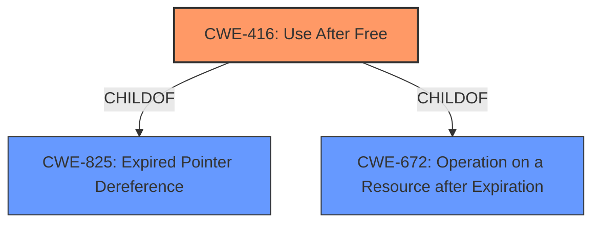

# Raw Analyzer Response for CVE-2021-22940

# Summary
| CWE ID  | CWE Name                                                                                             | Confidence | CWE Abstraction Level | CWE Vulnerability Mapping Label | CWE-Vulnerability Mapping Notes |
| :-------- | :----------------------------------------------------------------------------------------------------- | :--------- | :---------------------- | :------------------------------ | :------------------------------ |
| CWE-416 | Use After Free                                                                                       | 1          | Variant               | Primary                         | Allowed                       |

## Evidence and Confidence

*   **Confidence Score:** 1
*   **Evidence Strength:** HIGH

## Relationship Analysis
The primary CWE identified is CWE-416 (Use After Free), which is a variant-level CWE. It is a child of CWE-825 (Expired Pointer Dereference) and CWE-672 (Operation on a Resource after Expiration). The CWE-416 can be preceded by CWE-120 (Buffer Copy without Checking Size) or CWE-123 (Write-what-where Condition). The graph shows a clear parent-child relationship with CWE-825.

## Vulnerability Chain
The vulnerability chain is straightforward: the **use after free** (CWE-416) leads to memory corruption and allows an attacker to potentially change process behavior. The root cause is the improper handling of memory, and the impact is the potential for arbitrary code execution due to memory corruption.

## Summary of Analysis
The analysis is based on the provided vulnerability description, which explicitly states that the vulnerability is a **use after free**. The vulnerability description key phrases section confirms this with the line "**weakness:** **use after free**".

The retriever results list CWE-416 as the top candidate, and the description of CWE-416 aligns perfectly with the vulnerability description, which mentions memory corruption as a direct consequence. The CWE specification confirms that CWE-416 is at the Variant level of abstraction, which is the preferred level, and its usage is "Allowed".

Other CWEs were considered but deemed less appropriate:

*   CWE-362 (Concurrent Execution using Shared Resource with Improper Synchronization ('Race Condition')): While race conditions can sometimes lead to use-after-free vulnerabilities, there's no explicit mention of concurrency in the provided description.
*   CWE-415 (Double Free): Double free is a distinct weakness from use-after-free. The vulnerability description specifically mentions "use after free," not a double free.
*   CWE-755 (Improper Handling of Exceptional Conditions): This is too general and doesn't accurately reflect the specific memory management issue.
*   CWE-401 (Missing Release of Memory after Effective Lifetime): While a memory leak can occur with use-after-free, it's not the primary weakness described.
*   CWE-770 (Allocation of Resources Without Limits or Throttling): This CWE is not applicable as it deals with resource allocation limits, not memory corruption due to use after free.
* CWE-123 (Write-what-where Condition) While this can result from a use after free, the primary weakness is the memory management issue.
* CWE-115 (Misinterpretation of Input) This is not applicable.
* CWE-400 (Uncontrolled Resource Consumption) This is not applicable.
* CWE-364 (Signal Handler Race Condition) This is not applicable.

The selection of CWE-416 is at the optimal level of specificity because it directly reflects the stated weakness in the vulnerability description.