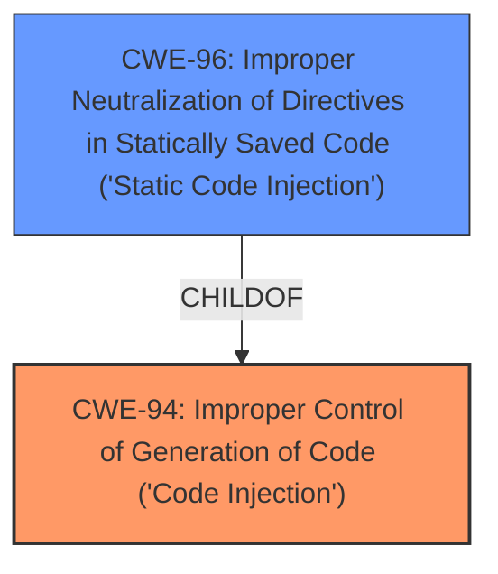

# Raw Analyzer Response for CVE-2021-22961

# Summary
| CWE ID | CWE Name | Confidence | CWE Abstraction Level | CWE Vulnerability Mapping Label | CWE-Vulnerability Mapping Notes |
|---|---|---|---|---|---|
| CWE-94 | Improper Control of Generation of Code ('Code Injection') | 0.9 | Base | Allowed-with-Review | Primary CWE |
| CWE-96 | Improper Neutralization of Directives in Statically Saved Code ('Static Code Injection') | 0.6 | Base | Allowed | Secondary Candidate |

## Evidence and Confidence

*   **Confidence Score:** 0.9
*   **Evidence Strength:** HIGH

## Relationship Analysis
The primary relationship impacting the decision is that CWE-96 is a ChildOf CWE-94. CWE-94 is a base level CWE which is frequently misused. CWE-96 is a more specific child of CWE-94. The vulnerability description contains the term **code injection**. Since the vulnerability description mentions arbitrary code execution, but also that the injection occurs "from a file in the user path on first execution" there is a possibility that the code is being injected into an executable resource such as a library. This makes the parent CWE-94 a stronger fit.

## Vulnerability Chain
The chain of events begins with a **code injection** vulnerability (CWE-94), leading to arbitrary code execution. The **weakness** allows an attacker to inject malicious code. This code is then executed, leading to the impact.

## Summary of Analysis
The initial assessment identified CWE-94 as the primary candidate due to the presence of **code injection**. However, further analysis considered other related CWEs to ensure the most accurate and specific mapping.

The vulnerability description states: "A **code injection** vulnerability exists within the firewall software of GlassWire v2.1.167 that could lead to arbitrary code execution from a file in the user path on first execution."

CWE-94 (Improper Control of Generation of Code ('Code Injection')) is a Base level CWE that describes a scenario where a product constructs a code segment using externally-influenced input, without proper neutralization of special elements. This aligns with the vulnerability description, as it involves injecting code that leads to arbitrary code execution. The "Usage" for CWE-94 is "Allowed-with-Review", indicating that it should be carefully considered due to frequent misuse. However, in this case, the vulnerability clearly involves the construction of a code segment.

CWE-96 (Improper Neutralization of Directives in Statically Saved Code ('Static Code Injection')) is a child of CWE-94. This CWE describes scenarios where code is injected into an executable resource, such as a library or configuration file. While the description mentions a file in the user path, it is unclear if the code is directly injected into an executable resource. This makes the parent CWE, CWE-94 a better fit.

The final decision is to assign CWE-94 as the primary CWE due to the direct evidence of **code injection** and arbitrary code execution, with CWE-96 considered as a secondary candidate because the injection might occur in a static code file. This is the optimal level of specificity based on the available evidence.

Relevant CWE Information:

## CWE-917: Improper Neutralization of Special Elements used in an Expression Language Statement ('Expression Language Injection')
**Abstraction Level**: Base
**Similarity Score**: 0.80
**Source**: dense

**Description**:
The product constructs all or part of an expression language (EL) statement in a framework such as a Java Server Page (JSP) using externally-influenced input from an upstream component, but it does not neutralize or incorrectly neutralizes special elements that could modify the intended EL statement before it is executed.

**Mapping Guidance**:
- Usage: Allowed
- Rationale: This CWE entry is at the Base level of abstraction, which is a preferred level of abstraction for mapping to the root causes of vulnerabilities.

This CWE was considered but not used because it is specific to Expression Language Injection, and the provided vulnerability description does not indicate that the **code injection** involves expression languages.

## CWE-74: Improper Neutralization of Special Elements in Output Used by a Downstream Component ('Injection')
**Abstraction Level**: Class
**Similarity Score**: 0.78
**Source**: dense

**Description**:
The product constructs all or part of a command, data structure, or record using externally-influenced input from an upstream component, but it does not neutralize or incorrectly neutralizes special elements that could modify how it is parsed or interpreted when it is sent to a downstream component.

**Mapping Guidance**:
- Usage: Discouraged
- Rationale: CWE-74 is high-level and often misused when lower-level weaknesses are more appropriate.

This CWE was considered but not used because it is a class-level CWE and is too general. It doesn't provide enough specificity compared to the base-level CWE-94.

## CWE-78: Improper Neutralization of Special Elements used in an OS Command ('OS Command Injection')
**Abstraction Level**: base
**Similarity Score**: 5.03
**Source**: graph

**Description**:
CWE-78: Improper Neutralization of Special Elements used in an OS Command ('OS Command Injection')

**Mapping Guidance**:
- Usage: Allowed
- Rationale: This CWE entry is at the Base level of abstraction, which is a preferred level of abstraction for mapping to the root causes of vulnerabilities.

This CWE was considered but not used because the vulnerability description does not specifically mention OS command injection. While arbitrary code execution is possible, it's not explicitly tied to OS commands.