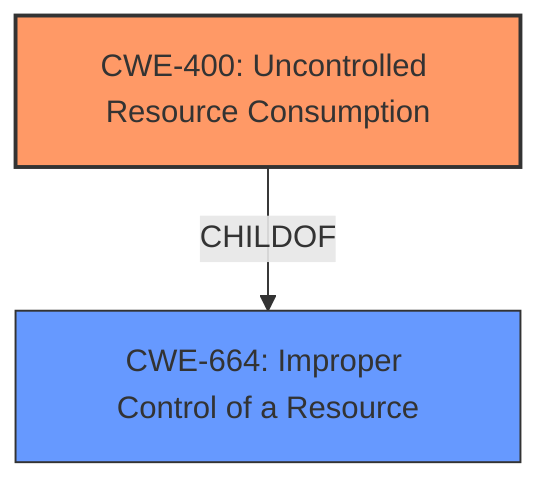

# Analysis Report for CVE-2021-22965

# Vulnerability Analysis Report: CVE-2021-22965

## Description


## Analysis (with Relationship Data)

# Summary
| CWE ID | CWE Name | Confidence | CWE Abstraction Level | CWE Vulnerability Mapping Label | CWE-Vulnerability Mapping Notes |
|---|---|---|---|---|---|
| CWE-400 | Uncontrolled Resource Consumption | 0.75 | Class | Primary | Discouraged, but selected because it directly addresses the **denial of service** caused by a **malformed request**. |

## Evidence and Confidence

*   **Confidence Score:** 0.75
*   **Evidence Strength:** MEDIUM

## Relationship Analysis
The primary relationship considered was the ChildOf relationship, specifically that CWE-400 (Uncontrolled Resource Consumption) is a child of CWE-664 (Improper Control of a Resource). This highlights the resource management aspect of the vulnerability. While CWE-400 is a Class-level CWE, the available information does not allow for a more specific Base-level mapping.



## Vulnerability Chain
The chain of events is as follows:
1.  **Malformed Request:** An unauthenticated administrator sends a malformed request.
2.  **Uncontrolled Resource Consumption (CWE-400):** The system fails to properly handle the malformed request, leading to excessive resource consumption.
3.  **Denial of Service:** The excessive resource consumption results in a denial of service.

The root cause is the **improper handling** of the malformed request, which leads to the impact of a denial of service.

## Summary of Analysis
The initial analysis focused on identifying the root cause of the denial of service. The vulnerability description explicitly mentions a "**denial of service**" caused by a "**malformed request**". The Retriever Results suggested CWE-400 (Uncontrolled Resource Consumption) as a potential match.

The selection of CWE-400 is primarily based on the vulnerability description's direct mention of a denial of service. While CWE-400 is discouraged, the provided information does not offer enough detail to identify a more specific Base-level CWE.

Relevant CWE Information:

# Enhanced Context (25 CWEs)

## CWE-400: Uncontrolled Resource Consumption
**Abstraction:** Class
**Status:** Draft

### Description
The product does not properly control the allocation and maintenance of a limited resource, thereby enabling an actor to influence the amount of resources consumed, eventually leading to the exhaustion of available resources.

### Mapping Guidance
**Usage:** Discouraged
**Rationale:** CWE-400 is intended for incorrect behaviors in which the product is expected to track and restrict how many resources it consumes, but CWE-400 is often misused because it is conflated with the "technical impact" of vulnerabilities in which resource consumption occurs. It is sometimes used for low-information vulnerability reports. It is a level-1 Class (i.e., a child of a Pillar).
**Comments:** Closely analyze the specific mistake that is causing resource consumption, and perform a CWE mapping for that mistake. Consider children/descendants such as CWE-770: Allocation of Resources Without Limits or Throttling, CWE-771: Missing Reference to Active Allocated Resource, CWE-410: Insufficient Resource Pool, CWE-772: Missing Release of Resource after Effective Lifetime, CWE-834: Excessive Iteration, CWE-405: Asymmetric Resource Consumption (Amplification), and others.

The vulnerability description states "A vulnerability in Pulse Connect Secure before 9.1R12.1 could allow an unauthenticated administrator to causes a **denial of service** when a **malformed request** is sent to the device."

Other CWEs Considered:

*   **CWE-444: Inconsistent Interpretation of HTTP Requests ('HTTP Request/Response Smuggling'):** While a malformed request is mentioned, there's no indication of inconsistent interpretation between different HTTP agents. Therefore, this CWE is not selected.
*   **CWE-287: Improper Authentication:** The description mentions an "unauthenticated administrator," but the core issue is the handling of the malformed request, not the authentication process itself. Therefore, this CWE is not selected as primary.
*   **CWE-1284: Improper Validation of Specified Quantity in Input:** It's possible the malformed request contains an improperly specified quantity, but this is not explicitly stated. Without more information, selecting this CWE would be speculative.
*   **CWE-789: Memory Allocation with Excessive Size Value:** Similar to CWE-1284, this is a possibility, but not explicitly stated.
*   **CWE-20: Improper Input Validation:** This is a general CWE and could apply, but is too broad.

The final decision is to assign CWE-400 (Uncontrolled Resource Consumption) due to its direct relevance to the reported denial of service. While it's a Class-level CWE and discouraged, the provided information doesn't allow for a more specific mapping.


## CWE Relationship Analysis

Current CWEs represent these abstraction levels: .


### Vulnerability Chain Analysis

**Chain starting from CWE-664:**
- 664 (Improper Control of a Resource Through its Lifetime) - ROOT


**Chain starting from CWE-834:**
- 834 (Excessive Iteration) - ROOT


### CWE Relationship Diagram

```mermaid
graph TD
    classDef primary fill:#f96,stroke:#333,stroke-width:2px
    classDef secondary fill:#69f,stroke:#333
    classDef tertiary fill:#9e9,stroke:#333
```


*Report generated on 2025-04-02 06:08:24*
