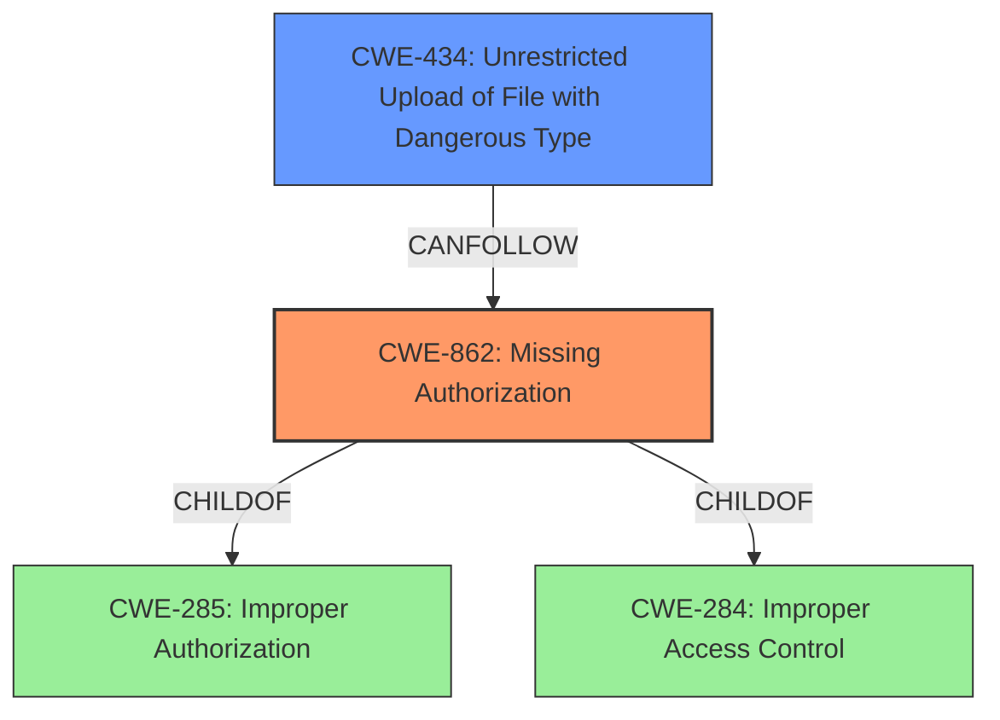

# Analysis Report for CVE-2021-23014

# Vulnerability Analysis Report: CVE-2021-23014

## Description


## Analysis (with Relationship Data)

# Summary
| CWE ID | CWE Name | Confidence | CWE Abstraction Level | CWE Vulnerability Mapping Label | CWE-Vulnerability Mapping Notes |
|---|---|---|---|---|---|
| CWE-862 | Missing Authorization | 1.0 | Class | Primary | Allowed-with-Review |
| CWE-434 | Unrestricted Upload of File with Dangerous Type | 0.7 | Base | Secondary | Allowed |

## Evidence and Confidence

*   **Confidence Score:** 0.85
*   **Evidence Strength:** HIGH

## Relationship Analysis
The primary CWE is CWE-862 **Missing Authorization**, which is a child of CWE-285 **Improper Authorization** and CWE-284 **Improper Access Control**. While CWE-862 is a Class-level CWE, it's the most specific and appropriate given the provided evidence. CWE-434 **Unrestricted Upload of File with Dangerous Type** can follow CWE-862 if authorization is missing and dangerous files can be uploaded.



## Vulnerability Chain
The vulnerability chain starts with **missing authorization checks** (CWE-862), leading to the ability to upload files, which could potentially be of a dangerous type (CWE-434) and cause further issues.

## Summary of Analysis
The vulnerability description clearly states "**missing authorization checks** for file uploads," which directly aligns with CWE-862 **Missing Authorization**. This is the primary weakness, as the system fails to verify if the authenticated user has the necessary privileges to perform the file upload.

The ability to upload files, particularly to a specific directory within the REST API, suggests that if the files uploaded are dangerous types, it could lead to further vulnerabilities (CWE-434 **Unrestricted Upload of File with Dangerous Type**). However, this is a secondary concern dependent on the type of files being uploaded and how they are handled.

The initial analysis focused on the **missing authorization checks** as the root cause. The retriever results supported this with CWE-862, CWE-863, and CWE-284 being among the top candidates. However, CWE-284 is a very high-level "Pillar" and the guidance discourages its use. CWE-863 is "Incorrect Authorization," which doesn't fit as well since the description indicates authorization is missing entirely, not incorrectly implemented.

The graph relationships reinforce the selection of CWE-862. It is a child of the more general CWEs related to access control and authorization. The CANFOLLOW relationship to CWE-434 highlights a potential chain of vulnerabilities.

The final selection is based on the explicit statement of "**missing authorization checks**" in the vulnerability description. CWE-862 is the most specific and appropriate representation of this weakness. While CWE-434 is a potential consequence, it's dependent on the nature of the uploaded files and is therefore considered a secondary issue. The selected CWEs are at the optimal level of specificity, with CWE-862 being a Class, but more specific than its parent Pillars.

Relevant CWE Information:

# Enhanced Context (25 CWEs)

## CWE-1289: Improper Validation of Unsafe Equivalence in Input
This CWE was considered but is not applicable as the vulnerability is not about improper validation of input equivalence.

## CWE-41: Improper Resolution of Path Equivalence
This CWE was considered but is not applicable as the vulnerability does not involve path equivalence issues.

## CWE-184: Incomplete List of Disallowed Inputs
This CWE was considered but is not directly relevant as the core issue is the lack of authorization, not an incomplete list of disallowed inputs.

## CWE-807: Reliance on Untrusted Inputs in a Security Decision
This CWE was considered but does not fit the primary issue, which is the absence of authorization checks.

## CWE-23: Relative Path Traversal
This CWE was considered but is not applicable as the vulnerability description does not mention path traversal.

## CWE-183: Permissive List of Allowed Inputs
This CWE was considered but is not applicable as the vulnerability description does not mention a permissive list of allowed inputs.

## CWE-73: External Control of File Name or Path
This CWE was considered but is not applicable as the vulnerability description does not mention external control of file names or paths.

## CWE-668: Exposure of Resource to Wrong Sphere
This CWE was considered but is too general and not as specific as CWE-862.

## CWE-36: Absolute Path Traversal
This CWE was considered but is not applicable as the vulnerability description does not mention absolute path traversal.

## CWE-639: Authorization Bypass Through User-Controlled Key
This CWE was considered but is not applicable as the vulnerability description does not mention user-controlled keys for authorization bypass.

## CWE-22: Improper Limitation of a Pathname to a Restricted Directory ('Path Traversal')
This CWE was considered but is not applicable as the vulnerability description does not mention path traversal.

## CWE-863: Incorrect Authorization
This CWE was considered, but it is less applicable than CWE-862 because the issue is not an incorrect authorization check, but the complete absence of one.

## CWE-285: Improper Authorization
This CWE was considered, but it is too general and not as specific as CWE-862.

## CWE-434: Unrestricted Upload of File with Dangerous Type
This CWE was selected as a secondary CWE.

## CWE-178: Improper Handling of Case Sensitivity
This CWE was considered but is not applicable as the vulnerability does not involve case sensitivity issues.

## CWE-430: Deployment of Wrong Handler
This CWE was considered but is not applicable as the vulnerability description does not mention deployment of a wrong handler.

## CWE-190: Integer Overflow or Wraparound
This CWE was considered but is not applicable as the vulnerability does not involve integer overflows or wraparounds.

## CWE-770: Allocation of Resources Without Limits or Throttling
This CWE was considered but is not applicable as the vulnerability does not involve resource allocation without limits or throttling.

## CWE-410: Insufficient Resource Pool
This CWE was considered but is not applicable as the vulnerability does not involve an insufficient resource pool.

## CWE-1284: Improper Validation of Specified Quantity in Input
This CWE was considered but is not applicable as the vulnerability does not involve validation of a specified quantity.

## CWE-789: Memory Allocation with Excessive Size Value
This CWE was considered but is not applicable as the vulnerability does not involve memory allocation with an excessive size value.

## CWE-252: Unchecked Return Value
This CWE was considered but is not applicable as the vulnerability does not involve unchecked return values.


## CWE Relationship Analysis

Current CWEs represent these abstraction levels: .


### Vulnerability Chain Analysis

**Chain starting from CWE-36:**
- 36 (Absolute Path Traversal) - ROOT


**Chain starting from CWE-862:**
- 862 (Missing Authorization) - ROOT


### CWE Relationship Diagram

```mermaid
graph TD
    classDef primary fill:#f96,stroke:#333,stroke-width:2px
    classDef secondary fill:#69f,stroke:#333
    classDef tertiary fill:#9e9,stroke:#333
```


*Report generated on 2025-04-01 23:04:24*
