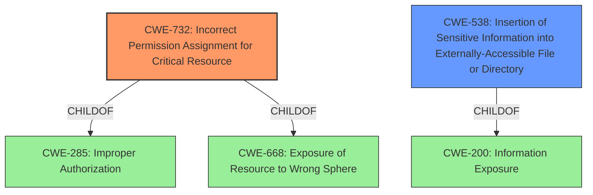

# Analysis Report for CVE-2021-23021

# Vulnerability Analysis Report: CVE-2021-23021

## Description


## Analysis (with Relationship Data)

# Summary
| CWE ID | CWE Name | Confidence | CWE Abstraction Level | CWE Vulnerability Mapping Label | CWE-Vulnerability Mapping Notes |
|---|---|---|---|---|---|
| CWE-732 | Incorrect Permission Assignment for Critical Resource | 1.0 | Class | Allowed-with-Review | Primary CWE |
| CWE-538 | Insertion of Sensitive Information into Externally-Accessible File or Directory | 0.7 | Base | Allowed | Secondary Candidate |

## Evidence and Confidence

*   **Confidence Score:** 0.9
*   **Evidence Strength:** HIGH

## Relationship Analysis
The primary relationship influencing the decision is the hierarchical relationship between CWE-732 (Class) and its potential children. While CWE-732 is a good starting point, the description notes that it is often misused and that lower-level CWEs might be more appropriate. However, in this case, there is no specific information about *why* the permissions are incorrect, only that they *are* incorrect. CWE-538 is a possible, more specific, Base CWE, but the description does not explicitly mention sensitive information is inserted.



## Vulnerability Chain
The vulnerability chain is relatively simple: **Incorrect Permission Assignment** (CWE-732) leading to world-readable access to the configuration file. If sensitive information is present, then **Exposure of Sensitive Information** (CWE-538) will follow.

## Summary of Analysis
The initial analysis identified CWE-732 as the most relevant CWE due to the **incorrect permission assignment** on the configuration file. The retriever results also ranked CWE-732 as the top candidate. The MITRE mapping guidance for CWE-732 suggests careful analysis to determine the specific mistake causing the resource exposure. However, the provided description lacks details beyond the fact that the file is world-readable.

The decision to classify this vulnerability as CWE-732 is based on the direct evidence from the vulnerability description stating that the "agent configuration file /etc/controller-agent/agent.conf is world readable with current permission bits set to 644." This directly aligns with the description of CWE-732, which covers scenarios where a security-critical resource has permissions that allow unintended actors to read or modify it.

Other CWEs were considered but ultimately deemed less appropriate. CWE-538 (Insertion of Sensitive Information into Externally-Accessible File or Directory) was considered a secondary candidate because, while likely, it's not explicitly stated that the configuration file *contains* sensitive information. It is only implied.

The selected CWE is at the optimal level of specificity given the available information. While a more specific CWE might exist if more details about the root cause were available, CWE-732 accurately captures the essence of the vulnerability based on the existing evidence.

Relevant CWE Information:

# Enhanced Context (25 CWEs)
The following CWEs were identified as potentially relevant to this vulnerability:

## CWE-538: Insertion of Sensitive Information into Externally-Accessible File or Directory
**Abstraction Level**: Base
**Similarity Score**: 0.77
**Source**: dense

**Description**:
The product places sensitive information into files or directories that are accessible to actors who are allowed to have access to the files, but not to the sensitive information.

**Mapping Guidance**:
- Usage: Allowed
- Rationale: This CWE entry is at the Base level of abstraction, which is a preferred level of abstraction for mapping to the root causes of vulnerabilities.

## CWE-732: Incorrect Permission Assignment for Critical Resource
**Abstraction:** Class
**Status:** Draft

### Description
The product specifies permissions for a security-critical resource in a way that allows that resource to be read or modified by unintended actors.

### Extended Description
When a resource is given a permission setting that provides access to a wider range of actors than required, it could lead to the exposure of sensitive information, or the modification of that resource by unintended parties. This is especially dangerous when the resource is related to program configuration, execution, or sensitive user data. For example, consider a misconfigured storage account for the cloud that can be read or written by a public or anonymous user.

### Alternative Terms
None

### Relationships
ChildOf -> CWE-285
ChildOf -> CWE-668

### Mapping Guidance
**Usage:** Allowed-with-Review
**Rationale:** While the name itself indicates an assignment of permissions for resources, this is often misused for vulnerabilities in which "permissions" are not checked, which is an "authorization" weakness (CWE-285 or descendants) within CWE's model [REF-1287].
**Comments:** Closely analyze the specific mistake that is allowing the resource to be exposed, and perform a CWE mapping for that mistake.
**Reasons:**
- Frequent Misuse


## CWE Relationship Analysis

Current CWEs represent these abstraction levels: .


### Vulnerability Chain Analysis

**Chain starting from CWE-732:**
- 732 (Incorrect Permission Assignment for Critical Resource) - ROOT


**Chain starting from CWE-538:**
- 538 (Insertion of Sensitive Information into Externally-Accessible File or Directory) - ROOT


### CWE Relationship Diagram

```mermaid
graph TD
    classDef primary fill:#f96,stroke:#333,stroke-width:2px
    classDef secondary fill:#69f,stroke:#333
    classDef tertiary fill:#9e9,stroke:#333
```


*Report generated on 2025-04-02 08:35:49*
