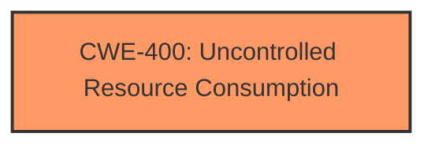

# Raw Analyzer Response for CVE-2021-23030

# Summary
| CWE ID | CWE Name | Confidence | CWE Abstraction Level | CWE Vulnerability Mapping Label | CWE-Vulnerability Mapping Notes |
|---|---|---|---|---|---|
| CWE-400 | Uncontrolled Resource Consumption | 0.75 | Class | Primary | Discouraged |

## Evidence and Confidence

*   **Confidence Score:** 0.75
*   **Evidence Strength:** MEDIUM

## Relationship Analysis
The primary CWE selected is CWE-400, which is a Class-level CWE. While there are more specific child CWEs, the current description doesn't provide enough information to pinpoint the exact resource that is being exhausted or the specific mechanism causing it. The relationship analysis primarily focuses on the parent-child relationship between CWE-400 and its potential children (e.g., CWE-770, CWE-771), but the lack of specifics prevents a more precise mapping.

## Vulnerability Chain
The vulnerability chain is relatively simple:
1.  **Undisclosed requests** (Root Cause)
2.  **Uncontrolled Resource Consumption** (CWE-400)
3.  **bd terminates** (Impact - Denial of Service)

The description focuses on the impact (service termination) and the trigger (undisclosed requests), but lacks details on the specific resource consumption issue.

## Summary of Analysis
The initial analysis focused on identifying the root cause of the vulnerability, which appears to be related to how the BIG-IP Advanced WAF and ASM handle undisclosed requests when a WebSocket profile is configured. The key phrase "bd to terminate" indicates a denial-of-service (DoS) condition. The primary CWE match from similar CVE descriptions is CWE-NVD-noinfo, which is not a suitable mapping.

Based on the vulnerability description and the retriever results, CWE-400 (Uncontrolled Resource Consumption) seems like the most appropriate CWE. This CWE describes scenarios where a product doesn't properly control the allocation and maintenance of a limited resource, leading to resource exhaustion. In this case, undisclosed requests could be triggering the consumption of resources (e.g., memory, CPU), ultimately causing the 'bd' process to terminate.

The MITRE mapping guidance for CWE-400 discourages its use, recommending more specific children. However, given the limited information in the description, selecting a more specific CWE would be speculative. The evidence available points to a resource consumption issue, but the exact nature of the resource and the control mechanism are not disclosed.

The final decision to use CWE-400 is based on the available evidence suggesting uncontrolled resource usage leading to a denial-of-service. While more specificity would be ideal, the provided information is insufficient for a more precise mapping.

Relevant CWE Information:

# Enhanced Context (25 CWEs)
The following CWEs were identified as potentially relevant to this vulnerability:

## CWE-74: Improper Neutralization of Special Elements in Output Used by a Downstream Component ('Injection')
**Abstraction Level**: Class
**Similarity Score**: 0.78
**Source**: dense

**Description**:
The product constructs all or part of a command, data structure, or record using externally-influenced input from an upstream component, but it does not neutralize or incorrectly neutralizes special elements that could modify how it is parsed or interpreted when it is sent to a downstream component.

**Mapping Guidance**:
- Usage: Discouraged
- Rationale: CWE-74 is high-level and often misused when lower-level weaknesses are more appropriate.

*Not Selected:* This CWE is related to injection vulnerabilities, which does not appear to be the case here.

## CWE-1289: Improper Validation of Unsafe Equivalence in Input
**Abstraction Level**: Base
**Similarity Score**: 0.77
**Source**: dense

**Description**:
The product receives an input value that is used as a resource identifier or other type of reference, but it does not validate or incorrectly validates that the input is equivalent to a potentially-unsafe value.

**Mapping Guidance**:
- Usage: Allowed
- Rationale: This CWE entry is at the Base level of abstraction, which is a preferred level of abstraction for mapping to the root causes of vulnerabilities.

*Not Selected:* There is no evidence for this weakness being present in the vulnerability description.

## CWE-99: Improper Control of Resource Identifiers ('Resource Injection')
**Abstraction Level**: Class
**Similarity Score**: 0.77
**Source**: dense

**Description**:
The product receives input from an upstream component, but it does not restrict or incorrectly restricts the input before it is used as an identifier for a resource that may be outside the intended sphere of control.

**Mapping Guidance**:
- Usage: Allowed-with-Review
- Rationale: This CWE entry is a Class and might have Base-level children that would be more appropriate

*Not Selected:* There is no evidence for this weakness being present in the vulnerability description.

## CWE-184: Incomplete List of Disallowed Inputs
**Abstraction Level**: Base
**Similarity Score**: 0.77
**Source**: dense

**Description**:
The product implements a protection mechanism that relies on a list of inputs (or properties of inputs) that are not allowed by policy or otherwise require other action to neutralize before additional processing takes place, but the list is incomplete.

**Mapping Guidance**:
- Usage: Allowed
- Rationale: This CWE entry is at the Base level of abstraction, which is a preferred level of abstraction for mapping to the root causes of vulnerabilities.

*Not Selected:* There is no evidence for this weakness being present in the vulnerability description.

## CWE-807: Reliance on Untrusted Inputs in a Security Decision
**Abstraction Level**: Base
**Similarity Score**: 0.76
**Source**: dense

**Description**:
The product uses a protection mechanism that relies on the existence or values of an input, but the input can be modified by an untrusted actor in a way that bypasses the protection mechanism.

**Mapping Guidance**:
- Usage: Allowed
- Rationale: This CWE entry is at the Base level of abstraction, which is a preferred level of abstraction for mapping to the root causes of vulnerabilities.

*Not Selected:* There is no evidence for this weakness being present in the vulnerability description.

## CWE-405: Asymmetric Resource Consumption (Amplification)
**Abstraction Level**: Class
**Similarity Score**: 0.76
**Source**: dense

**Description**:
The product does not properly control situations in which an adversary can cause the product to consume or produce excessive resources without requiring the adversary to invest equivalent work or otherwise prove authorization, i.e., the adversary's influence is "asymmetric."

**Mapping Guidance**:
- Usage: Allowed-with-Review
- Rationale: This CWE entry is a Class and might have Base-level children that would be more appropriate

*Not Selected:* While resource consumption is involved, there is no evidence of amplification.

## CWE-799: Improper Control of Interaction Frequency
**Abstraction Level**: Class
**Similarity Score**: 0.75
**Source**: dense

**Description**:
The product does not properly limit the number or frequency of interactions that it has with an actor, such as the number of incoming requests.

**Mapping Guidance**:
- Usage: Allowed-with-Review
- Rationale: This CWE entry is a Class and might have Base-level children that would be more appropriate

*Not Selected:* This CWE could be considered as a possible candidate, however, the description only mentions 'undisclosed requests' and not explicitly about the frequency of interactions.

## CWE-138: Improper Neutralization of Special Elements
**Abstraction Level**: Class
**Similarity Score**: 0.75
**Source**: dense

**Description**:
The product receives input from an upstream component, but it does not neutralize or incorrectly neutralizes special elements that could be interpreted as control elements or syntactic markers when they are sent to a downstream component.

**Mapping Guidance**:
- Usage: Discouraged
- Rationale: This CWE entry is a level-1 Class (i.e., a child of a Pillar). It might have lower-level children that would be more appropriate

*Not Selected:* This CWE is related to neutralization, which does not appear to be the case here.

## CWE-80: Improper Neutralization of Script-Related HTML Tags in a Web Page (Basic XSS)
**Abstraction Level**: Variant
**Similarity Score**: 0.75
**Source**: dense

**Description**:
The product receives input from an upstream component, but it does not neutralize or incorrectly neutralizes special characters such as "<", ">", and "&" that could be interpreted as web-scripting elements when they are sent to a downstream component that processes web pages.

**Mapping Guidance**:
- Usage: Allowed
- Rationale: This CWE entry is at the Variant level of abstraction, which is a preferred level of abstraction for mapping to the root causes of vulnerabilities.

*Not Selected:* This CWE is related to XSS, which does not appear to be the case here.

## CWE-183: Permissive List of Allowed Inputs
**Abstraction Level**: Base
**Similarity Score**: 0.74
**Source**: dense

**Description**:
The product implements a