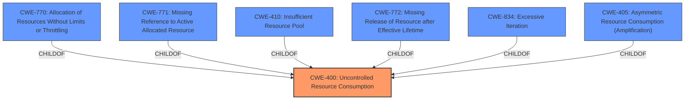

# Enhanced Analysis for CVE-2021-23034

# Summary
| CWE ID | CWE Name | Confidence | CWE Abstraction Level | CWE Vulnerability Mapping Label | CWE-Vulnerability Mapping Notes |
|---|---|---|---|---|---|
| CWE-400 | Uncontrolled Resource Consumption | 0.8 | Class | Discouraged | The product does not properly control the allocation and maintenance of a limited resource, thereby enabling an actor to influence the amount of resources consumed, eventually leading to the exhaustion of available resources. |

## Evidence and Confidence

*   **Confidence Score:** 0.8
*   **Evidence Strength:** MEDIUM

## Relationship Analysis
The primary CWE is CWE-400, which is a Class-level CWE. While there are no direct child CWEs that seem to fit perfectly, the description of CWE-400 aligns with the vulnerability's impact of the TMM process terminating due to undisclosed requests.



## Vulnerability Chain
The vulnerability chain is as follows:
1.  Undisclosed requests are sent to the BIG-IP device.
2.  The DNS profile using a DNS cache resolver processes these requests.
3.  The Traffic Management Microkernel (TMM) process terminates due to **uncontrolled resource consumption**.
4.  This leads to a denial-of-service condition.

In this case, the root cause is the **uncontrolled resource consumption** within the TMM process, and the impact is the TMM process termination.

## Summary of Analysis
Based on the provided evidence, the most appropriate CWE is CWE-400 **Uncontrolled Resource Consumption**. The vulnerability description indicates that undisclosed requests can cause the TMM process to terminate, which aligns with the concept of a denial-of-service due to resource exhaustion.

The vulnerability description key phrases highlight the **impact** as "Traffic Management Microkernel (TMM) process termination," suggesting resource exhaustion. The retriever results also list CWE-400 as the top combined result.

CWE-400 is a Class-level CWE, and the mapping guidance discourages its use in low-information vulnerability reports, suggesting consideration of its children. However, without more specific information about the exact mechanism causing the resource consumption (e.g., excessive memory allocation, CPU usage, etc.), a more specific child CWE cannot be confidently selected. The vulnerability description mentions "undisclosed requests," which hints at a potential input validation issue, but the primary problem appears to be the lack of resource control when processing these requests.

Other CWEs Considered:

*   CWE-119: Improper Restriction of Operations within the Bounds of a Memory Buffer - While a memory buffer issue might be present, the description focuses more on the process termination, suggesting resource exhaustion as the primary issue.
*   CWE-770: Allocation of Resources Without Limits or Throttling - This is a child of CWE-400 and a strong candidate, but there isn't explicit evidence of unlimited allocation.
*   CWE-789: Memory Allocation with Excessive Size Value - Similar to CWE-770, this requires more explicit evidence of excessive memory allocation based on untrusted size values.

The decision to use CWE-400 is based primarily on the **impact** of the vulnerability, which is the termination of the TMM process. This suggests a denial-of-service condition due to **uncontrolled resource consumption**.

Relevant CWE Information:

**Vulnerability Description Key Phrases**
-   **impact:** Traffic Management Microkernel (TMM) process termination

**Retriever Results**
-   CWE-400: Uncontrolled Resource Consumption
    -   Abstraction: Class
    -   Usage: Discouraged


## CWE Relationship Analysis

Current CWEs represent these abstraction levels: .


### Vulnerability Chain Analysis

**Chain starting from CWE-834:**
- 834 (Excessive Iteration) - ROOT


**Chain starting from CWE-410:**
- 410 (Insufficient Resource Pool) - ROOT


### CWE Relationship Diagram

```mermaid
graph TD
    classDef primary fill:#f96,stroke:#333,stroke-width:2px
    classDef secondary fill:#69f,stroke:#333
    classDef tertiary fill:#9e9,stroke:#333
```