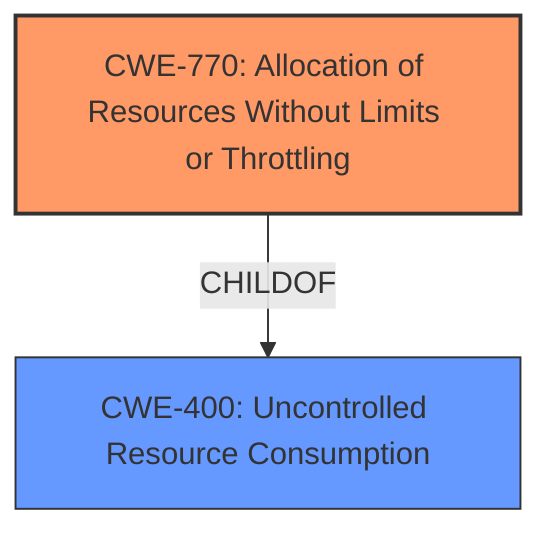

# Analysis Report for CVE-2021-23053

# Vulnerability Analysis Report: CVE-2021-23053

## Description


## Analysis (with Relationship Data)

# Summary
| CWE ID  | CWE Name                                                     | Confidence | CWE Abstraction Level | CWE Vulnerability Mapping Label | CWE-Vulnerability Mapping Notes |
| :-------- | :----------------------------------------------------------- | :--------- | :-------------------- | :------------------------------ | :------------------------------ |
| CWE-770   | Allocation of Resources Without Limits or Throttling       | 0.9        | Base                  | Primary CWE                     | Allowed                       |
| CWE-400   | Uncontrolled Resource Consumption                          | 0.7        | Class                 | Secondary CWE                   | Discouraged                    |

## Evidence and Confidence

*   **Confidence Score:** 0.8
*   **Evidence Strength:** HIGH

## Relationship Analysis
The primary CWE is CWE-770, which is a child of CWE-400. This indicates a hierarchical relationship where CWE-770 provides a more specific classification of the uncontrolled resource consumption issue. CWE-400 is a class-level CWE, while CWE-770 is a base-level CWE, making CWE-770 a preferred choice for its specificity. The relationship shows that the **lack of limits on resource allocation** (CWE-770) leads to **uncontrolled resource consumption** (CWE-400), ultimately causing the MySQL database to run out of disk space.



## Vulnerability Chain
The vulnerability chain starts with the **lack of a row limit on undisclosed tables** (CWE-770), which leads to the MySQL database running out of disk space. The brute force attack exacerbates this issue by rapidly filling the tables, accelerating the resource exhaustion.

## Summary of Analysis
The analysis is primarily based on the provided evidence, which includes the vulnerability description and key phrases. The vulnerability description clearly states the **root cause** as a **lack of row limit on undisclosed tables**, leading to resource exhaustion. The phrase "**lack of row limit**" strongly suggests CWE-770: Allocation of Resources Without Limits or Throttling.

The graph relationships confirm that CWE-770 is a more specific child of CWE-400, making it a better choice for classification. The mapping guidance for CWE-400 discourages its use when more specific mappings are available, further supporting the selection of CWE-770.

The selected CWEs are at the optimal level of specificity because CWE-770 directly addresses the **root cause** of the vulnerability, which is the **unrestricted allocation of resources**. While CWE-400 describes the overall resource consumption issue, CWE-770 pinpoints the specific mechanism causing it.

Relevant CWE Information:

# Enhanced Context (25 CWEs)
The following CWEs were identified as potentially relevant to this vulnerability:

## CWE-405: Asymmetric Resource Consumption (Amplification)
**Abstraction Level**: Class
**Similarity Score**: 0.77
**Source**: dense

**Description**:
The product does not properly control situations in which an adversary can cause the product to consume or produce excessive resources without requiring the adversary to invest equivalent work or otherwise prove authorization, i.e., the adversary's influence is "asymmetric."

**Mapping Guidance**:
- Usage: Allowed-with-Review
- Rationale: This CWE entry is a Class and might have Base-level children that would be more appropriate

*Rationale for not selecting this CWE:* While the brute force attack amplifies the effect of the vulnerability, the **root cause** is the **lack of resource limits**, not an inherent asymmetry in resource consumption.

## CWE-799: Improper Control of Interaction Frequency
**Abstraction Level**: Class
**Similarity Score**: 0.77
**Source**: dense

**Description**:
The product does not properly limit the number or frequency of interactions that it has with an actor, such as the number of incoming requests.

**Mapping Guidance**:
- Usage: Allowed-with-Review
- Rationale: This CWE entry is a Class and might have Base-level children that would be more appropriate

*Rationale for not selecting this CWE:* The **lack of row limits** isn't directly about limiting the number of interactions, but about how those interactions consume resources without bounds.

## CWE-807: Reliance on Untrusted Inputs in a Security Decision
**Abstraction Level**: Base
**Similarity Score**: 0.76
**Source**: dense

**Description**:
The product uses a protection mechanism that relies on the existence or values of an input, but the input can be modified by an untrusted actor in a way that bypasses the protection mechanism.

**Mapping Guidance**:
- Usage: Allowed
- Rationale: This CWE entry is at the Base level of abstraction, which is a preferred level of abstraction for mapping to the root causes of vulnerabilities.

*Rationale for not selecting this CWE:* This CWE doesn't fit as there's no direct evidence of relying on untrusted inputs for a security decision related to the resource exhaustion.

## CWE-1289: Improper Validation of Unsafe Equivalence in Input
**Abstraction Level**: Base
**Similarity Score**: 0.76
**Source**: dense

**Description**:
The product receives an input value that is used as a resource identifier or other type of reference, but it does not validate or incorrectly validates that the input is equivalent to a potentially-unsafe value.

**Mapping Guidance**:
- Usage: Allowed
- Rationale: This CWE entry is at the Base level of abstraction, which is a preferred level of abstraction for mapping to the root causes of vulnerabilities.

*Rationale for not selecting this CWE:* This CWE is not applicable as the vulnerability is due to **lack of row limit**, not validation of input equivalence.

## CWE-404: Improper Resource Shutdown or Release
**Abstraction Level**: Class
**Similarity Score**: 0.76
**Source**: dense

**Description**:
The product does not release or incorrectly releases a resource before it is made available for re-use.

**Mapping Guidance**:
- Usage: Allowed-with-Review
- Rationale: This CWE entry is a Class and might have Base-level children that would be more appropriate

*Rationale for not selecting this CWE:* This CWE is not applicable as the vulnerability is due to **lack of row limit**, not related to shutdown or release of resources.

## CWE-226: Sensitive Information in Resource Not Removed Before Reuse
**Abstraction Level**: Base
**Similarity Score**: 0.75
**Source**: dense

**Description**:
The product releases a resource such as memory or a file so that it can be made available for reuse, but it does not clear or "zeroize" the information contained in the resource before the product performs a critical state transition or makes the resource available for reuse by other entities.

**Mapping Guidance**:
- Usage: Allowed
- Rationale: This CWE entry is at the Base level of abstraction, which is a preferred level of abstraction for mapping to the root causes of vulnerabilities.

*Rationale for not selecting this CWE:* This CWE is not applicable as the vulnerability is due to **lack of row limit**, not related to sensitive information.

## CWE-668: Exposure of Resource to Wrong Sphere
**Abstraction Level**: Class
**Similarity Score**: 0.75
**Source**: dense

**Description**:
The product exposes a resource to the wrong control sphere, providing unintended actors with inappropriate access to the resource.

**Mapping Guidance**:
- Usage: Discouraged
- Rationale: CWE-668 is high-level and is often misused as a catch-all when lower-level CWE IDs might be applicable. It is sometimes used for low-information vulnerability reports [REF-1287]. It is a level-1 Class (i.e., a child of a Pillar). It is not useful for trend analysis.

*Rationale for not selecting this CWE:* This CWE is not applicable as the vulnerability is due to **lack of row limit**, not exposure of resources.

## CWE-41: Improper Resolution of Path Equivalence
**Abstraction Level**: Base
**Similarity Score**: 0.75
**Source**: dense

**Description**:
The product is vulnerable to file system contents disclosure through path equivalence. Path equivalence involves the use of special characters in file and directory names. The associated manipulations are intended to generate multiple names for the same object.

**Mapping Guidance**:
- Usage: Allowed
- Rationale: This CWE entry is at the Base level of abstraction, which is a preferred level of abstraction for mapping to the root causes of vulnerabilities.

*Rationale for not selecting this CWE:* This CWE is not applicable as the vulnerability is due to **lack of row limit**, not related to path equivalence.

## CWE-667: Improper Locking
**Abstraction Level**: Class
**Similarity Score**: 0.75
**Source**: dense

**Description**:
The product does not properly acquire or release a lock on a resource, leading to unexpected resource state changes and behaviors.

**Mapping Guidance**:
- Usage


## CWE Relationship Analysis

Current CWEs represent these abstraction levels: .


### Vulnerability Chain Analysis

**Chain starting from CWE-667:**
- 667 (Improper Locking) - ROOT


**Chain starting from CWE-404:**
- 404 (Improper Resource Shutdown or Release) - ROOT


### CWE Relationship Diagram

```mermaid
graph TD
    classDef primary fill:#f96,stroke:#333,stroke-width:2px
    classDef secondary fill:#69f,stroke:#333
    classDef tertiary fill:#9e9,stroke:#333
```


*Report generated on 2025-04-02 03:52:13*
