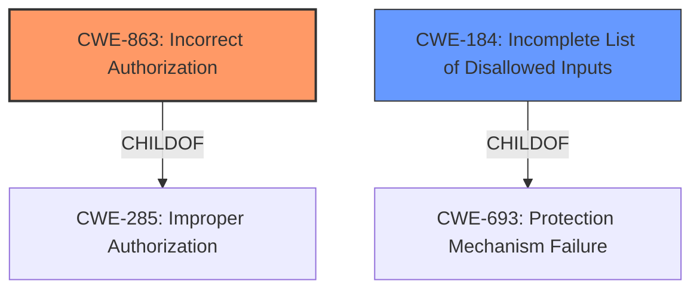

# Analysis for CVE-2021-23055

# Summary
| CWE ID | CWE Name | Confidence | CWE Abstraction Level | CWE Vulnerability Mapping Label | CWE-Vulnerability Mapping Notes |
|---|---|---|---|---|---|
| CWE-863 | Incorrect Authorization | 0.8 | Class | Primary | Allowed-with-Review |
| CWE-184 | Incomplete List of Disallowed Inputs | 0.6 | Base | Secondary | Allowed |

## Evidence and Confidence

*   **Confidence Score:** 0.7
*   **Evidence Strength:** MEDIUM

## Relationship Analysis
The primary CWE is CWE-863 (Incorrect Authorization), which falls under the broader category of CWE-285 (Improper Authorization). CWE-863 is a class-level CWE, and the guidance suggests examining child CWEs for a better fit. CWE-184 (Incomplete List of Disallowed Inputs) is included as a secondary CWE because the command line restriction is essentially a list of disallowed inputs that is incomplete due to not applying to Ingress objects. It is a base-level CWE, which is preferred.

## Vulnerability Chain
The vulnerability chain starts with the **incorrect authorization** mechanism (CWE-863) due to the command line restriction not applying to Ingress objects. This can be seen as an **incomplete list of disallowed inputs** (CWE-184) because the Ingress objects are not being checked against the command line restrictions. The final impact is the ability to bypass intended restrictions, potentially leading to further exploitation depending on the commands that can be executed.

## Summary of Analysis
The initial assessment considered CWE-863 as the primary weakness, supported by the description stating the command line restriction "does not apply to Ingress objects". This indicates an **incorrect authorization**. The secondary weakness, CWE-184, is included because the command line restriction can be seen as a list of disallowed inputs, and this list is **incomplete** because it does not include Ingress objects.

The relationship graph shows that CWE-863 is a child of CWE-285, representing a more specific type of authorization issue. CWE-184 is a child of CWE-693 "Protection Mechanism Failure".

The final decision favors CWE-863 as the primary weakness because the core issue is that the authorization check is not being correctly performed for Ingress objects. CWE-184 provides additional context, highlighting that the command-line restriction list is incomplete. Both CWEs are at appropriate levels of specificity, with CWE-863 at the Class level and CWE-184 at the Base level. The analysis is based on the provided evidence, specifically the vulnerability description.

Relevant CWE Information:

# Enhanced Context (25 CWEs)
The following CWEs were identified as potentially relevant to this vulnerability:

## CWE-1220: Insufficient Granularity of Access Control
**Abstraction Level**: Base
**Similarity Score**: 0.75
**Source**: dense

**Description**:
The product implements access controls via a policy or other feature with the intention to disable or restrict accesses (reads and/or writes) to assets in a system from untrusted agents. However, implemented access controls lack required granularity, which renders the control policy too broad because it allows accesses from unauthorized agents to the security-sensitive assets.

**Mapping Guidance**:
- Usage: Allowed
- Rationale: This CWE entry is at the Base level of abstraction, which is a preferred level of abstraction for mapping to the root causes of vulnerabilities.

*This was not chosen, because the vulnerability is not due to the access control lacking granularity.*

## CWE-653: Improper Isolation or Compartmentalization
**Abstraction Level**: Class
**Similarity Score**: 0.75
**Source**: dense

**Description**:
The product does not properly compartmentalize or isolate functionality, processes, or resources that require different privilege levels, rights, or permissions.

**Mapping Guidance**:
- Usage: Allowed
- Rationale: This CWE entry is at the Base level of abstraction, which is a preferred level of abstraction for mapping to the root causes of vulnerabilities.

*This was not chosen because the description of the vulnerability does not seem to involve the isolation or compartmentalization of functionality, processes, or resources.*

## CWE-807: Reliance on Untrusted Inputs in a Security Decision
**Abstraction Level**: Base
**Similarity Score**: 0.75
**Source**: dense

**Description**:
The product uses a protection mechanism that relies on the existence or values of an input, but the input can be modified by an untrusted actor in a way that bypasses the protection mechanism.

**Mapping Guidance**:
- Usage: Allowed
- Rationale: This CWE entry is at the Base level of abstraction, which is a preferred level of abstraction for mapping to the root causes of vulnerabilities.

*This was not chosen because the vulnerability is not clearly about relying on untrusted inputs.*

## CWE-274: Improper Handling of Insufficient Privileges
**Abstraction Level**: Base
**Similarity Score**: 0.75
**Source**: dense

**Description**:
The product does not handle or incorrectly handles when it has insufficient privileges to perform an operation, leading to resultant weaknesses.

**Mapping Guidance**:
- Usage: Discouraged
- Rationale: This CWE entry could be deprecated in a future version of CWE.

*This was not chosen because the vulnerability is not about handling insufficient privileges.*

## CWE-664: Improper Control of a Resource Through its Lifetime
**Abstraction Level**: Pillar
**Similarity Score**: 0.74
**Source**: dense

**Description**:
The product does not maintain or incorrectly maintains control over a resource throughout its lifetime of creation, use, and release.

**Mapping Guidance**:
- Usage: Discouraged
- Rationale: This CWE entry is high-level when lower-level children are available.

*This was not chosen because this is a high-level CWE.*

## CWE-1289: Improper Validation of Unsafe Equivalence in Input
**Abstraction Level**: Base
**Similarity Score**: 0.74
**Source**: dense

**Description**:
The product receives an input value that is used as a resource identifier or other type of reference, but it does not validate or incorrectly validates that the input is equivalent to a potentially-unsafe value.

**Mapping Guidance**:
- Usage: Allowed
- Rationale: This CWE entry is at the Base level of abstraction, which is a preferred level of abstraction for mapping to the root causes of vulnerabilities.

*This was not chosen because the vulnerability isn't about validating unsafe equivalence in input.*

## CWE-280: Improper Handling of Insufficient Permissions or Privileges 
**Abstraction Level**: Base
**Similarity Score**: 0.74
**Source**: dense

**Description**:
The product does not handle or incorrectly handles when it has insufficient privileges to access resources or functionality as specified by their permissions. This may cause it to follow unexpected code paths that may leave the product in an invalid state.

**Mapping Guidance**:
- Usage: Allowed
- Rationale: This CWE entry is at the Base level of abstraction, which is a preferred level of abstraction for mapping to the root causes of vulnerabilities.

*This was not chosen because the vulnerability is not about handling insufficient permissions or privileges.*

## CWE-183: Permissive List of Allowed Inputs
**Abstraction Level**: Base
**Similarity Score**: 0.74
**Source**: dense

**Description**:
The product implements a protection mechanism that relies on a list of inputs (or properties of inputs) that are explicitly allowed by policy because the inputs are assumed to be safe, but the list is too permissive - that is, it allows an input that is unsafe, leading to resultant weaknesses.

**Mapping Guidance**:
- Usage: Allowed
- Rationale: This CWE entry is at the Base level of abstraction, which is a preferred level of abstraction for mapping to the root causes of vulnerabilities.

*This was not chosen, because it's not due to the list of allowed inputs being too permissive.*

## CWE-799: Improper Control of Interaction Frequency
**Abstraction Level**: Class
**Similarity Score**: 0.73
**Source**: dense

**Description**:
The product does not properly limit the number or frequency of interactions that it has with an actor, such as the number of incoming requests.

**Mapping Guidance**:
- Usage: Allowed-with-Review
- Rationale: This CWE entry is a Class and might have Base-level children that would be more appropriate

*This was not chosen because the vulnerability isn't about limiting the interaction frequency.*

## CWE-22: Improper Limitation of a Pathname to a Restricted Directory ('Path Traversal')
**Abstraction Level**: Base
**Similarity Score**: 70