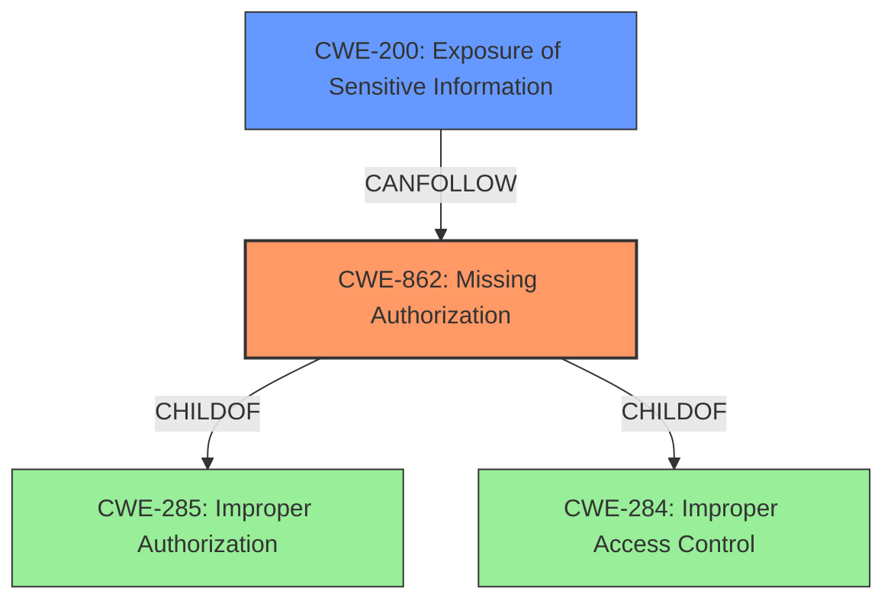

# Analysis for CVE-2021-23123

# Summary
| CWE ID | CWE Name | Confidence | CWE Abstraction Level | CWE Vulnerability Mapping Label | CWE-Vulnerability Mapping Notes |
|---|---|---|---|---|---|
| CWE-862 | Missing Authorization | 0.9 | Class | Allowed-with-Review | Primary CWE: The **lack of ACL checks** in the `orderPosition` endpoint directly corresponds to the absence of authorization checks. |
| CWE-200 | Exposure of Sensitive Information | 0.7 | Class | Allowed | Secondary CWE: The **impact** of this vulnerability is the **leak** of names of unpublished and/or inaccessible modules, indicating sensitive information exposure. |

## Evidence and Confidence

*   **Confidence Score:** 0.8
*   **Evidence Strength:** HIGH

## Relationship Analysis
The primary CWE is CWE-862, Missing Authorization, a Class-level CWE. It is a child of CWE-285, Improper Authorization, and CWE-284, Improper Access Control. The vulnerability description explicitly states a **lack of ACL checks**, directly mapping to the absence of authorization. The secondary CWE is CWE-200, Exposure of Sensitive Information, also a Class-level CWE. It describes the **impact** of the vulnerability, where module names, normally inaccessible, are leaked.

## Vulnerability Chain
The vulnerability chain starts with the **lack of ACL checks** (CWE-862), leading to the exposure of names of unpublished and/or inaccessible modules (CWE-200). The root cause is the missing authorization check, and the impact is the information disclosure.

## Summary of Analysis
The analysis is based on the vulnerability description and CVE reference summary, which clearly state the **lack of ACL checks** as the root cause and the exposure of module names as the impact.

The vulnerability description states: "The **lack of ACL checks** in the orderPosition endpoint of com_modules leak names of unpublished and/or inaccessible modules."

The CVE reference summary states: "**Root cause of vulnerability:** Lack of Access Control List (ACL) checks in the `orderPosition` endpoint of the `com_modules` component."

CWE-862 aligns perfectly with the root cause. The **impact** is the information disclosure, which aligns with CWE-200, Exposure of Sensitive Information.

Other CWEs were considered but not used:

*   CWE-863 (Incorrect Authorization): This was not selected because the issue is a **lack** of authorization, not an incorrect authorization implementation.
*   CWE-284 (Improper Access Control): This is a high-level Pillar, and CWE-862 is a more specific child.
*   CWE-352 (Cross-Site Request Forgery (CSRF)): This is not applicable as the vulnerability is not related to CSRF.
*   CWE-359 (Exposure of Private Personal Information to an Unauthorized Actor): While information is exposed, it's not explicitly "private personal information".
*   CWE-639 (Authorization Bypass Through User-Controlled Key): This is not applicable because there is no user-controlled key involved in the authorization bypass.
*   CWE-201 (Insertion of Sensitive Information Into Sent Data): This is related to information exposure, but CWE-200 is more appropriate because it is about the **exposure** of information through data queries, not the **insertion** of the information into sent data.

The selected CWEs are at the optimal level of specificity, with CWE-862 representing the root cause and CWE-200 representing the impact.