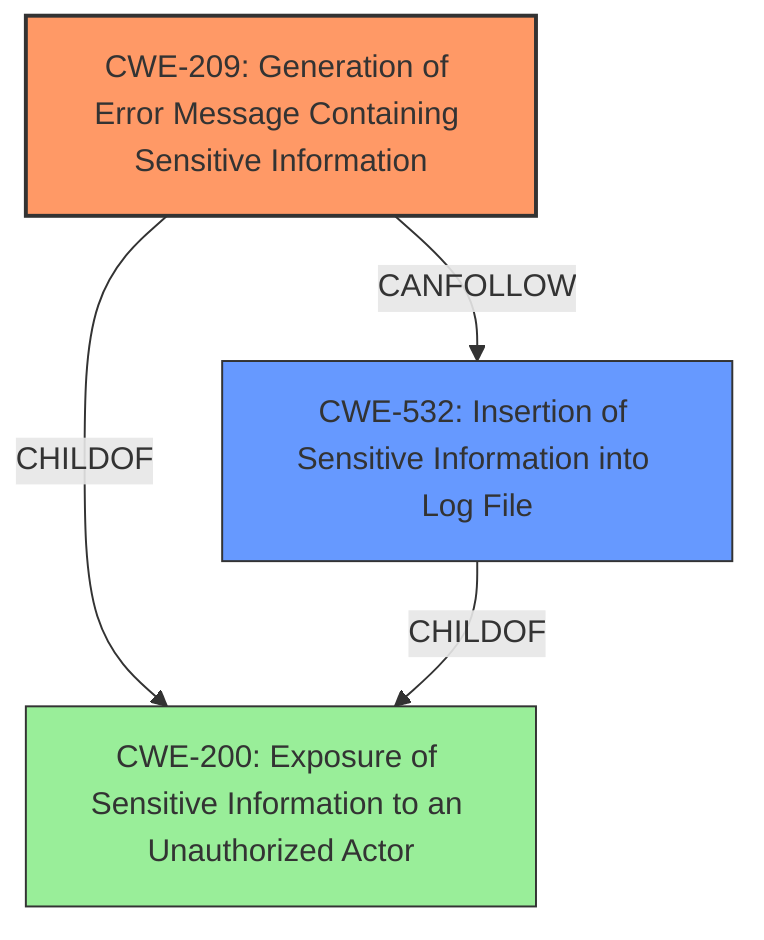

# Analysis for CVE-2021-23135

# Summary
| CWE ID  | CWE Name                                                                  | Confidence | CWE Abstraction Level | CWE Vulnerability Mapping Label | CWE-Vulnerability Mapping Notes |
| :------- | :------------------------------------------------------------------------ | :--------- | :---------------------- | :------------------------------ | :------------------------------ |
| CWE-209 | Generation of Error Message Containing Sensitive Information             | 0.95       | Base                    | Primary                         | Allowed                       |
| CWE-532 | Insertion of Sensitive Information into Log File                          | 0.85       | Base                    | Secondary                       | Allowed                       |
| CWE-200 | Exposure of Sensitive Information to an Unauthorized Actor                  | 0.60       | Class                   | Secondary                       | Discouraged                   |

## Evidence and Confidence

*   **Confidence Score:** 0.90
*   **Evidence Strength:** HIGH

## Relationship Analysis
The primary relationship influencing the selection was the ChildOf relationship, where CWE-209 is a child of CWE-200, providing a more specific classification. CWE-532, while also related to information exposure, is mapped as a secondary weakness since the initial exposure happens via error messages and then propagates to logs. The abstraction levels were considered, favoring the base level for CWE-209 and CWE-532.

## Vulnerability Chain
The vulnerability chain starts with a user providing invalid input while editing a `Secret` resource in the Argo CD UI. This leads to the generation of an error message containing the entire contents of the `Secret` (CWE-209). The error message is then logged (CWE-532), further increasing the risk of exposure and causing **Exposure of System Data to an Unauthorized Control Sphere** (CWE-200).
  - Root Cause: Incorrect error handling leading to sensitive data in error messages (CWE-209).
  - Weakness Propagation: Sensitive data being logged (CWE-532).
  - Impact: **Exposure of System Data to an Unauthorized Control Sphere** (CWE-200).

## Summary of Analysis
Initially, the vulnerability description points towards a general **Exposure of System Data to an Unauthorized Control Sphere**. However, the CVE Reference Links Content Summary reveals that the root cause is specifically the improper generation of error messages containing sensitive information (secrets) when a user provides invalid input to a secret resource. This sensitive information is then logged.

The retriever results also suggest CWE-209 (Generation of Error Message Containing Sensitive Information) as the top candidate, supported by a high sparse score. The description of CWE-209 aligns well with the vulnerability details: "The product generates an error message that includes sensitive information about its environment, users, or associated data." This directly reflects the scenario where Argo CD generates an error message containing the contents of the `Secret` resource.

CWE-532 is also selected as the error message is logged into a log file which then increases the exposure of sensitive data.

CWE-200 is considered but is too general as it describes a broad class of information exposure issues. The more specific CWE-209 and CWE-532 are more appropriate given the provided evidence.

The final decision is based on the evidence from the CVE Reference Links Content Summary that clearly indicates the **rootcause** is the improper handling of error messages and logging of secrets. The hierarchical relationships, particularly the ChildOf relationship between CWE-209 and CWE-200, and between CWE-532 and CWE-200, reinforces the selection of the more specific CWE-209 and CWE-532 to accurately represent the vulnerability.
The selection of CWE-209 and CWE-532 offers a more precise and actionable classification of the vulnerability, focusing on the specific coding error that leads to the information exposure.

Relevant CWE Information:

# Enhanced Context (25 CWEs)
The following CWEs were identified as potentially relevant to this vulnerability:

## CWE-335: Incorrect Usage of Seeds in Pseudo-Random Number Generator (PRNG)
**Abstraction Level**: Base
**Similarity Score**: 0.78
**Source**: dense

**Description**:
The product uses a Pseudo-Random Number Generator (PRNG) but does not correctly manage seeds.

**Mapping Guidance**:
- Usage: Allowed
- Rationale: This CWE entry is at the Base level of abstraction, which is a preferred level of abstraction for mapping to the root causes of vulnerabilities.

*Not Selected*: Irrelevant to the vulnerability description.

## CWE-330: Use of Insufficiently Random Values
**Abstraction Level**: Class
**Similarity Score**: 0.78
**Source**: dense

**Description**:
The product uses insufficiently random numbers or values in a security context that depends on unpredictable numbers.

**Mapping Guidance**:
- Usage: Discouraged
- Rationale: This CWE entry is a level-1 Class (i.e., a child of a Pillar). It might have lower-level children that would be more appropriate

*Not Selected*: Irrelevant to the vulnerability description.

## CWE-538: Insertion of Sensitive Information into Externally-Accessible File or Directory
**Abstraction Level**: Base
**Similarity Score**: 0.76
**Source**: dense

**Description**:
The product places sensitive information into files or directories that are accessible to actors who are allowed to have access to the files, but not to the sensitive information.

**Mapping Guidance**:
- Usage: Allowed
- Rationale: This CWE entry is at the Base level of abstraction, which is a preferred level of abstraction for mapping to the root causes of vulnerabilities.

*Not Selected*: While related to information exposure, it's less specific than CWE-209 and CWE-532 in this case.

## CWE-226: Sensitive Information in Resource Not Removed Before Reuse
**Abstraction Level**: Base
**Similarity Score**: 0.76
**Source**: dense

**Description**:
The product releases a resource such as memory or a file so that it can be made available for reuse, but it does not clear or "zeroize" the information contained in the resource before the product performs a critical state transition or makes the resource available for reuse by other entities.

**Mapping Guidance**:
- Usage: Allowed
- Rationale: This CWE entry is at the Base level of abstraction, which is a preferred level of abstraction for mapping to the root causes of vulnerabilities.

*Not Selected*: Irrelevant to the vulnerability description.

## CWE-331: Insufficient Entropy
**Abstraction Level**: Base
**Similarity Score**: 0.75
**Source**: dense

**Description**:
The product uses an algorithm or scheme that produces insufficient entropy, leaving patterns or clusters of values that are more likely to occur than others.

**Mapping Guidance**:
- Usage: Allowed
- Rationale: This CWE entry is at the Base level of abstraction, which is a preferred level of abstraction for mapping to the root causes of vulnerabilities.

*Not Selected*: Irrelevant to the vulnerability description.

## CWE-345: Insufficient Verification of Data Authenticity
**Abstraction Level**: Class
**Similarity Score**: 0.74
**Source**: dense

**Description**:
The product does not sufficiently verify the origin or authenticity of data, in a way that causes it to accept invalid data.

**Mapping Guidance**:
- Usage: Discouraged
- Rationale: This CWE entry is a level-1 Class (i.e., a child of a Pillar). It might have lower-level children that would be more appropriate

*Not Selected*: Irrelevant to the vulnerability description.

## CWE-212: Improper Removal of Sensitive Information Before Storage or Transfer
**Abstraction Level**: Base
**Similarity Score**: 0.74
**Source**: dense

**Description**:
The product stores, transfers, or shares a resource that contains sensitive information, but it does not properly remove that information before the product makes the resource available to unauthorized actors.

**Mapping Guidance**:
- Usage: Allowed
- Rationale: This CWE entry is at the Base level of abstraction, which is a preferred level of abstraction for mapping to the root causes of vulnerabilities.

*Not Selected*: While related to information exposure, it is not directly related to error message generation or logging.

## CWE-668: Exposure of Resource to Wrong Sphere
**Abstraction Level**: Class
**Similarity Score**: 0.74
**Source**: dense

**Description**:
The product exposes a resource to the wrong control sphere, providing unintended actors with inappropriate access to