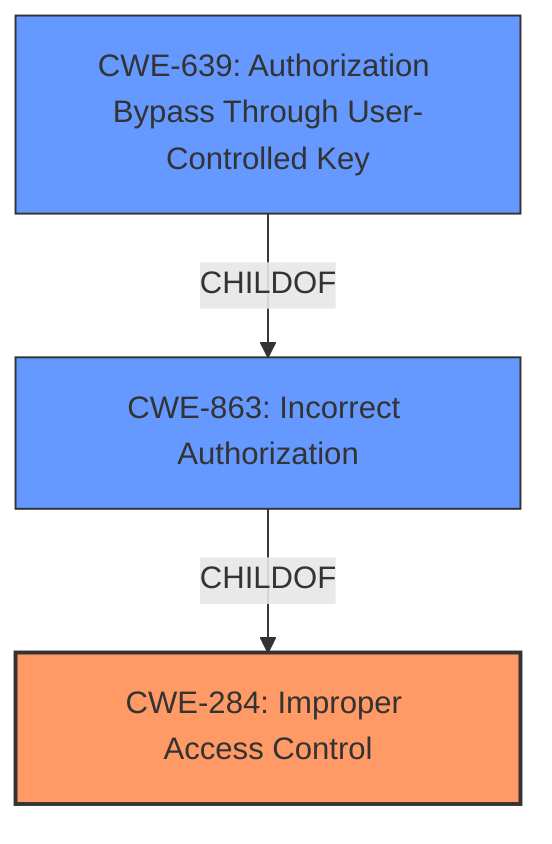

# Analysis Report for CVE-2021-23173

# Vulnerability Analysis Report: CVE-2021-23173

## Description


## Analysis (with Relationship Data)

# Summary
| CWE ID  | CWE Name                                                      | Confidence | CWE Abstraction Level | CWE Vulnerability Mapping Label | CWE-Vulnerability Mapping Notes |
| :-------- | :------------------------------------------------------------ | :---------- | :-------------------- | :------------------------------ | :------------------------------ |
| CWE-284 | Improper Access Control                                       | 0.75        | Pillar                | Primary                         | Discouraged                   |
| CWE-863 | Incorrect Authorization                                       | 0.75        | Class                 | Secondary                       | Allowed-with-Review           |
| CWE-639 | Authorization Bypass Through User-Controlled Key              | 0.6         | Base                  | Secondary                       | Allowed                       |

## Evidence and Confidence

*   **Confidence Score:** 0.7
*   **Evidence Strength:** HIGH

## Relationship Analysis
The primary CWE is CWE-284, which is a high-level Pillar. CWE-863 (Incorrect Authorization) and CWE-639 (Authorization Bypass Through User-Controlled Key) are both children of CWE-284, offering more specific classifications. CWE-639 is a child of CWE-863, representing an even more specific case of incorrect authorization. Choosing the right level of abstraction is important, as the description focuses on **improper access control**, suggesting a high-level issue but also contains details of how an authenticated user could gain unauthorized access, pushing towards more specific authorization-related CWEs.



## Vulnerability Chain
The vulnerability chain starts with the **improper access control**, which allows an authenticated user to bypass authorization checks and gain unauthorized access to sensitive data. The chain is as follows:

1.  **Improper Access Control** (CWE-284): The root cause is the failure to properly restrict access to sensitive data.
2.  **Incorrect Authorization** (CWE-863): This is a more specific form of access control failure, where authorization checks are either missing or implemented incorrectly.
3.  **Authorization Bypass Through User-Controlled Key** (CWE-639): A specific instance where a user can manipulate a key to gain access to unauthorized data.

## Summary of Analysis
The initial assessment points towards **improper access control**, as stated in the vulnerability description. However, the details provided suggest that the issue lies within the authorization mechanisms, specifically how an authenticated user can bypass these checks to access sensitive data.

The decision to include CWE-284 is based on the direct statement in the **Vulnerability Description Key Phrases**: "**rootcause:** **improper access control**". However, due to the high-level nature of CWE-284 and the advice against its use, it will be a primary.

CWE-863 (Incorrect Authorization) is considered because the vulnerability allows an authenticated user to gain unauthorized access to sensitive data, indicating a flaw in the authorization process. This aligns with the description of CWE-863: "The product performs an authorization check when an actor attempts to access a resource or perform an action, but it does not correctly perform the check."

CWE-639 (Authorization Bypass Through User-Controlled Key) is considered as a possibility if the key is under user control.

Based on the evidence, the selected CWEs are at the optimal level of specificity, representing both the general access control issue and the specific authorization flaws that enable the vulnerability.

Relevant CWE Information:

# Enhanced Context (25 CWEs)
The following CWEs were identified as potentially relevant to this vulnerability:

## CWE-668: Exposure of Resource to Wrong Sphere
**Abstraction Level**: Class
**Similarity Score**: 0.76
**Source**: dense

**Description**:
The product exposes a resource to the wrong control sphere, providing unintended actors with inappropriate access to the resource.

**Mapping Guidance**:
- Usage: Discouraged
- Rationale: CWE-668 is high-level and is often misused as a catch-all when lower-level CWE IDs might be applicable. It is sometimes used for low-information vulnerability reports [REF-1287]. It is a level-1 Class (i.e., a child of a Pillar). It is not useful for trend analysis.


## CWE-807: Reliance on Untrusted Inputs in a Security Decision
**Abstraction Level**: Base
**Similarity Score**: 0.76
**Source**: dense

**Description**:
The product uses a protection mechanism that relies on the existence or values of an input, but the input can be modified by an untrusted actor in a way that bypasses the protection mechanism.

**Mapping Guidance**:
- Usage: Allowed
- Rationale: This CWE entry is at the Base level of abstraction, which is a preferred level of abstraction for mapping to the root causes of vulnerabilities.


## CWE-497: Exposure of Sensitive System Information to an Unauthorized Control Sphere
**Abstraction Level**: Base
**Similarity Score**: 0.76
**Source**: dense

**Description**:
The product does not properly prevent sensitive system-level information from being accessed by unauthorized actors who do not have the same level of access to the underlying system as the product does.

**Mapping Guidance**:
- Usage: Allowed
- Rationale: This CWE entry is at the Base level of abstraction, which is a preferred level of abstraction for mapping to the root causes of vulnerabilities.


## CWE-226: Sensitive Information in Resource Not Removed Before Reuse
**Abstraction Level**: Base
**Similarity Score**: 0.75
**Source**: dense

**Description**:
The product releases a resource such as memory or a file so that it can be made available for reuse, but it does not clear or "zeroize" the information contained in the resource before the product performs a critical state transition or makes the resource available for reuse by other entities.

**Mapping Guidance**:
- Usage: Allowed
- Rationale: This CWE entry is at the Base level of abstraction, which is a preferred level of abstraction for mapping to the root causes of vulnerabilities.


## CWE-274: Improper Handling of Insufficient Privileges
**Abstraction Level**: Base
**Similarity Score**: 0.75
**Source**: dense

**Description**:
The product does not handle or incorrectly handles when it has insufficient privileges to perform an operation, leading to resultant weaknesses.

**Mapping Guidance**:
- Usage: Discouraged
- Rationale: This CWE entry could be deprecated in a future version of CWE.


## CWE-1220: Insufficient Granularity of Access Control
**Abstraction Level**: Base
**Similarity Score**: 0.75
**Source**: dense

**Description**:
The product implements access controls via a policy or other feature with the intention to disable or restrict accesses (reads and/or writes) to assets in a system from untrusted agents. However, implemented access controls lack required granularity, which renders the control policy too broad because it allows accesses from unauthorized agents to the security-sensitive assets.

**Mapping Guidance**:
- Usage: Allowed
- Rationale: This CWE entry is at the Base level of abstraction, which is a preferred level of abstraction for mapping to the root causes of vulnerabilities.


## CWE-538: Insertion of Sensitive Information into Externally-Accessible File or Directory
**Abstraction Level**: Base
**Similarity Score**: 0.75
**Source**: dense

**Description**:
The product places sensitive information into files or directories that are accessible to actors who are allowed to have access to the files, but not to the sensitive information.

**Mapping Guidance**:
- Usage: Allowed
- Rationale: This CWE entry is at the Base level of abstraction, which is a preferred level of abstraction for mapping to the root causes of vulnerabilities.


## CWE-552: Files or Directories Accessible to External Parties
**Abstraction Level**: Base
**Similarity Score**: 0.75
**Source**: dense

**Description**:
The product makes files or directories accessible to unauthorized actors, even though they should not be.

**Mapping Guidance**:
- Usage: Allowed
- Rationale: This CWE entry is at the Base level of abstraction, which is a preferred level of abstraction for mapping to the root causes of vulnerabilities.


## CWE-653: Improper Isolation or Compartmentalization
**Abstraction Level**: Class
**Similarity Score**: 0.75
**Source**: dense

**Description**:
The product does not properly compartmentalize or isolate functionality, processes, or resources that require different privilege levels, rights, or permissions.

**Mapping Guidance**:
- Usage: Allowed
- Rationale: This CWE entry is at the Base level of abstraction, which is a preferred level of abstraction for mapping to the root causes of vulnerabilities.


## CWE


## CWE Relationship Analysis

Current CWEs represent these abstraction levels: .


### Vulnerability Chain Analysis

**Chain starting from CWE-497:**
- 497 (Exposure of Sensitive System Information to an Unauthorized Control Sphere) - ROOT


**Chain starting from CWE-284:**
- 284 (Improper Access Control) - ROOT


### CWE Relationship Diagram

```mermaid
graph TD
    classDef primary fill:#f96,stroke:#333,stroke-width:2px
    classDef secondary fill:#69f,stroke:#333
    classDef tertiary fill:#9e9,stroke:#333
```


*Report generated on 2025-04-01 20:59:18*
