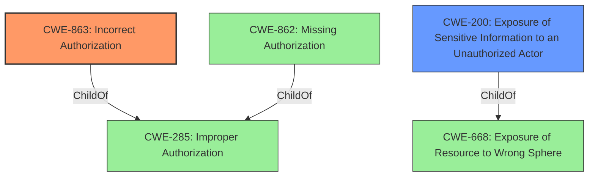

# Analysis for CVE-2021-23193

# Summary
| CWE ID | CWE Name | Confidence | CWE Abstraction Level | CWE Vulnerability Mapping Label | CWE-Vulnerability Mapping Notes |
|---|---|---|---|---|---|
| CWE-863 | Incorrect Authorization | 0.9 | Class | Primary | Allowed-with-Review |
| CWE-200 | Exposure of Sensitive Information to an Unauthorized Actor | 0.7 | Class | Secondary | Discouraged |

## Evidence and Confidence

*   **Confidence Score:** 0.8
*   **Evidence Strength:** HIGH

## Relationship Analysis
The primary CWE is CWE-863 (Incorrect Authorization), which is a Class-level CWE. It has children such as CWE-862 (Missing Authorization) which is more specific.

## Vulnerability Chain
The vulnerability chain starts with **improper privilege validation** (CWE-863), leading to the ability for unprivileged operators to retrieve sensitive information (CWE-200).

## Summary of Analysis
The initial assessment focused on identifying the root cause of the vulnerability and mapping it to the most appropriate CWE. The primary weakness identified is **Improper privilege validation**, which directly leads to the exposure of sensitive information.

The description states "**Improper privilege validation** vulnerability in COM Interface of Gallagher Command Centre Server allows authenticated unprivileged operators to retrieve sensitive information from the Command Centre Server."

Based on the vulnerability description and the CVE Reference Links Content Summary, the primary weakness is **improper privilege validation** which leads to unauthorized access to sensitive information.

The following CWEs were considered:

*   CWE-863 Incorrect Authorization: This CWE was selected as the primary because the vulnerability description explicitly mentions "**Improper privilege validation**," which aligns directly with the concept of incorrect authorization. The **incorrect authorization** allows unprivileged users to access sensitive information that they should not have access to. The CVE Reference Links Content Summary supports that the **root cause** of the vulnerability is "**Improper privilege validation**".
*   CWE-200 Exposure of Sensitive Information to an Unauthorized Actor: This CWE was considered as a secondary weakness because it represents the impact of the **improper privilege validation**. The vulnerability allows authenticated unprivileged operators to retrieve sensitive information. However, it's important to note that CWE-200 is often misused and that the root cause is the primary concern.
*   CWE-285 Improper Authorization: This is a parent of CWE-863, and while relevant, CWE-863 is more specific to the **incorrect** authorization.
*   CWE-269 Improper Privilege Management: While related to privileges, this CWE is more general and doesn't capture the specific nature of the **incorrect authorization** check.

The selection of CWE-863 as the primary CWE is based on the direct evidence of **improper privilege validation** in the vulnerability description and its detailed explanation in the CVE Reference Links Content Summary.

Relevant CWE Information:

# Enhanced Context (25 CWEs)
The following CWEs were identified as potentially relevant to this vulnerability:

## CWE-863: Incorrect Authorization
**Abstraction Level**: Class
**Similarity Score**: 8080.97
**Source**: sparse

**Description**:
The product performs an authorization check when an actor attempts to access a resource or perform an action, but it does not correctly perform the check.

**Mapping Guidance**:
- Usage: Allowed-with-Review
- Rationale: This CWE entry is a Class and might have Base-level children that would be more appropriate