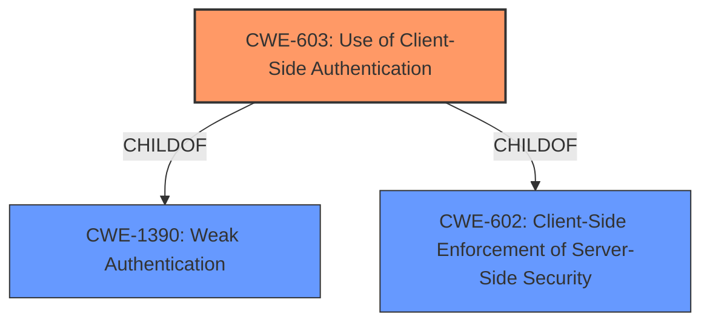

# Raw Analyzer Response for CVE-2021-23196

# Summary
| CWE ID | CWE Name | Confidence | CWE Abstraction Level | CWE Vulnerability Mapping Label | CWE-Vulnerability Mapping Notes |
|---|---|---|---|---|---|
| CWE-603 | Use of Client-Side Authentication | 1 | Base | Allowed | Primary CWE |
| CWE-602 | Client-Side Enforcement of Server-Side Security | 0.7 | Class | Allowed-with-Review | Secondary Candidate |
| CWE-1390 | Weak Authentication | 0.6 | Class | Allowed-with-Review | Secondary Candidate |

## Evidence and Confidence

*   **Confidence Score:** 0.9
*   **Evidence Strength:** HIGH

## Relationship Analysis
The primary CWE is CWE-603, which is a Base level CWE and a child of both CWE-1390 (Weak Authentication) and CWE-602 (Client-Side Enforcement of Server-Side Security). CWE-602 is a Class-level CWE, and using CWE-603 is more specific and appropriate. CWE-1390 is also a class and less specific. The relationships show that the chosen CWE is appropriately granular and related to broader authentication issues.

## Vulnerability Chain
The chain starts with the **root cause**, the use of **authentication and session management mechanisms exclusively on the client-side**. This leads to **insufficiently protected credentials**. The impact is that an attacker can potentially gain access to sensitive information, modify settings, or perform arbitrary actions as an authenticated user.

## Summary of Analysis
The initial assessment identified CWE-603 as the primary candidate based on the vulnerability description, which states that the web application implements **authentication and session management mechanisms exclusively on the client-side**. This aligns directly with CWE-603's description: "A client/server product performs authentication within client code but not in server code, allowing server-side authentication to be bypassed via a modified client that omits the authentication check." The **rootcause** is the **authentication and session management mechanisms exclusively on the client-side**

The retriever results also listed CWE-603 as the top combined result, supporting this choice. The mapping guidance for CWE-603 specifies that it is at the Base level of abstraction, which is a preferred level, and its usage is "Allowed."

CWE-602 and CWE-1390 were considered as secondary candidates because they are parent classes of CWE-603. However, since CWE-603 accurately describes the specific vulnerability, it is the most appropriate choice.

The evidence from the CVE Reference Links Content Summary reinforces the selection of CWE-603: "The web application on Agilia Link+ implements authentication and session management mechanisms exclusively on the client-side and does not protect authentication attributes sufficiently."

Relevant CWE Information:

# Enhanced Context (25 CWEs)

## CWE-603: Use of Client-Side Authentication
**Abstraction Level**: Base
**Similarity Score**: 0.79
**Source**: dense

**Description**:
A client/server product performs authentication within client code but not in server code, allowing server-side authentication to be bypassed via a modified client that omits the authentication check.

**Mapping Guidance**:
- Usage: Allowed
- Rationale: This CWE entry is at the Base level of abstraction, which is a preferred level of abstraction for mapping to the root causes of vulnerabilities.

## CWE-602: Client-Side Enforcement of Server-Side Security
**Abstraction Level**: Class
**Similarity Score**: 0.77
**Source**: dense

**Description**:
The product is composed of a server that relies on the client to implement a mechanism that is intended to protect the server.

**Mapping Guidance**:
- Usage: Allowed-with-Review
- Rationale: This CWE entry is a Class and might have Base-level children that would be more appropriate

## CWE-1390: Weak Authentication
**Abstraction Level**: Class
**Similarity Score**: 0.76
**Source**: dense

**Description**:
The product uses an authentication mechanism to restrict access to specific users or identities, but the mechanism does not sufficiently prove that the claimed identity is correct.

**Mapping Guidance**:
- Usage: Allowed-with-Review
- Rationale: This CWE entry is a Class and might have Base-level children that would be more appropriate