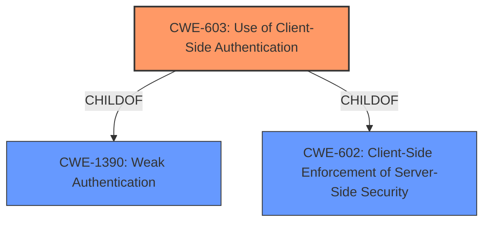

# Analysis for CVE-2021-23196

# Summary
| CWE ID | CWE Name | Confidence | CWE Abstraction Level | CWE Vulnerability Mapping Label | CWE-Vulnerability Mapping Notes |
|---|---|---|---|---|---|
| CWE-603 | Use of Client-Side Authentication | 1 | Base | Allowed | Primary CWE |
| CWE-602 | Client-Side Enforcement of Server-Side Security | 0.7 | Class | Allowed-with-Review | Secondary Candidate |
| CWE-1390 | Weak Authentication | 0.6 | Class | Allowed-with-Review | Secondary Candidate |

## Evidence and Confidence

*   **Confidence Score:** 0.9
*   **Evidence Strength:** HIGH

## Relationship Analysis
The primary CWE is CWE-603, which is a Base level CWE and a child of both CWE-1390 (Weak Authentication) and CWE-602 (Client-Side Enforcement of Server-Side Security). CWE-602 is a Class-level CWE, and using CWE-603 is more specific and appropriate. CWE-1390 is also a class and less specific. The relationships show that the chosen CWE is appropriately granular and related to broader authentication issues.

## Vulnerability Chain
The chain starts with the **root cause**, the use of **authentication and session management mechanisms exclusively on the client-side**. This leads to **insufficiently protected credentials**. The impact is that an attacker can potentially gain access to sensitive information, modify settings, or perform arbitrary actions as an authenticated user.

## Summary of Analysis
The initial assessment identified CWE-603 as the primary candidate based on the vulnerability description, which states that the web application implements **authentication and session management mechanisms exclusively on the client-side**. This aligns directly with CWE-603's description: "A client/server product performs authentication within client code but not in server code, allowing server-side authentication to be bypassed via a modified client that omits the authentication check." The **rootcause** is the **authentication and session management mechanisms exclusively on the client-side**

The retriever results also listed CWE-603 as the top combined result, supporting this choice. The mapping guidance for CWE-603 specifies that it is at the Base level of abstraction, which is a preferred level, and its usage is "Allowed."

CWE-602 and CWE-1390 were considered as secondary candidates because they are parent classes of CWE-603. However, since CWE-603 accurately describes the specific vulnerability, it is the most appropriate choice.

The evidence from the CVE Reference Links Content Summary reinforces the selection of CWE-603: "The web application on Agilia Link+ implements authentication and session management mechanisms exclusively on the client-side and does not protect authentication attributes sufficiently."

Relevant CWE Information:

# Enhanced Context (25 CWEs)

## CWE-603: Use of Client-Side Authentication
**Abstraction Level**: Base
**Similarity Score**: 0.79
**Source**: dense

**Description**:
A client/server product performs authentication within client code but not in server code, allowing server-side authentication to be bypassed via a modified client that omits the authentication check.

**Mapping Guidance**:
- Usage: Allowed
- Rationale: This CWE entry is at the Base level of abstraction, which is a preferred level of abstraction for mapping to the root causes of vulnerabilities.

## CWE-602: Client-Side Enforcement of Server-Side Security
**Abstraction Level**: Class
**Similarity Score**: 0.77
**Source**: dense

**Description**:
The product is composed of a server that relies on the client to implement a mechanism that is intended to protect the server.

**Mapping Guidance**:
- Usage: Allowed-with-Review
- Rationale: This CWE entry is a Class and might have Base-level children that would be more appropriate

## CWE-1390: Weak Authentication
**Abstraction Level**: Class
**Similarity Score**: 0.76
**Source**: dense

**Description**:
The product uses an authentication mechanism to restrict access to specific users or identities, but the mechanism does not sufficiently prove that the claimed identity is correct.

**Mapping Guidance**:
- Usage: Allowed-with-Review
- Rationale: This CWE entry is a Class and might have Base-level children that would be more appropriate

# Enhanced Query for CVE-2021-23196

## Vulnerability Description
The web application on Agilia Link+ version 3.0 implements **authentication and session management mechanisms exclusively on the client-side** and does not protect authentication attributes sufficiently.

### Vulnerability Description Key Phrases
- **rootcause:** **authentication and session management mechanisms exclusively on the client-side**
- **product:** Agilia Link+
- **version:** 3.0
- **component:** web application

## CVE Reference Links Content Summary
The provided content is related to CVE-2021-23196.

**Root cause of vulnerability:**
The web application on Agilia Link+ implements authentication and session management mechanisms exclusively on the client-side and does not protect authentication attributes sufficiently.

**Weaknesses/vulnerabilities present:**
- Insufficiently protected credentials, with authentication and session management implemented client-side.

**Impact of exploitation:**
- An attacker can potentially gain access to sensitive information, modify settings or parameters, or perform arbitrary actions as an authenticated user.

**Attack vectors:**
- Network-based attacks.

**Required attacker capabilities/position:**
- Remote attacker with low attack complexity.
- No special privileges or user interaction needed.

## Retriever Results

### Top Combined Results

| Rank | CWE ID | Name | Abstraction | Usage  | Retrievers | Individual Scores |
|------|--------|------|-------------|-------|------------|-------------------|
| 1 | 603 | Use of Client-Side Authentication | Base | Allowed | sparse | 0.339 |
| 2 | 614 | Sensitive Cookie in HTTPS Session Without 'Secure' Attribute | Variant | Allowed | sparse | 0.218 |
| 3 | 602 | Client-Side Enforcement of Server-Side Security | Class | Allowed-with-Review | sparse | 0.211 |
| 4 | 784 | Reliance on Cookies without Validation and Integrity Checking in a Security Decision | Variant | Allowed | sparse | 0.208 |
| 5 | 459 | Incomplete Cleanup | Base | Allowed | sparse | 0.194 |
| 6 | 384 | Session Fixation | Compound | Allowed | dense | 0.472 |
| 7 | 613 | Insufficient Session Expiration | Base | Allowed | graph | 0.002 |
| 8 | 1390 | Weak Authentication | Class | Allowed-with-Review | sparse | 0.187 |
| 9 | 472 | External Control of Assumed-Immutable Web Parameter | Base | Allowed | sparse | 0.185 |
| 10 | 287 | Improper Authentication | Class | Discouraged | sparse | 0.184 |

# Complete CWE Specifications

## CWE-603: Use of Client-Side Authentication
**Abstraction:** Base
**Status:** Draft

### Description
A client/server product performs authentication within client code but not in server code, allowing server-side authentication to be bypassed via a modified client that omits the authentication check.

### Extended Description
Client-side authentication is extremely weak and may be breached easily. Any attacker may read the source code and reverse-engineer the authentication mechanism to access parts of the application which would otherwise be protected.

### Alternative Terms
None

### Relationships
ChildOf -> CWE-1390
ChildOf -> CWE-602
PeerOf -> CWE-300
PeerOf -> CWE-656

### Mapping Guidance
**Usage:** Allowed
**Rationale:** This CWE entry is at the Base level of abstraction, which is a preferred level of abstraction for mapping to the root causes of vulnerabilities.
**Comments:** Carefully read both the name and description to ensure that this mapping is an appropriate fit. Do not try to 'force' a mapping to a lower-level Base/Variant simply to comply with this preferred level of abstraction.
**Reasons:**
- Acceptable-Use

### Observed Examples
- **CVE-2022-33139:** SCADA system only uses client-side authentication, allowing adversaries to impersonate other users.
- **CVE-2006-0230:** Client-side check for a password allows access to a server using crafted XML requests from a modified client.

## CWE-614: Sensitive Cookie in HTTPS Session Without 'Secure' Attribute
**Abstraction:** Variant
**Status:** Draft

### Description
The Secure attribute for sensitive cookies in HTTPS sessions is not set, which could cause the user agent to send those cookies in plaintext over an HTTP session.

### Extended Description
Not provided

### Alternative Terms
None

### Relationships
ChildOf -> CWE-319

### Mapping Guidance
**Usage:** Allowed
**Rationale:** This CWE entry is at the Variant level of abstraction, which is a preferred level of abstraction for mapping to the root causes of vulnerabilities.
**Comments:** Carefully read both the name and description to ensure that this mapping is an appropriate fit. Do not try to 'force' a mapping to a lower-level Base/Variant simply to comply with this preferred level of abstraction.
**Reasons:**
- Acceptable-Use

### Observed Examples
- **CVE-2004-0462:** A product does not set the Secure attribute for sensitive cookies in HTTPS sessions, which could cause the user agent to send those cookies in plaintext over an HTTP session with the product.
- **CVE-2008-3663:** A product does not set the secure flag for the session cookie in an https session, which can cause the cookie to be sent in http requests and make it easier for remote attackers to capture this cookie.
- **CVE-2008-3662:** A product does not set the secure flag for the session cookie in an https session, which can cause the cookie to be sent in http requests and make it easier for remote attackers to capture this cookie.

## CWE-602: Client-Side Enforcement of Server-Side Security
**Abstraction:** Class
**Status:** Draft

### Description
The product is composed of a server that relies on the client to implement a mechanism that is intended to protect the server.

### Extended Description
When the server relies on protection mechanisms placed on the client side, an attacker can modify the client-side behavior to bypass the protection mechanisms, resulting in potentially unexpected interactions between the client and server. The consequences will vary, depending on what the mechanisms are trying to protect.

### Alternative Terms
None

### Relationships
ChildOf -> CWE-693
CanPrecede -> CWE-471
PeerOf -> CWE-290
PeerOf -> CWE-300

### Mapping Guidance
**Usage:** Allowed-with-Review
**Rationale:** This CWE entry is a Class and might have Base-level children that would be more appropriate
**Comments:** Examine children of this entry to see if there is a better fit
**Reasons:**
- Abstraction

### Observed Examples
- **CVE-2022-33139:** SCADA system only uses client-side authentication, allowing adversaries to impersonate other users.
- **CVE-2006-6994:** ASP program allows upload of .asp files by bypassing client-side checks.
- **CVE-2007-0163:** steganography products embed password information in the carrier file, which can be extracted from a modified client.

## CWE-784: Reliance on Cookies without Validation and Integrity Checking in a Security Decision
**Abstraction:** Variant
**Status:** Draft

### Description
The product uses a protection mechanism that relies on the existence or values of a cookie, but it does not properly ensure that the cookie is valid for the associated user.

### Extended Description
Attackers can easily modify cookies, within the browser or by implementing the client-side code outside of the browser. Attackers can bypass protection mechanisms such as authorization and authentication by modifying the cookie to contain an expected value.

### Alternative Terms
None

### Relationships
ChildOf -> CWE-807
ChildOf -> CWE-565

### Mapping Guidance
**Usage:** Allowed
**Rationale:** This CWE entry is at the Variant level of abstraction, which is a preferred level of abstraction for mapping to the root causes of vulnerabilities.
**Comments:** Carefully read both the name and description to ensure that this mapping is an appropriate fit. Do not try to 'force' a mapping to a lower-level Base/Variant simply to comply with this preferred level of abstraction.
**Reasons:**
- Acceptable-Use

### Additional Notes
**[Maintenance]** A new parent might need to be defined for this entry. This entry is specific to cookies, which reflects the significant number of vulnerabilities being reported for cookie-based authentication in CVE during 2008 and 2009. However, other types of inputs - such as parameters or headers - could also be used for similar authentication or authorization. Similar issues (under the Research view) include CWE-247 and CWE-472.

### Observed Examples
- **CVE-2009-1549:** Attacker can bypass authentication by setting a cookie to a specific value.
- **CVE-2009-1619:** Attacker can bypass authentication and gain admin privileges by setting an "admin" cookie to 1.
- **CVE-2009-0864:** Content management system allows admin privileges by setting a "login" cookie to "OK."

## CWE-459: Incomplete Cleanup
**Abstraction:** Base
**Status:** Draft

### Description
The product does not properly "clean up" and remove temporary or supporting resources after they have been used.

### Extended Description
Not provided

### Alternative Terms
Insufficient Cleanup

### Relationships
ChildOf -> CWE-404
ChildOf -> CWE-404

### Mapping Guidance
**Usage:** Allowed
**Rationale:** This CWE entry is at the Base level of abstraction, which is a preferred level of abstraction for mapping to the root causes of vulnerabilities.
**Comments:** Carefully read both the name and description to ensure that this mapping is an appropriate fit. Do not try to 'force' a mapping to a lower-level Base/Variant simply to comply with this preferred level of abstraction.
**Reasons:**
- Acceptable-Use

### Additional Notes
**[Relationship]** CWE-459 is a child of CWE-404 because, while CWE-404 covers any type of improper shutdown or release of a resource, CWE-459 deals specifically with a multi-step shutdown process in which a crucial step for "proper" cleanup is omitted or impossible. That is, CWE-459 deals specifically with a cleanup or shutdown process that does not successfully remove all potentially sensitive data.

**[Relationship]** Overlaps other categories such as permissions and containment. Concept needs further development. This could be primary (e.g. leading to infoleak) or resultant (e.g. resulting from unhandled error conditions or early termination).

### Observed Examples
- **CVE-2000-0552:** World-readable temporary file not deleted after use.
- **CVE-2005-2293:** Temporary file not deleted after use, leaking database usernames and passwords.
- **CVE-2002-0788:** Interaction error creates a temporary file that can not be deleted due to strong permissions.

## CWE-384: Session Fixation
**Abstraction:** Compound
**Status:** Incomplete

### Description
Authenticating a user, or otherwise establishing a new user session, without invalidating any existing session identifier gives an attacker the opportunity to steal authenticated sessions.

### Extended Description

Such a scenario is commonly observed when:

  - A web application authenticates a user without first invalidating the existing session, thereby continuing to use the session already associated with the user.

  - An attacker is able to force a known session identifier on a user so that, once the user authenticates, the attacker has access to the authenticated session.

  - The application or container uses predictable session identifiers.

In the generic exploit of session fixation vulnerabilities, an attacker creates a new session on a web application and records the associated session identifier. The attacker then causes the victim to associate, and possibly authenticate, against the server using that session identifier, giving the attacker access to the user's account through the active session.

### Alternative Terms
None

### Relationships
ChildOf -> CWE-610
ChildOf -> CWE-610
Requires -> CWE-346
Requires -> CWE-472
Requires -> CWE-441

### Mapping Guidance
**Usage:** Allowed
**Rationale:** This is a well-known Composite of multiple weaknesses that must all occur simultaneously, although it is attack-oriented in nature.
**Comments:** While attack-oriented composites are supported in CWE, they have not been a focus of research. There is a chance that future research or CWE scope clarifications will change or deprecate them. Perform root-cause analysis to determine which weaknesses allow session fixation to occur, and map to those weaknesses. For example, predictable session identifiers might enable session fixation attacks to succeed; if this occurs, they might be better characterized as randomness/predictability weaknesses.
**Reasons:**
- Other

### Additional Notes
**[Other]** Other attack vectors include DNS poisoning and related network based attacks where an attacker causes the user to visit a malicious site by redirecting a request for a valid site. Network based attacks typically involve a physical presence on the victim's network or control of a compromised machine on the network, which makes them harder to exploit remotely, but their significance should not be overlooked. Less secure session management mechanisms, such as the default implementation in Apache Tomcat, allow session identifiers normally expected in a cookie to be specified on the URL as well, which enables an attacker to cause a victim to use a fixed session identifier simply by emailing a malicious URL.

### Observed Examples
- **CVE-2022-2820:** Website software for game servers does not proprerly terminate user sessions, allowing for possible session fixation

## CWE-613: Insufficient Session Expiration
**Abstraction:** Base
**Status:** Incomplete

### Description
According to WASC, "Insufficient Session Expiration is when a web site permits an attacker to reuse old session credentials or session IDs for authorization."

### Extended Description
Not provided

### Alternative Terms
None

### Relationships
ChildOf -> CWE-672
ChildOf -> CWE-672
CanPrecede -> CWE-287

### Mapping Guidance
**Usage:** Allowed
**Rationale:** This CWE entry is at the Base level of abstraction, which is a preferred level of abstraction for mapping to the root causes of vulnerabilities.
**Comments:** Carefully read both the name and description to ensure that this mapping is an appropriate fit. Do not try to 'force' a mapping to a lower-level Base/Variant simply to comply with this preferred level of abstraction.
**Reasons:**
- Acceptable-Use

### Additional Notes
**[Other]** The lack of proper session expiration may improve the likely success of certain attacks. For example, an attacker may intercept a session ID, possibly via a network sniffer or Cross-site Scripting attack. Although short session expiration times do not help if a stolen token is immediately used, they will protect against ongoing replaying of the session ID. In another scenario, a user might access a web site from a shared computer (such as at a library, Internet cafe, or open work environment). Insufficient Session Expiration could allow an attacker to use the browser's back button to access web pages previously accessed by the victim.

## CWE-1390: Weak Authentication
**Abstraction:** Class
**Status:** Incomplete

### Description
The product uses an authentication mechanism to restrict access to specific users or identities, but the mechanism does not sufficiently prove that the claimed identity is correct.

### Extended Description

Attackers may be able to bypass weak authentication faster and/or with less effort than expected.

### Alternative Terms
None

### Relationships
ChildOf -> CWE-287

### Mapping Guidance
**Usage:** Allowed-with-Review
**Rationale:** This CWE entry is a Class and might have Base-level children that would be more appropriate
**Comments:** Examine children of this entry to see if there is a better fit
**Reasons:**
- Abstraction

### Observed Examples
- **CVE-2022-30034:** Chain: Web UI for a Python RPC framework does not use regex anchors to validate user login emails (CWE-777), potentially allowing bypass of OAuth (CWE-1390).
- **CVE-2022-35248:** Chat application skips validation when Central Authentication Service (CAS) is enabled, effectively removing the second factor from two-factor authentication
- **CVE-2021-3116:** Chain: Python-based HTTP Proxy server uses the wrong boolean operators (CWE-480) causing an incorrect comparison (CWE-697) that identifies an authN failure if all three conditions are met instead of only one, allowing bypass of the proxy authentication (CWE-1390)

## CWE-472: External Control of Assumed-Immutable Web Parameter
**Abstraction:** Base
**Status:** Draft

### Description
The web application does not sufficiently verify inputs that are assumed to be immutable but are actually externally controllable, such as hidden form fields.

### Extended Description

If a web product does not properly protect assumed-immutable values from modification in hidden form fields, parameters, cookies, or URLs, this can lead to modification of critical data. Web applications often mistakenly make the assumption that data passed to the client in hidden fields or cookies is not susceptible to tampering. Improper validation of data that are user-controllable can lead to the application processing incorrect, and often malicious, input.

For example, custom cookies commonly store session data or persistent data across sessions. This kind of session data is normally involved in security related decisions on the server side, such as user authentication and access control. Thus, the cookies might contain sensitive data such as user credentials and privileges. This is a dangerous practice, as it can often lead to improper reliance on the value of the client-provided cookie by the server side application.

### Alternative Terms
Assumed-Immutable Parameter Tampering

### Relationships
ChildOf -> CWE-642
ChildOf -> CWE-471

### Mapping Guidance
**Usage:** Allowed
**Rationale:** This CWE entry is at the Base level of abstraction, which is a preferred level of abstraction for mapping to the root causes of vulnerabilities.
**Comments:** Carefully read both the name and description to ensure that this mapping is an appropriate fit. Do not try to 'force' a mapping to a lower-level Base/Variant simply to comply with this preferred level of abstraction.
**Reasons:**
- Acceptable-Use

### Additional Notes
**[Relationship]** This is a primary weakness for many other weaknesses and functional consequences, including XSS, SQL injection, path disclosure, and file inclusion.

**[Theoretical]** This is a technology-specific MAID problem.

### Observed Examples
- **CVE-2002-0108:** Forum product allows spoofed messages of other users via hidden form fields for name and e-mail address.
- **CVE-2000-0253:** Shopping cart allows price modification via hidden form field.
- **CVE-2000-0254:** Shopping cart allows price modification via hidden form field.

## CWE-287: Improper Authentication
**Abstraction:** Class
**Status:** Draft

### Description
When an actor claims to have a given identity, the product does not prove or insufficiently proves that the claim is correct.

### Extended Description
Not provided

### Alternative Terms
authentification: An alternate term is "authentification", which appears to be most commonly used by people from non-English-speaking countries.
AuthN: "AuthN" is typically used as an abbreviation of "authentication" within the web application security community. It is also distinct from "AuthZ," which is an abbreviation of "authorization." The use of "Auth" as an abbreviation is discouraged, since it could be used for either authentication or authorization.
AuthC: "AuthC" is used as an abbreviation of "authentication," but it appears to used less frequently than "AuthN."

### Relationships
ChildOf -> CWE-284
ChildOf -> CWE-284

### Mapping Guidance
**Usage:** Discouraged
**Rationale:** This CWE entry might be misused when lower-level CWE entries are likely to be applicable. It is a level-1 Class (i.e., a child of a Pillar).
**Comments:** Consider children or descendants, beginning with CWE-1390: Weak Authentication or CWE-306: Missing Authentication for Critical Function.
**Reasons:**
- Frequent Misuse
**Suggested Alternatives:**
- CWE-1390: Weak Authentication
- CWE-306: Missing Authentication for Critical Function

### Additional Notes
**[Relationship]** This can be resultant from SQL injection vulnerabilities and other issues.

**[Maintenance]** The Taxonomy_Mappings to ISA/IEC 62443 were added in CWE 4.10, but they are still under review and might change in future CWE versions. These draft mappings were performed by members of the "Mapping CWE to 62443" subgroup of the CWE-CAPEC ICS/OT Special Interest Group (SIG), and their work is incomplete as of CWE 4.10. The mappings are included to facilitate discussion and review by the broader ICS/OT community, and they are likely to change in future CWE versions.

### Observed Examples
- **CVE-2022-35248:** Chat application skips validation when Central Authentication Service (CAS) is enabled, effectively removing the second factor from two-factor authentication
- **CVE-2022-36436:** Python-based authentication proxy does not enforce password authentication during the initial handshake, allowing the client to bypass authentication by specifying a 'None' authentication type.
- **CVE-2022-30034:** Chain: Web UI for a Python RPC framework does not use regex anchors to validate user login emails (CWE-777), potentially allowing bypass of OAuth (CWE-1390).

