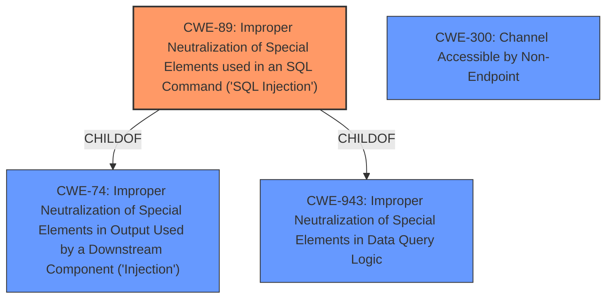

# Analysis for CVE-2021-23214

# Summary
| CWE ID | CWE Name | Confidence | CWE Abstraction Level | CWE Vulnerability Mapping Label | CWE-Vulnerability Mapping Notes |
|---|---|---|---|---|---|
| CWE-89 | Improper Neutralization of Special Elements used in an SQL Command ('SQL Injection') | 1.0 | Base | Allowed | Primary CWE. The vulnerability allows for SQL injection due to improper handling of data, enabling attackers to inject arbitrary SQL queries. |
| CWE-300 | Channel Accessible by Non-Endpoint | 0.7 | Class | Discouraged | Secondary candidate. The vulnerability involves a man-in-the-middle attack, which aligns with the description of CWE-300. However, it is a high-level classification and the root cause is better captured by CWE-89. |
| CWE-295 | Improper Certificate Validation | 0.6 | Base | Allowed | Secondary candidate. The vulnerability involves trust authentication and certificate usage, but the primary issue is the SQL injection, not the certificate validation itself. |

## Evidence and Confidence

*   **Confidence Score:** 0.9
*   **Evidence Strength:** HIGH

## Relationship Analysis
The primary weakness is CWE-89, which describes the **improper SQL escaping** that leads to SQL injection. CWE-89 is a child of CWE-74 (Improper Neutralization of Special Elements in Output Used by a Downstream Component ('Injection')) and CWE-943 (Improper Neutralization of Special Elements in Data Query Logic). The man-in-the-middle attack aspect brings in CWE-300 (Channel Accessible by Non-Endpoint), but this is a consequence of the **improper** handling, not the root cause.

## Vulnerability Chain
1.  **Improper SQL escaping** (CWE-89)
2.  Man-in-the-middle attacker injects SQL queries.
3.  Unauthorized data access, data manipulation, or other malicious activity.

## Summary of Analysis
The initial analysis focused on the **improper SQL escaping** as the root cause, leading to SQL injection. The man-in-the-middle aspect and certificate usage were considered, but the primary driver of the vulnerability is the **improper neutralization** of special elements in the SQL command.

The evidence from the "CVE Reference Links Content Summary" section supports the selection of CWE-89: "The PostgreSQL server was not properly handling unencrypted data after a TLS/SSL handshake or GSSAPI authentication, allowing a man-in-the-middle attacker to inject arbitrary SQL queries." This statement clearly indicates that the **improper handling** leads directly to the SQL injection vulnerability.

The graph relationships influenced the final selection by highlighting the parent-child relationships between CWE-89 and other relevant CWEs like CWE-74 and CWE-943. This ensured that the selected CWE was at the optimal level of specificity. CWE-89 is a Base level CWE, which is the preferred level of abstraction.

Relevant CWE Information:
# Enhanced Context (25 CWEs)
The following CWEs were identified as potentially relevant to this vulnerability:

## CWE-1289: Improper Validation of Unsafe Equivalence in Input
**Abstraction Level**: Base
**Similarity Score**: 0.79
**Source**: dense

**Description**:
The product receives an input value that is used as a resource identifier or other type of reference, but it does not validate or incorrectly validates that the input is equivalent to a potentially-unsafe value.

**Mapping Guidance**:
- Usage: Allowed
- Rationale: This CWE entry is at the Base level of abstraction, which is a preferred level of abstraction for mapping to the root causes of vulnerabilities.

*Not Selected*: This is not about validating unsafe equivalence, but about **improperly** handling SQL escaping.

## CWE-74: Improper Neutralization of Special Elements in Output Used by a Downstream Component ('Injection')
**Abstraction Level**: Class
**Similarity Score**: 0.78
**Source**: dense

**Description**:
The product constructs all or part of a command, data structure, or record using externally-influenced input from an upstream component, but it does not neutralize or incorrectly neutralizes special elements that could modify how it is parsed or interpreted when it is sent to a downstream component.

**Mapping Guidance**:
- Usage: Discouraged
- Rationale: CWE-74 is high-level and often misused when lower-level weaknesses are more appropriate.

*Not Selected*: While relevant as a parent of CWE-89, CWE-89 is more specific and therefore a better fit.

## CWE-319: Cleartext Transmission of Sensitive Information
**Abstraction Level**: Base
**Similarity Score**: 0.77
**Source**: dense

**Description**:
The product transmits sensitive or security-critical data in cleartext in a communication channel that can be sniffed by unauthorized actors.

**Mapping Guidance**:
- Usage: Allowed
- Rationale: This CWE entry is at the Base level of abstraction, which is a preferred level of abstraction for mapping to the root causes of vulnerabilities.

*Not Selected*: The issue isn't about transmitting data in cleartext, but about allowing SQL injection due to **improper escaping**.

## CWE-297: Improper Validation of Certificate with Host Mismatch
**Abstraction Level**: Variant
**Similarity Score**: 0.77
**Source**: dense

**Description**:
The product communicates with a host that provides a certificate, but the product does not properly ensure that the certificate is actually associated with that host.

**Mapping Guidance**:
- Usage: Allowed
- Rationale: This CWE entry is at the Variant level of abstraction, which is a preferred level of abstraction for mapping to the root causes of vulnerabilities.

*Not Selected*: This is about hostname validation, whereas the issue is about allowing SQL injection due to **improper escaping**, even with certificate verification in place.

## CWE-138: Improper Neutralization of Special Elements
**Abstraction Level**: Class
**Similarity Score**: 0.77
**Source**: dense

**Description**:
The product receives input from an upstream component, but it does not neutralize or incorrectly neutralizes special elements that could be interpreted as control elements or syntactic markers when they are sent to a downstream component.

**Mapping Guidance**:
- Usage: Discouraged
- Rationale: This CWE entry is a level-1 Class (i.e., a child of a Pillar). It might have lower-level children that would be more appropriate

*Not Selected*: Too generic; CWE-89 is more specific.

## CWE-116: Improper Encoding or Escaping of Output
**Abstraction Level**: Class
**Similarity Score**: 0.77
**Source**: dense

**Description**:
The product prepares a structured message for communication with another component, but encoding or escaping of the data is either missing or done incorrectly. As a result, the intended structure of the message is not preserved.

**Mapping Guidance**:
- Usage: Allowed-with-Review
- Rationale: This CWE entry is a Class and might have Base-level children that would be more appropriate

*Not Selected*: Relevant, but CWE-89 is a more direct match to the SQL injection scenario.

## CWE-303: Incorrect Implementation of Authentication Algorithm
**Abstraction Level**: Base
**Similarity Score**: 0.76
**Source**: dense

**Description**:
The requirements for the product dictate the use of an established authentication algorithm, but the implementation of the algorithm is incorrect.

**Mapping Guidance**:
- Usage: Allowed
- Rationale: This CWE entry is at the Base level of abstraction, which is a preferred level of abstraction for mapping to the root causes of vulnerabilities.

*Not Selected*: The issue is not in the authentication algorithm itself, but in the **improper handling** of SQL escaping.

## CWE-345: Insufficient Verification of Data Authenticity
**Abstraction Level**: Class
**Similarity Score**: 0.76
**Source**: dense

**Description**:
The product does not sufficiently verify the origin or authenticity of data, in a way that causes it to accept invalid data.

**Mapping Guidance**:
- Usage: Discouraged
- Rationale: This CWE entry is a level-1 Class (i.e., a child of a Pillar). It might have lower-level children that would be more appropriate

*Not Selected*: Data authenticity is not the primary concern. The vulnerability is about