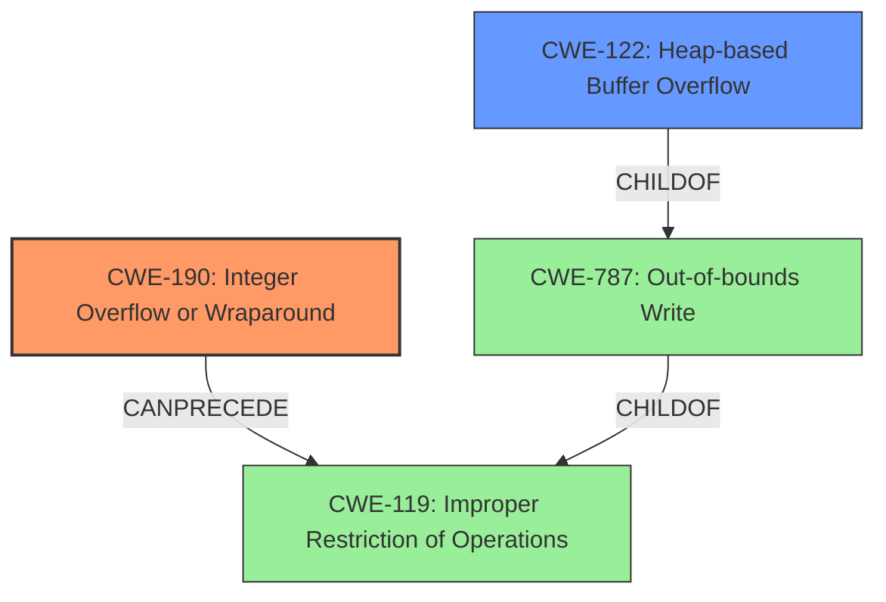

# Raw Analyzer Response for CVE-2021-23215

# Summary
| CWE ID  | CWE Name                                                                    | Confidence | CWE Abstraction Level | CWE Vulnerability Mapping Label | CWE-Vulnerability Mapping Notes |
| :-------- | :-------------------------------------------------------------------------- | :--------- | :---------------------- | :------------------------------ | :------------------------------ |
| CWE-190 | Integer Overflow or Wraparound                                              | 1.0        | Base                    | Primary CWE                   | Allowed                       |
| CWE-122 | Heap-based Buffer Overflow                                                  | 0.9        | Variant                 | Secondary CWE                 | Allowed                       |

## Evidence and Confidence

*   **Confidence Score:** 0.95
*   **Evidence Strength:** HIGH

## Relationship Analysis
The primary weakness is an **integer overflow** (CWE-190), which directly leads to a **heap-based buffer overflow** (CWE-122). CWE-190 can precede CWE-119 (Improper Restriction of Operations within the Bounds of a Memory Buffer), and CWE-122 is a child of CWE-787 (Out-of-bounds Write), which is a child of CWE-119. The integer overflow results in an incorrect buffer size calculation, causing the heap-based buffer overflow during memory allocation.

## Vulnerability Chain
The vulnerability chain starts with an **integer overflow** (CWE-190) in the calculation of buffer sizes. This leads to an undersized buffer allocation on the heap, resulting in a **heap-based buffer overflow** (CWE-122) when data is written to the buffer. The final impact is a potential application crash (Denial of Service).

## Summary of Analysis
The analysis is based on the vulnerability description and the CVE reference link content summary. The root cause is clearly identified as an **integer overflow**, which leads to a **heap-based buffer overflow**.

The evidence from the CVE Reference Links Content Summary:
*   "root\_cause": "Integer overflow in the calculation of buffer sizes within the `Imf_2_5::DwaCompressor::initializeBuffers` function."
*   "weaknesses": ["Integer overflow", "Heap-based buffer overflow"]
*   "impact": "An attacker can cause a denial of service (application crash) by providing a specially crafted image file that triggers the integer overflow, leading to a heap-based buffer overflow when memory is allocated based on the incorrect size, which is then used in the image processing."

The primary CWE is CWE-190 (Integer Overflow or Wraparound) because it is the root cause of the vulnerability. The secondary CWE is CWE-122 (Heap-based Buffer Overflow) as it is the direct consequence of the integer overflow.

The selected CWEs are at the optimal level of specificity. CWE-190 is a Base level CWE, and CWE-122 is a Variant level CWE, providing a detailed and accurate representation of the vulnerability. The relationship between CWE-190 and CWE-122 is well-defined, with CWE-190 leading to CWE-122 in this specific scenario.

Relevant CWE Information:

# Enhanced Context (25 CWEs)

## CWE-190: Integer Overflow or Wraparound
**Abstraction:** Base
**Similarity Score**: 0.80
**Source**: dense

**Description**:
The product performs a calculation that can produce an **integer overflow** or wraparound when the logic assumes that the resulting value will always be larger than the original value. This occurs when an integer value is incremented to a value that is too large to store in the associated representation. When this occurs, the value may become a very small or negative number.

**Mapping Guidance**:
- Usage: Allowed
- Rationale: This CWE entry is at the Base level of abstraction, which is a preferred level of abstraction for mapping to the root causes of vulnerabilities.

## CWE-122: Heap-based Buffer Overflow
**Abstraction:** Variant
**Similarity Score**: 0.290
**Source**: sparse

**Description**:
A heap overflow condition is a buffer overflow, where the buffer that can be overwritten is allocated in the heap portion of memory, generally meaning that the buffer was allocated using a routine such as malloc().

**Mapping Guidance**:
- Usage: Allowed
- Rationale: This CWE entry is at the Variant level of abstraction, which is a preferred level of abstraction for mapping to the root causes of vulnerabilities.