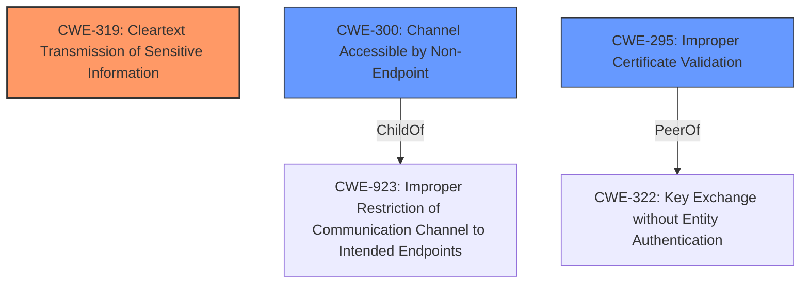

# Analysis for CVE-2021-23222

# Summary
| CWE ID | CWE Name | Confidence | CWE Abstraction Level | CWE Vulnerability Mapping Label | CWE-Vulnerability Mapping Notes |
|---|---|---|---|---|---|
| CWE-319 | Cleartext Transmission of Sensitive Information | 0.9 | Base | Primary | Allowed |
| CWE-300 | Channel Accessible by Non-Endpoint | 0.7 | Class | Secondary | Discouraged |
| CWE-295 | Improper Certificate Validation | 0.6 | Base | Secondary | Allowed |

## Evidence and Confidence

*   **Confidence Score:** 0.8
*   **Evidence Strength:** HIGH

## Relationship Analysis
The primary CWE is CWE-319, which directly addresses the core issue of transmitting unencrypted data. CWE-300 is a Class-level CWE that is commonly misused, but relevant because it discusses channels accessible by non-endpoints, which is how the attacker injects the false responses. CWE-295 is related since it involves certificates. However, the vulnerability doesn't stem from a certificate validation issue itself, but rather from the **handling of unencrypted data** *despite* the presence of certificate verification.

## Vulnerability Chain
The vulnerability chain starts with the **failure to properly handle unencrypted data** after the initial SSL/GSSAPI handshake, leading to the **injection of false responses** by a man-in-the-middle attacker.

**Root Cause:** Improper handling of unencrypted data.
**Weakness:** Cleartext transmission, channel accessible by non-endpoint
**Impact:** Injection of false responses, potential data exfiltration

## Summary of Analysis
The initial analysis pointed towards CWE-319 as the primary weakness due to the **unencrypted data handling**. The "CVE Reference Links Content Summary" states, "The `libpq` library does not properly validate or discard extra data received alongside the server's SSL/GSSAPI handshake confirmation, treating it as decrypted data." This is direct evidence of the **cleartext transmission issue**.

CWE-300, "Channel Accessible by Non-Endpoint" is included as a secondary issue. The vulnerability enables a man-in-the-middle attacker to inject data, which aligns with the description of CWE-300. The "Vulnerability Description" states, "A man-in-the-middle attacker can inject false responses to the clients first few queries, despite the use of SSL certificate verification and encryption." However, the mapping guidance for CWE-300 discourages its use for vulnerabilities where the attacker needs to be in a privileged MITM position, so it's a weaker candidate.

CWE-295, "Improper Certificate Validation" was considered because the vulnerability description mentions SSL certificate verification. However, the root cause is not a failure to validate the certificate itself, but the **improper handling of data received *after* the certificate is validated**. The fact that SSL certificate verification exists but is bypassed by this vulnerability is what makes this vulnerability significant.

The selected CWEs are at the optimal level of specificity. CWE-319 is a Base level CWE that directly addresses the unencrypted data handling. CWE-300 is a Class level CWE, but it is used to show that an attacker is able to inject responses. CWE-295 is a Base level CWE that mentions how the certificate is not correctly validated, which is relevant since a MITM is able to inject data even with the validation.

Relevant CWE Information:

# Enhanced Context (25 CWEs)

## CWE-1240: Use of a Cryptographic Primitive with a Risky Implementation
**Abstraction Level**: Base
**Similarity Score**: 0.80
**Source**: dense

**Description**:
To fulfill the need for a cryptographic primitive, the product implements a cryptographic algorithm using a non-standard, unproven, or disallowed/non-compliant cryptographic implementation.
...
This is not the vulnerability since the the algorithm implementation itself is not the risk.

## CWE-345: Insufficient Verification of Data Authenticity
**Abstraction Level**: Class
**Similarity Score**: 0.79
**Source**: dense

**Description**:
The product does not sufficiently verify the origin or authenticity of data, in a way that causes it to accept invalid data.
...
This is related to the vulnerability since the product is accepting invalid data. However, the fact that it is unencrypted makes CWE-319 more relevant.

## CWE-1391: Use of Weak Credentials
**Abstraction Level**: Class
**Similarity Score**: 0.79
**Source**: dense

**Description**:
The product uses weak credentials (such as a default key or hard-coded password) that can be calculated, derived, reused, or guessed by an attacker.
...
This is not relevant to the vulnerability.

## CWE-303: Incorrect Implementation of Authentication Algorithm
**Abstraction Level**: Base
**Similarity Score**: 0.79
**Source**: dense

**Description**:
The requirements for the product dictate the use of an established authentication algorithm, but the implementation of the algorithm is incorrect.
...
This is not relevant to the vulnerability.

## CWE-319: Cleartext Transmission of Sensitive Information
**Abstraction Level**: Base
**Similarity Score**: 0.79
**Source**: dense

**Description**:
The product transmits sensitive or security-critical data in cleartext in a communication channel that can be sniffed by unauthorized actors.
...
This is relevant to the vulnerability because the `libpq` library does not properly validate or discard extra data received alongside the server's SSL/GSSAPI handshake confirmation, treating it as decrypted data.

## CWE-295: Improper Certificate Validation
**Abstraction Level**: Base
**Similarity Score**: 0.79
**Source**: dense

**Description**:
The product does not validate, or incorrectly validates, a certificate.
...
This is relevant because the attacker is able to inject the client's first few queries, despite the use of SSL certificate verification and encryption.

## CWE-330: Use of Insufficiently Random Values
**Abstraction Level**: Class
**Similarity Score**: 0.78
**Source**: dense

**Description**:
The product uses insufficiently random numbers or values in a security context that depends on unpredictable numbers.
...
This is not relevant to the vulnerability.

## CWE-203: Observable Discrepancy
**Abstraction Level**: Base
**Similarity Score**: 0.78
**Source**: dense

**Description**:
The product behaves differently or sends different responses under different circumstances in a way that is observable to an unauthorized actor, which exposes security-relevant information about the state of the product, such as whether a particular operation was successful or not.
...
This is not relevant to the vulnerability.

## CWE-657: Violation of Secure Design Principles
**Abstraction Level**: Class
**Similarity Score**: 0.78
**Source**: dense

**Description**:
The product violates well-established principles for secure design.
...
This is too generic and is not relevant to the vulnerability.

## CWE-297: Improper Validation of Certificate with Host Mismatch
**Abstraction Level**: Variant
**Similarity Score**: 0.77
**Source**: dense

**Description**:
The product communicates with a host that provides a certificate, but the product does not properly ensure that the certificate is actually associated with that host.
...
This is related since this occurs after the server's initial response to an encryption request.

## CWE-327: Use of a Broken or Risky Cryptographic Algorithm
**Abstraction Level**: Class
**Similarity Score**: 6702.81
**Source**: sparse

**Description**:
The product uses a broken or risky cryptographic algorithm or protocol.
...
This is not relevant to the vulnerability.