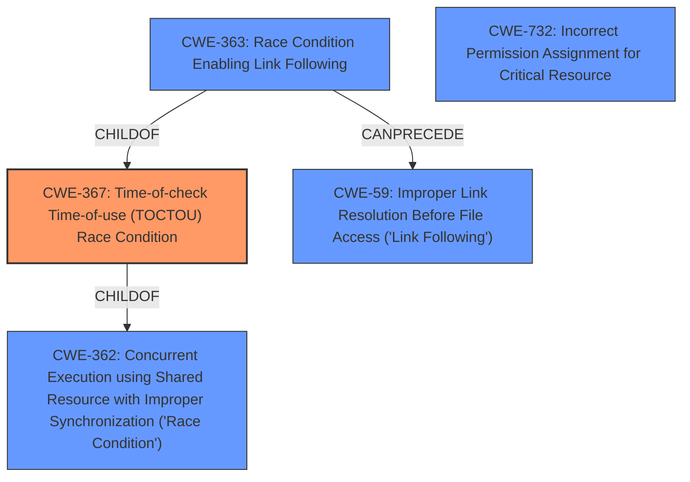

# Analysis for CVE-2021-23239

# Summary
| CWE ID | CWE Name | Confidence | CWE Abstraction Level | CWE Vulnerability Mapping Label | CWE-Vulnerability Mapping Notes |
|---|---|---|---|---|---|
| CWE-367 | Time-of-check Time-of-use (TOCTOU) Race Condition | 0.9 | Base | Allowed | Primary CWE |
| CWE-59 | Improper Link Resolution Before File Access ('Link Following') | 0.7 | Base | Allowed | Secondary Candidate |
| CWE-363 | Race Condition Enabling Link Following | 0.6 | Base | Allowed | Secondary Candidate |
| CWE-732 | Incorrect Permission Assignment for Critical Resource | 0.4 | Class | Allowed-with-Review | Secondary Candidate |

## Evidence and Confidence

*   **Confidence Score:** 0.9
*   **Evidence Strength:** HIGH

## Relationship Analysis
The primary CWE is CWE-367, which is a child of CWE-362 (Concurrent Execution using Shared Resource with Improper Synchronization ('Race Condition')). CWE-363 (Race Condition Enabling Link Following) is also a child of CWE-367 and can precede CWE-59 (Improper Link Resolution Before File Access ('Link Following')). These relationships indicate a chain where a race condition allows for link following, leading to potential security issues. CWE-732 (Incorrect Permission Assignment for Critical Resource) is related as a potential contributing factor, but less directly involved in the described race condition.

## Vulnerability Chain
The vulnerability chain starts with a **race condition** (CWE-367) where the state of a resource (directory) can change between the check (existence and type) and the use (file creation). This allows a local unprivileged user to replace a user-controlled directory with a symlink. This leads to information disclosure by allowing arbitrary directory-existence tests.

## Summary of Analysis
The primary assessment is based on the vulnerability description and CVE reference summary, which indicates a **race condition** in `sudoedit` that allows an unprivileged user to perform arbitrary directory-existence tests.

The key evidence for CWE-367 is:
*   "The sudoedit personality of Sudo before 1.9.5 may allow a local unprivileged user to perform arbitrary directory-existence tests by winning a sudo_edit.c **race condition** in replacing a user-controlled directory by a symlink to an arbitrary path."
*   "A **race condition** in the `sudoedit` functionality within the Sudo application when creating new files. Specifically, the code checks the parent directory's existence and type using `stat()`"
*   "**Race Condition:** The vulnerability stems from the time gap between the initial file existence check and the subsequent check with `stat()`."

CWE-367 (Time-of-check Time-of-use (TOCTOU) Race Condition) is the most specific and accurate representation of the vulnerability because it describes the **race condition** where the state of a resource is checked, but can change before it is used.

CWE-59 (Improper Link Resolution Before File Access ('Link Following')) is considered because the **race condition** allows a symlink to be created, potentially leading to unauthorized file access. However, the primary issue is the **race condition** itself, not necessarily the direct exploitation of link following to access arbitrary files. The CVE description notes that the file creation happens with `O_CREAT` which does not follow symlinks, making CWE-59 a less direct fit.

CWE-363 (Race Condition Enabling Link Following) is considered as a more specific variant of CWE-367 leading to CWE-59. The description is that the product checks the status of a file or directory before accessing it, which produces a **race condition** in which the file can be replaced with a link before the access is performed, causing the product to access the wrong file. While the description matches the scenario well, the impact is only the ability to conduct directory-existence test, so the link following aspect is less important than the **race condition**.

CWE-732 (Incorrect Permission Assignment for Critical Resource) is considered because the user-controlled directory needs to have writable permissions for the unprivileged user to create the symlink. However, the vulnerability isn't fundamentally about permission misconfiguration but about the **race condition** itself, making it a less direct fit.

The selected CWEs are at the optimal level of specificity because they accurately capture the **root cause** (CWE-367) and potential consequences (CWE-59 and CWE-363) of the vulnerability.

Relevant CWE Information:

# Enhanced Context (25 CWEs)
The following CWEs were identified as potentially relevant to this vulnerability:

## CWE-59: Improper Link Resolution Before File Access ('Link Following')
**Abstraction Level**: Base
**Similarity Score**: 0.78
**Source**: dense

**Description**:
The product attempts to access a file based on the filename, but it does not properly prevent that filename from identifying a link or shortcut that resolves to an unintended resource.

**Mapping Guidance**:
- Usage: Allowed
- Rationale: This CWE entry is at the Base level of abstraction, which is a preferred level of abstraction for mapping to the root causes of vulnerabilities.

## CWE-41: Improper Resolution of Path Equivalence
**Abstraction Level**: Base
**Similarity Score**: 0.76
**Source**: dense

**Description**:
The product is vulnerable to file system contents disclosure through path equivalence. Path equivalence involves the use of special characters in file and directory names. The associated manipulations are intended to generate multiple names for the same object.

**Mapping Guidance**:
- Usage: Allowed
- Rationale: This CWE entry is at the Base level of abstraction, which is a preferred level of abstraction for mapping to the root causes of vulnerabilities.

## CWE-668: Exposure of Resource to Wrong Sphere
**Abstraction Level**: Class
**Similarity Score**: 0.75
**Source**: dense

**Description**:
The product exposes a resource to the wrong control sphere, providing unintended actors with inappropriate access to the resource.

**Mapping Guidance**:
- Usage: Discouraged
- Rationale: CWE-668 is high-level and is often misused as a catch-all when lower-level CWE IDs might be applicable. It is sometimes used for low-information vulnerability reports [REF-1287]. It is a level-1 Class (i.e., a child of a Pillar). It is not useful for trend analysis.

## CWE-667: Improper Locking
**Abstraction Level**: Class
**Similarity Score**: 0.75
**Source**: dense

**Description**:
The product does not properly acquire or release a lock on a resource, leading to unexpected resource state changes and behaviors.

**Mapping Guidance**:
- Usage: Allowed-with-Review
- Rationale: This CWE entry is a Class and might have Base-level children that would be more appropriate

## CWE-61: UNIX Symbolic Link (Symlink) Following
**Abstraction Level**: Compound
**Similarity Score**: 0.74
**Source**: dense

**Description**:
The product, when opening a file or directory, does not sufficiently account for when the file is a symbolic link that resolves to a target outside of the intended control sphere. This could allow an attacker to cause the product to operate on unauthorized files.

**Mapping Guidance**:
- Usage: Allowed
- Rationale: This is a well-known Composite of multiple weaknesses that must all occur simultaneously, although it is attack-oriented in nature.

## CWE-23: Relative Path Traversal
**Abstraction Level**: Base
**Similarity Score**: 0.74
**Source**: dense

**Description**:
The product uses external input to construct a pathname that should be within a restricted directory, but it does not properly neutralize sequences such as ".." that can resolve to a location that is outside of that directory.

**Mapping Guidance**:
- Usage: Allowed
- Rationale: This CWE entry is at the Base level of abstraction, which is a preferred level of abstraction for mapping to the root causes of vulnerabilities.

## CWE-367: Time-of-check