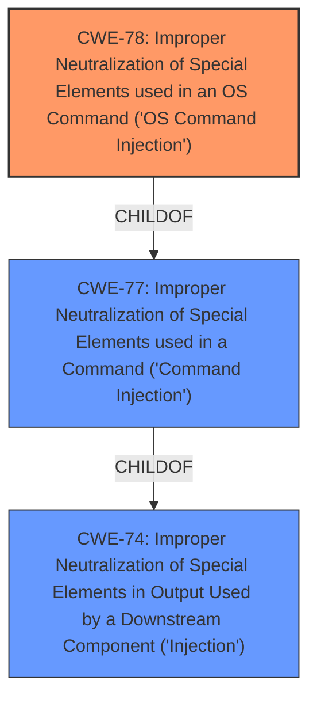

# Raw Analyzer Response for CVE-2021-23247

# Summary
| CWE ID | CWE Name | Confidence | CWE Abstraction Level | CWE Vulnerability Mapping Label | CWE-Vulnerability Mapping Notes |
|---|---|---|---|---|---|
| CWE-78 | Improper Neutralization of Special Elements used in an OS Command ('OS Command Injection') | 0.9 | Base | Allowed | Primary CWE |

## Evidence and Confidence

*   **Confidence Score:** 0.9
*   **Evidence Strength:** HIGH

## Relationship Analysis
The primary relationship that influenced the decision was the ChildOf relationship between CWE-78 and CWE-77. CWE-78 is a Base variant of CWE-77, which is a Class. Since the vulnerability description specifically refers to "command injection" in the context of a game engine, it's reasonable to assume this means OS commands could be executed. Therefore, the more specific CWE-78 is selected over the more generic CWE-77.

## Vulnerability Chain
The vulnerability chain consists of:
1.  **Root Cause:** Improper Neutralization of Special Elements used in an OS Command (CWE-78).
2.  **Impact:** Arbitrary code execution.

## Summary of Analysis
The analysis is based on the vulnerability description which states a "**command injection** vulnerability" exists in the Quick Game Engine that "allows arbitrary remote code in quick app," and "allows remote attackers to gain arbitrary code execution".

The Retriever Results listed CWE-77 (Improper Neutralization of Special Elements used in a Command ('Command Injection')) as the top hit and CWE-78 (Improper Neutralization of Special Elements used in an OS Command ('OS Command Injection')) as the second hit.
CWE-77 is a Class, and CWE-78 is a Base.

The term "**command injection**" often implies OS command injection, as noted in the CWE-77 mapping guidance ("CWE-77 is often misused when OS command injection (CWE-78) was intended instead"). Given the context of a game engine, the injection likely involves OS commands. Therefore, selecting CWE-78 is appropriate.

CWE-78 is at the optimal level of specificity because it directly addresses the **root cause** of the vulnerability: the failure to properly neutralize special elements in OS commands. The vulnerability description clearly states that the **command injection** leads to arbitrary code execution, which is a direct consequence of the **weakness**. Other CWEs like CWE-77 are more general and less descriptive of the specific vulnerability.