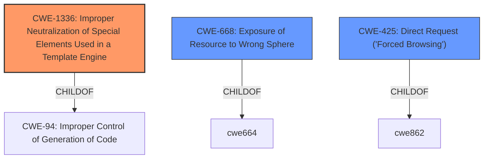

# Analysis for CVE-2021-23263

# Summary
| CWE ID | CWE Name | Confidence | CWE Abstraction Level | CWE Vulnerability Mapping Label | CWE-Vulnerability Mapping Notes |
|---|---|---|---|---|---|
| CWE-1336 | Improper Neutralization of Special Elements Used in a Template Engine | 0.8 | Base | Allowed | Primary CWE |
| CWE-668 | Exposure of Resource to Wrong Sphere | 0.6 | Class | Discouraged | Secondary Candidate |
| CWE-425 | Direct Request ('Forced Browsing') | 0.5 | Base | Allowed | Secondary Candidate |

## Evidence and Confidence

*   **Confidence Score:** 0.7
*   **Evidence Strength:** MEDIUM

## Relationship Analysis
The primary CWE, CWE-1336, is a child of CWE-94 (Improper Control of Generation of Code), indicating a code injection context. CWE-668 (Exposure of Resource to Wrong Sphere) is a high-level class which is discouraged. CWE-425 is about missing authorization.

## Vulnerability Chain
The vulnerability chain starts with the improper handling of input in the FreeMarker template engine (CWE-1336), leading to the ability to read sensitive files. This could be seen as an exposure of resources to the wrong sphere (CWE-668) or a missing authorization check (CWE-425).

## Summary of Analysis
The initial assessment identified several candidate CWEs, but after a detailed analysis, CWE-1336 (Improper Neutralization of Special Elements Used in a Template Engine) appears to be the most appropriate primary CWE. This is based on the **root cause** being related to the FreeMarker template engine and the ability of attackers to read textual content by injecting special elements.

The vulnerability description states: "Unauthenticated remote attackers can read textual content via FreeMarker including files /scripts/*, /templates/* and some of the files in /.git/* (non-binary)." This indicates that the **weakness** lies in how FreeMarker handles input, allowing attackers to read sensitive files.

CWE-1336 specifically addresses the scenario where a template engine **does not neutralize or incorrectly neutralizes special elements or syntax**, which aligns with the vulnerability description. The description of CWE-1336 also mentions FreeMarker as an example of a template engine that can be affected by this type of vulnerability.

The retriever results show CWE-1336 as a top combined result, further supporting this classification.

CWE-668 (Exposure of Resource to Wrong Sphere) was considered because the vulnerability allows attackers to read files they should not have access to. However, CWE-668 is a high-level class and is often misused when lower-level CWE IDs might be applicable, as stated in its mapping guidance. Since CWE-1336 provides a more specific explanation of the **root cause**, it is a better fit.

CWE-425 (Direct Request ('Forced Browsing')) was also considered because the vulnerability allows attackers to access files directly without proper authorization. However, the **root cause** is not a lack of authorization checks, but rather the improper handling of input in the template engine.

Ultimately, CWE-1336 is the most appropriate CWE because it accurately describes the **root cause** of the vulnerability, which is the improper handling of special elements in the FreeMarker template engine, leading to the ability to read sensitive files. This aligns with the vulnerability description and the mapping guidance for CWE-1336.

Relevant CWE Information:

# Enhanced Context (25 CWEs)
The following CWEs were identified as potentially relevant to this vulnerability:

## CWE-59: Improper Link Resolution Before File Access ('Link Following')
**Abstraction Level**: Base
**Similarity Score**: 0.81
**Source**: dense

**Description**:
The product attempts to access a file based on the filename, but it does not properly prevent that filename from identifying a link or shortcut that resolves to an unintended resource.

**Mapping Guidance**:
- Usage: Allowed
- Rationale: This CWE entry is at the Base level of abstraction, which is a preferred level of abstraction for mapping to the root causes of vulnerabilities.

## CWE-41: Improper Resolution of Path Equivalence
**Abstraction Level**: Base
**Similarity Score**: 0.80
**Source**: dense

**Description**:
The product is vulnerable to file system contents disclosure through path equivalence. Path equivalence involves the use of special characters in file and directory names. The associated manipulations are intended to generate multiple names for the same object.

**Mapping Guidance**:
- Usage: Allowed
- Rationale: This CWE entry is at the Base level of abstraction, which is a preferred level of abstraction for mapping to the root causes of vulnerabilities.

## CWE-23: Relative Path Traversal
**Abstraction Level**: Base
**Similarity Score**: 0.80
**Source**: dense

**Description**:
The product uses external input to construct a pathname that should be within a restricted directory, but it does not properly neutralize sequences such as ".." that can resolve to a location that is outside of that directory.

**Mapping Guidance**:
- Usage: Allowed
- Rationale: This CWE entry is at the Base level of abstraction, which is a preferred level of abstraction for mapping to the root causes of vulnerabilities.

## CWE-24: Path Traversal: '../filedir'
**Abstraction Level**: Variant
**Similarity Score**: 0.79
**Source**: dense

**Description**:
The product uses external input to construct a pathname that should be within a restricted directory, but it does not properly neutralize "../" sequences that can resolve to a location that is outside of that directory.

**Mapping Guidance**:
- Usage: Allowed
- Rationale: This CWE entry is at the Variant level of abstraction, which is a preferred level of abstraction for mapping to the root causes of vulnerabilities.

## CWE-73: External Control of File Name or Path
**Abstraction Level**: Base
**Similarity Score**: 0.79
**Source**: dense

**Description**:
The product allows user input to control or influence paths or file names that are used in filesystem operations.

**Mapping Guidance**:
- Usage: Allowed
- Rationale: This CWE entry is at the Base level of abstraction, which is a preferred level of abstraction for mapping to the root causes of vulnerabilities.

## CWE-36: Absolute Path Traversal
**Abstraction Level**: Base
**Similarity Score**: 0.78
**Source**: dense

**Description**:
The product uses external input to construct a pathname that should be within a restricted directory, but it does not properly neutralize absolute path sequences such as "/abs/path" that can resolve to a location that is outside of that directory.

**Mapping Guidance**:
- Usage: Allowed
- Rationale: This CWE entry is at the Base level of abstraction, which is a preferred level of abstraction for mapping to the root causes of vulnerabilities.

## CWE-61: UNIX Symbolic Link (Symlink) Following
**Abstraction Level**: Compound
**Similarity Score**: 0.77
**Source**: dense

**Description**:
The product, when opening a file or directory, does not sufficiently account for when the file is a symbolic link that resolves to a target outside of the intended control sphere. This could allow an attacker to cause the product to operate on unauthorized files.

**Mapping Guidance**:
- Usage: Allowed
- Rationale: This is a well-known Composite of multiple weaknesses that must all occur simultaneously, although it is attack-oriented in nature.

## CWE-427: Uncontrolled Search Path Element
**Abstraction Level**: Base
**Similarity Score**: 0.77
**Source**: dense

**Description**:
The product uses a fixed or controlled search path to find resources, but one or more locations in that path can be under the control of unintended actors.

**Mapping Guidance**:
- Usage: Allowed
- Rationale: This CWE entry is at the Base level of abstraction, which is a preferred level of abstraction for mapping to the root causes of vulnerabilities.

## CWE-552: Files or Directories Accessible to External Parties
**Abstraction Level**: Base
**Similarity Score**: 0.76
**Source**: dense

**Description**:
The product makes files or directories accessible to unauthorized actors, even though they should not be.

**Mapping Guidance**:
- Usage: Allowed
- Rationale: This CWE entry is