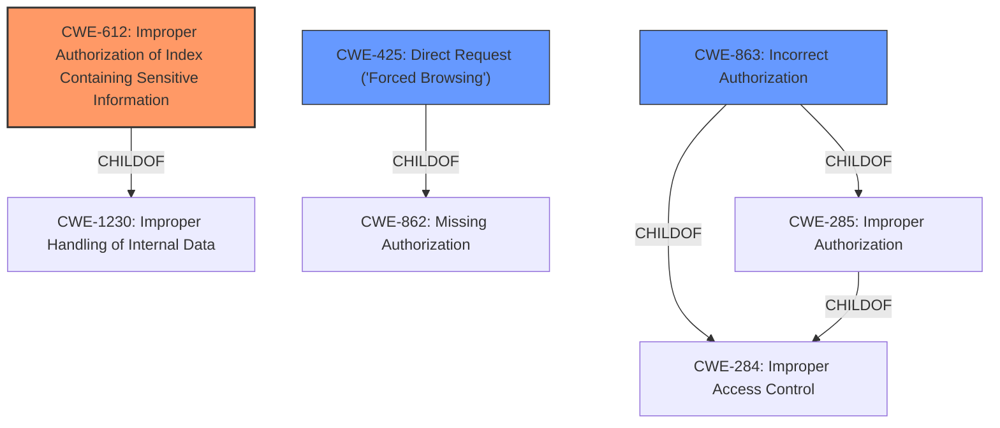

# Raw Analyzer Response for CVE-2021-23264

# Summary
| CWE ID | CWE Name | Confidence | CWE Abstraction Level | CWE Vulnerability Mapping Label | CWE-Vulnerability Mapping Notes |
|---|---|---|---|---|---|
| CWE-612 | Improper Authorization of Index Containing Sensitive Information | 0.8 | Base | Allowed | Primary CWE |
| CWE-425 | Direct Request ('Forced Browsing') | 0.6 | Base | Allowed | Secondary Candidate |
| CWE-863 | Incorrect Authorization | 0.5 | Class | Allowed-with-Review | Secondary Candidate |

## Evidence and Confidence

*   **Confidence Score:** 0.8
*   **Evidence Strength:** MEDIUM

## Relationship Analysis
The primary CWE, CWE-612, is a base-level CWE that describes the **improper authorization** of a search index containing sensitive information. This is a child of CWE-1230. The secondary CWEs CWE-425 and CWE-863 relate to **improper authorization** and access control issues. CWE-425 is a child of CWE-862, and CWE-863 is a child of CWE-285 and CWE-284. The relationship analysis highlights the importance of focusing on **improper authorization** when dealing with vulnerabilities involving access to sensitive information through search indexes.

## Vulnerability Chain
The vulnerability chain starts with the **lack of authorization** controls on the crafter-search component, leading to unauthenticated remote attackers being able to create, view, and delete search indexes. This directly relates to **improper authorization** and potentially **exposure of sensitive information**.

## Summary of Analysis
The initial analysis pointed towards CWE-612 because the vulnerability description explicitly mentions the ability to create, view, and delete search indexes without authentication. This indicates that the system **does not properly limit index access to actors who are authorized to see the original information.** The evidence supporting this is: "Installations, where crafter-search is not protected, allow unauthenticated remote attackers to create, view, and delete search indexes."

The retriever results also listed CWE-612 with the highest dense score, reinforcing this assessment.

CWE-425 and CWE-863 were considered as secondary CWEs because they are related to authorization issues, but they are less specific than CWE-612. The decision to prioritize CWE-612 is based on the vulnerability description's emphasis on the **improper authorization** of search indexes.

The selected CWEs are at the optimal level of specificity because they directly address the **root cause** of the vulnerability: the **lack of proper authorization** controls on the search indexes.

Relevant CWE Information:

# Enhanced Context (25 CWEs)

## CWE-612: Improper Authorization of Index Containing Sensitive Information
**Abstraction Level**: Base
**Similarity Score**: 0.75
**Source**: dense

**Description**:
The product creates a search index of private or sensitive documents, but it does not properly limit index access to actors who are authorized to see the original information.

**Mapping Guidance**:
- Usage: Allowed
- Rationale: This CWE entry is at the Base level of abstraction, which is a preferred level of abstraction for mapping to the root causes of vulnerabilities.