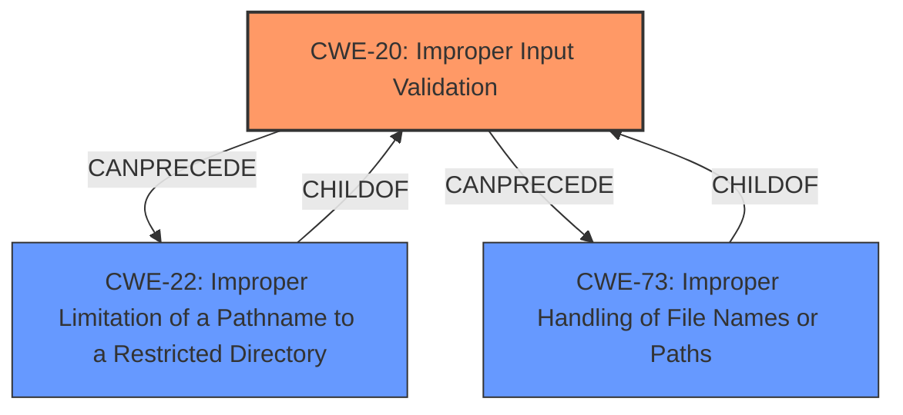

# Analysis for CVE-2021-23278

# Summary
| CWE ID  | CWE Name                                                                                | Confidence | CWE Abstraction Level | CWE Vulnerability Mapping Label | CWE-Vulnerability Mapping Notes |
| :-------- | :--------------------------------------------------------------------------------------- | :---------- | :----------------------- | :------------------------------ | :------------------------------ |
| CWE-20    | Improper Input Validation                                                               | 0.85         | Class                    | Primary                         | Discouraged                   |
| CWE-73    | Improper Handling of File Names or Paths                                               | 0.75         | Base                  | Secondary                         | Allowed                     |
| CWE-22   | Improper Limitation of a Pathname to a Restricted Directory ('Path Traversal') | 0.60         | Base                   | Secondary                         | Allowed                  |

## Evidence and Confidence

*   **Confidence Score:** 0.75
*   **Evidence Strength:** MEDIUM

## Relationship Analysis
The primary weakness identified is **CWE-20 (Improper Input Validation)**, which is a high-level Class. The analysis considers that the vulnerability involves **improper input validation** leading to arbitrary file deletion. While **CWE-20** is broad, it sets the stage for understanding the root cause. The analysis also considers that path traversal could be possible, which falls under **CWE-22 (Improper Limitation of a Pathname to a Restricted Directory ('Path Traversal'))** or **CWE-73 (Improper Handling of File Names or Paths)**.
*   **CWE-20** is a class-level CWE, suggesting the need for more specific child CWEs if the evidence supports them.
*   **CWE-22** and **CWE-73** are both base-level CWEs, representing more specific types of path-related vulnerabilities.
*   **CWE-20** can precede **CWE-22** or **CWE-73** in a vulnerability chain.

## Vulnerability Chain
The vulnerability chain starts with **improper input validation** (**CWE-20**), which then allows for the deletion of arbitrary files on the system.

## Summary of Analysis
The initial analysis identified the root cause as **improper input validation**, which leads to arbitrary file deletion. The evidence, taken directly from the vulnerability description and CVE reference links, supports this: "**improper input validation** at server/maps_srv.js with action removeBackground and server/node_upgrade_srv.js with action removeFirmware" and "**Weaknesses/vulnerabilities present**: **Improper input validation** leading to arbitrary file deletion."

The relationship analysis shows that **CWE-20** can lead to other vulnerabilities such as **CWE-22** and **CWE-73**. Based on the description, a file path is provided as input, and **improper validation** of this path allows deletion of arbitrary files. This suggests a path traversal or path injection issue. Therefore, **CWE-22** and **CWE-73** are considered as secondary CWEs.

Given the available evidence, **CWE-20** is the primary weakness, while **CWE-22** and **CWE-73** are secondary weaknesses that provide more specific context to the **improper input validation**. The chosen CWEs are at an appropriate level of specificity, with **CWE-20** being a class and **CWE-22** and **CWE-73** being base.

Relevant CWE Information:

# Enhanced Context (25 CWEs)
The following CWEs were identified as potentially relevant to this vulnerability:

## CWE-1289: Improper Validation of Unsafe Equivalence in Input
**Abstraction Level**: Base
**Similarity Score**: 0.76
**Source**: dense

**Description**:
The product receives an input value that is used as a resource identifier or other type of reference, but it does not validate or incorrectly validates that the input is equivalent to a potentially-unsafe value.

**Mapping Guidance**:
- Usage: Allowed
- Rationale: This CWE entry is at the Base level of abstraction, which is a preferred level of abstraction for mapping to the root causes of vulnerabilities.

## CWE-74: Improper Neutralization of Special Elements in Output Used by a Downstream Component ('Injection')
**Abstraction Level**: Class
**Similarity Score**: 0.76
**Source**: dense

**Description**:
The product constructs all or part of a command, data structure, or record using externally-influenced input from an upstream component, but it does not neutralize or incorrectly neutralizes special elements that could modify how it is parsed or interpreted when it is sent to a downstream component.

**Mapping Guidance**:
- Usage: Discouraged
- Rationale: CWE-74 is high-level and often misused when lower-level weaknesses are more appropriate.

## CWE-184: Incomplete List of Disallowed Inputs
**Abstraction Level**: Base
**Similarity Score**: 0.76
**Source**: dense

**Description**:
The product implements a protection mechanism that relies on a list of inputs (or properties of inputs) that are not allowed by policy or otherwise require other action to neutralize before additional processing takes place, but the list is incomplete.

**Mapping Guidance**:
- Usage: Allowed
- Rationale: This CWE entry is at the Base level of abstraction, which is a preferred level of abstraction for mapping to the root causes of vulnerabilities.

## CWE-807: Reliance on Untrusted Inputs in a Security Decision
**Abstraction Level**: Base
**Similarity Score**: 0.76
**Source**: dense

**Description**:
The product uses a protection mechanism that relies on the existence or values of an input, but the input can be modified by an untrusted actor in a way that bypasses the protection mechanism.

**Mapping Guidance**:
- Usage: Allowed
- Rationale: This CWE entry is at the Base level of abstraction, which is a preferred level of abstraction for mapping to the root causes of vulnerabilities.

## CWE-183: Permissive List of Allowed Inputs
**Abstraction Level**: Base
**Similarity Score**: 0.75
**Source**: dense

**Description**:
The product implements a protection mechanism that relies on a list of inputs (or properties of inputs) that are explicitly allowed by policy because the inputs are assumed to be safe, but the list is too permissive - that is, it allows an input that is unsafe, leading to resultant weaknesses.

**Mapping Guidance**:
- Usage: Allowed
- Rationale: This CWE entry is at the Base level of abstraction, which is a preferred level of abstraction for mapping to the root causes of vulnerabilities.

## CWE-653: Improper Isolation or Compartmentalization
**Abstraction Level**: Class
**Similarity Score**: 0.75
**Source**: dense

**Description**:
The product does not properly compartmentalize or isolate functionality, processes, or resources that require different privilege levels, rights, or permissions.

**Mapping Guidance**:
- Usage: Allowed
- Rationale: This CWE entry is at the Base level of abstraction, which is a preferred level of abstraction for mapping to the root causes of vulnerabilities.

## CWE-274: Improper Handling of Insufficient Privileges
**Abstraction Level**: Base
**Similarity Score**: 0.75
**Source**: dense

**Description**:
The product does not handle or incorrectly handles when it has insufficient privileges to perform an operation, leading to resultant weaknesses.

**Mapping Guidance**:
- Usage: Discouraged
- Rationale: This CWE entry could be deprecated in a future version of CWE.

## CWE-138: Improper Neutralization of Special Elements
**Abstraction Level**: Class
**Similarity Score**: 0.75
**Source**: dense

**Description**:
The product receives input from an upstream component, but it does not neutralize or incorrectly neutralizes special elements that could be interpreted as control elements or syntactic markers when they are sent to a downstream component.

**Mapping Guidance**:
- Usage: Discouraged
- Rationale: This CWE entry is a level-1 Class (i.e., a child of a Pillar). It might have lower-level children that would be more appropriate

## CWE-280: Improper Handling of Insufficient Permissions or Privileges
**Abstraction Level**: Base
**Similarity Score**: 0.75
**Source**: dense

**Description**:
The product does not handle or incorrectly handles when it has insufficient privileges to access resources or functionality as specified by their permissions. This may cause it to follow unexpected code paths that may leave the product in an invalid state.

**Mapping Guidance**:
-