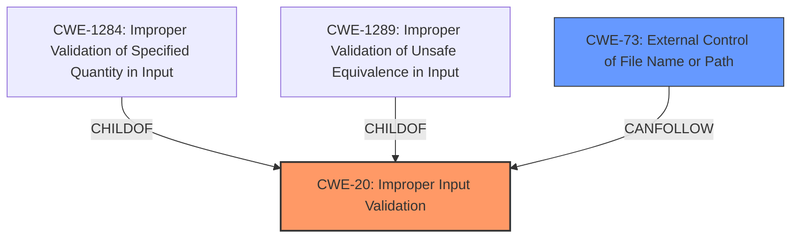

# Raw Analyzer Response for CVE-2021-23279

# Summary
| CWE ID | CWE Name | Confidence | CWE Abstraction Level | CWE Vulnerability Mapping Label | CWE-Vulnerability Mapping Notes |
|---|---|---|---|---|---|
| CWE-20 | Improper Input Validation | 0.9 | Class | Primary | Discouraged |
| CWE-73 | External Control of File Name or Path | 0.7 | Base | Secondary | Allowed |

## Evidence and Confidence

*   **Confidence Score:** 0.9
*   **Evidence Strength:** HIGH

## Relationship Analysis
The primary CWE is CWE-20 **Improper Input Validation**, which is a class-level CWE. While it's generally discouraged to map to class-level CWEs, the description clearly indicates that the root cause is **improper input validation**. CWE-20 has child relationships with CWEs like CWE-1284 (Improper Validation of Specified Quantity in Input) and CWE-1289 (Improper Validation of Unsafe Equivalence in Input). Although these are more specific, the available information does not provide enough detail to pinpoint the precise type of input validation that's missing, making CWE-20 the most appropriate choice. A secondary CWE is CWE-73, **External Control of File Name or Path**, because the vulnerability leads to arbitrary file deletion, suggesting that the file name or path is influenced by external input without proper validation.

## Vulnerability Chain
The chain of events is as follows:
1.  **Root Cause:** **Improper Input Validation** (CWE-20) in `meta_driver_srv.js` with the `saveDriverData` action.
2.  The invalidated `driverID` is used without proper checks.
3.  **Impact:** This leads to an unauthenticated arbitrary file delete.

## Summary of Analysis
The initial analysis correctly identifies **improper input validation** as the root cause. The vulnerability description explicitly states that the Eaton IPM software is vulnerable to an unauthenticated arbitrary file delete due to **improper input validation** in the `meta_driver_srv.js` class. The `CVE Reference Links Content Summary` reinforces this, pointing out that the root cause is **improper input validation** using an invalidated `driverID`.

The retriever results also suggest CWE-20 **Improper Input Validation** as a candidate, although it's a class-level CWE and generally discouraged. However, the evidence directly points to this weakness, and more specific variant CWEs cannot be determined with the given information.

The graph relationships highlight that CWE-20 has children that represent more specific types of input validation issues. While ideally, a more specific CWE would be chosen, there isn't enough information to select a child CWE confidently.

CWE-73 **External Control of File Name or Path** is selected as a secondary CWE because the vulnerability enables an attacker to delete arbitrary files, implying that the file name or path is influenced by external input without proper validation.

The final selection is based on the evidence provided in the vulnerability description and CVE summary, which clearly indicates **improper input validation** as the primary issue. While CWE-20 is a class-level CWE, it is the most accurate representation of the root cause given the available information.

Relevant CWE Information:
# Enhanced Context (25 CWEs)
The following CWEs were identified as potentially relevant to this vulnerability:

## CWE-1289: Improper Validation of Unsafe Equivalence in Input
**Abstraction Level**: Base
**Similarity Score**: 0.78

## CWE-74: Improper Neutralization of Special Elements in Output Used by a Downstream Component ('Injection')
**Abstraction Level**: Class
**Similarity Score**: 0.75

## CWE-184: Incomplete List of Disallowed Inputs
**Abstraction Level**: Base
**Similarity Score**: 0.75

## CWE-807: Reliance on Untrusted Inputs in a Security Decision
**Abstraction Level**: Base
**Similarity Score**: 0.75

## CWE-138: Improper Neutralization of Special Elements
**Abstraction Level**: Class
**Similarity Score**: 0.75

## CWE-41: Improper Resolution of Path Equivalence
**Abstraction Level**: Base
**Similarity Score**: 0.74

## CWE-274: Improper Handling of Insufficient Privileges
**Abstraction Level**: Base
**Similarity Score**: 0.74

## CWE-183: Permissive List of Allowed Inputs
**Abstraction Level**: Base
**Similarity Score**: 0.74

## CWE-73: External Control of File Name or Path
**Abstraction Level**: Base
**Similarity Score**: 0.74

## CWE-280: Improper Handling of Insufficient Permissions or Privileges
**Abstraction Level**: Base
**Similarity Score**: 0.74

## CWE-22: Improper Limitation of a Pathname to a Restricted Directory ('Path Traversal')
**Abstraction Level**: Base
**Similarity Score**: 7290.53

## CWE-95: Improper Neutralization of Directives in Dynamically Evaluated Code ('Eval Injection')
**Abstraction Level**: Variant
**Similarity Score**: 7201.53

## CWE-23: Relative Path Traversal
**Abstraction Level**: Base
**Similarity Score**: 7099.52

## CWE-116: Improper Encoding or Escaping of Output
**Abstraction Level**: Class
**Similarity Score**: 7083.53

## CWE-138: Improper Neutralization of Special Elements
**Abstraction Level**: Class
**Similarity Score**: 7045.92

## CWE-78: Improper Neutralization of Special Elements used in an OS Command ('OS Command Injection')
**Abstraction Level**: base
**Similarity Score**: 5.03

## CWE-59: Improper Link Resolution Before File Access ('Link Following')
**Abstraction Level**: base
**Similarity Score**: 4.33

## CWE-22: Improper Limitation of a Pathname to a Restricted Directory ('Path Traversal')
**Abstraction Level**: base
**Similarity Score**: 4.33

## CWE-770: Allocation of Resources Without Limits or Throttling
**Abstraction Level**: base
**Similarity Score**: 4.33

## CWE-190: Integer Overflow or Wraparound
**Abstraction Level**: base
**Similarity Score**: 4.33

## CWE-1284: Improper Validation of Specified Quantity in Input
**Abstraction Level**: base
**Similarity Score**: 4.33

## CWE-789: Memory Allocation with Excessive Size Value
**Abstraction Level**: variant
**Similarity Score**: 3.88

## CWE-88: Improper Neutralization of Argument Delimiters in a Command ('Argument Injection')
**Abstraction Level**: base
**Similarity Score**: 3.64

## CWE-625: Permissive Regular Expression
**Abstraction Level**: base
**Similarity Score**: 3.64

## CWE-843: Access of Resource Using Incompatible Type ('Type Confusion')
**Abstraction Level**: base
**Similarity Score**: 3.44

CWEs Considered but not used:
- CWE-95 **Improper Neutralization of Directives in Dynamically Evaluated Code ('Eval Injection')**: While this CWE appeared in the retriever results, there's no indication that the vulnerability involves dynamic code evaluation. The description focuses on file deletion due to **improper input validation**, not code injection.
- CWE-23 **Relative Path Traversal**: This CWE is related to path manipulation, but the vulnerability description does not explicitly mention path traversal. The primary issue is **improper input validation** that leads to arbitrary file deletion, not necessarily traversing directories.
- CWE-78 **Improper Neutralization of Special Elements used in an OS Command ('OS Command Injection')**: This CWE is for OS command injection, which is not indicated in the vulnerability description. The issue is arbitrary file deletion, not executing arbitrary commands.
- CWE-862 **Missing Authorization**: While the vulnerability is unauthenticated, the root cause is **improper input validation**, not a missing authorization check. The input validation failure allows the file deletion to occur without authentication.
- CWE-1284 **Improper Validation of Specified Quantity in Input**: This CWE is more specific than CWE-20, focusing on the validation of quantities. While input validation is the root cause, there's no information to suggest the type of input that is not validated is a quantity such as size or