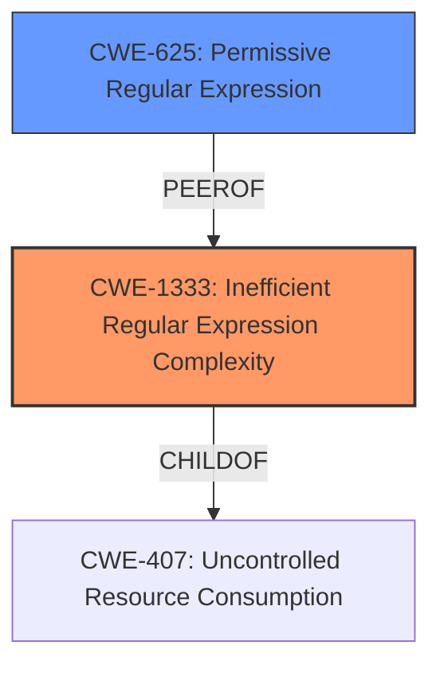

# Analysis Report for CVE-2021-23341

# Vulnerability Analysis Report: CVE-2021-23341

## Description


## Analysis (with Relationship Data)

# Summary
| CWE ID | CWE Name | Confidence | CWE Abstraction Level | CWE Vulnerability Mapping Label | CWE-Vulnerability Mapping Notes |
|---|---|---|---|---|---|
| CWE-1333 | Inefficient Regular Expression Complexity | 1.0 | Base | Allowed | Primary CWE |
| CWE-625 | Permissive Regular Expression | 0.7 | Base | Allowed | Secondary Candidate |

## Evidence and Confidence

*   **Confidence Score:** 0.9
*   **Evidence Strength:** HIGH

## Relationship Analysis
The primary relationship that influenced the CWE selection was the hierarchical relationship between CWE-1333 and CWE-407 (Uncontrolled Resource Consumption). CWE-1333 is a child of CWE-407, indicating that it's a more specific type of resource consumption issue related to inefficient regular expressions. Since the vulnerability description explicitly mentions "Regular Expression Denial of Service (ReDoS)" and "crafted input strings that force the regex engine to consume excessive CPU resources", CWE-1333 is the more appropriate choice.

CWE-625 (Permissive Regular Expression) is a peer of CWE-187 (Partial String Comparison), CWE-184 (Incomplete List of Disallowed Inputs) and CWE-183 (Permissive List of Allowed Inputs) and a child of CWE-185 (Incorrect Regular Expression). These relationships suggest alternative classifications related to regular expression issues, but CWE-1333 more directly addresses the denial-of-service aspect caused by complexity.



## Vulnerability Chain
The vulnerability chain starts with the **inefficient regular expression** (CWE-1333). This leads to excessive CPU consumption and ultimately results in a denial-of-service (DoS) condition.

## Summary of Analysis
The initial assessment strongly pointed towards CWE-1333 (Inefficient Regular Expression Complexity) due to the explicit mention of "Regular Expression Denial of Service (ReDoS)" in the vulnerability description and the "root_cause" section of the CVE Reference Links Content Summary. The summary states that "The vulnerability is caused by the use of vulnerable regular expressions in the prismjs library. These regexes are susceptible to catastrophic backtracking." This aligns perfectly with the description of CWE-1333, which focuses on regular expressions with inefficient computational complexity leading to excessive CPU cycles.

The evidence to support CWE-1333 is strong:
- Vulnerability Description Key Phrases: "**weakness:** **regular expression denial of service**"
- CVE Reference Links Content Summary: "root_cause": "The vulnerability is caused by the use of vulnerable regular expressions ... susceptible to catastrophic backtracking."

The Retriever Results also strongly suggest CWE-1333, with a score of 1.0.

CWE-625 (Permissive Regular Expression) was considered as a secondary candidate because the regular expressions might not sufficiently restrict the set of allowed values, contributing to the ReDoS. However, the primary issue is the inefficient complexity rather than the permissiveness.

The selected CWE, CWE-1333, is at the optimal level of specificity because it directly addresses the root cause of the vulnerability – the inefficient regular expression complexity leading to denial of service.

Relevant CWE Information:

# Enhanced Context (25 CWEs)
The following CWEs were identified as potentially relevant to this vulnerability:

## CWE-625: Permissive Regular Expression
**Abstraction Level**: Base
**Similarity Score**: 0.79
**Source**: dense

**Description**:
The product uses a regular expression that does not sufficiently restrict the set of allowed values.

**Mapping Guidance**:
- Usage: Allowed
- Rationale: This CWE entry is at the Base level of abstraction, which is a preferred level of abstraction for mapping to the root causes of vulnerabilities.


## CWE-185: Incorrect Regular Expression
**Abstraction Level**: Class
**Similarity Score**: 0.78
**Source**: dense

**Description**:
The product specifies a regular expression in a way that causes data to be improperly matched or compared.

**Mapping Guidance**:
- Usage: Allowed-with-Review
- Rationale: This CWE entry is a Class and might have Base-level children that would be more appropriate


## CWE-186: Overly Restrictive Regular Expression
**Abstraction Level**: Base
**Similarity Score**: 0.76
**Source**: dense

**Description**:
A regular expression is overly restrictive, which prevents dangerous values from being detected.

**Mapping Guidance**:
- Usage: Allowed
- Rationale: This CWE entry is at the Base level of abstraction, which is a preferred level of abstraction for mapping to the root causes of vulnerabilities.


## CWE-777: Regular Expression without Anchors
**Abstraction Level**: Variant
**Similarity Score**: 0.75
**Source**: dense

**Description**:
The product uses a regular expression to perform neutralization, but the regular expression is not anchored and may allow malicious or malformed data to slip through.

**Mapping Guidance**:
- Usage: Allowed
- Rationale: This CWE entry is at the Variant level of abstraction, which is a preferred level of abstraction for mapping to the root causes of vulnerabilities.


## CWE-1333: Inefficient Regular Expression Complexity
**Abstraction Level**: Base
**Similarity Score**: 0.74
**Source**: dense

**Description**:
The product uses a regular expression with an inefficient, possibly exponential worst-case computational complexity that consumes excessive CPU cycles.

**Mapping Guidance**:
- Usage: Allowed
- Rationale: This CWE entry is at the Base level of abstraction, which is a preferred level of abstraction for mapping to the root causes of vulnerabilities.


## CWE-1289: Improper Validation of Unsafe Equivalence in Input
**Abstraction Level**: Base
**Similarity Score**: 0.74
**Source**: dense

**Description**:
The product receives an input value that is used as a resource identifier or other type of reference, but it does not validate or incorrectly validates that the input is equivalent to a potentially-unsafe value.

**Mapping Guidance**:
- Usage: Allowed
- Rationale: This CWE entry is at the Base level of abstraction, which is a preferred level of abstraction for mapping to the root causes of vulnerabilities.


## CWE-184: Incomplete List of Disallowed Inputs
**Abstraction Level**: Base
**Similarity Score**: 0.72
**Source**: dense

**Description**:
The product implements a protection mechanism that relies on a list of inputs (or properties of inputs) that are not allowed by policy or otherwise require other action to neutralize before additional processing takes place, but the list is incomplete.

**Mapping Guidance**:
- Usage: Allowed
- Rationale: This CWE entry is at the Base level of abstraction, which is a preferred level of abstraction for mapping to the root causes of vulnerabilities.


## CWE-668: Exposure of Resource to Wrong Sphere
**Abstraction Level**: Class
**Similarity Score**: 0.72
**Source**: dense

**Description**:
The product exposes a resource to the wrong control sphere, providing unintended actors with inappropriate access to the resource.

**Mapping Guidance**:
- Usage: Discouraged
- Rationale: CWE-668 is high-level and is often misused as a catch-all when lower-level CWE IDs might be applicable. It is sometimes used for low-information vulnerability reports [REF-1287]. It is a level-1 Class (i.e., a child of a Pillar). It is not useful for trend analysis.


## CWE-183: Permissive List of Allowed Inputs
**Abstraction Level**: Base
**Similarity Score**: 0.72
**Source**: dense

**Description**:
The product implements a protection mechanism that relies on a list of inputs (or properties of inputs) that are explicitly allowed by policy because the inputs are assumed to be safe, but the list is too permissive - that is, it allows an input that is unsafe, leading to resultant weaknesses.

**Mapping Guidance**:
- Usage: Allowed
- Rationale: This CWE entry is at the Base level of abstraction, which is a preferred level of abstraction for mapping to the root causes of vulnerabilities.


## CWE-41: Improper Resolution of Path Equivalence
**Abstraction Level**: Base
**Similarity Score**: 0.72
**Source**: dense

**Description**:
The product is vulnerable to file system contents disclosure through path equivalence. Path equivalence involves the use of special characters in file and directory names. The associated manipulations are intended to generate multiple names for the same object.

**Mapping Guidance**:
- Usage: Allowed
- Rationale: This CWE entry is at the Base level of abstraction, which is a preferred level of abstraction for mapping to the root causes of vulnerabilities.


##


## CWE Relationship Analysis

Current CWEs represent these abstraction levels: .


### Vulnerability Chain Analysis

**Chain starting from CWE-186:**
- 186 (Overly Restrictive Regular Expression) - ROOT


**Chain starting from CWE-185:**
- 185 (Incorrect Regular Expression) - ROOT


### CWE Relationship Diagram

```mermaid
graph TD
    classDef primary fill:#f96,stroke:#333,stroke-width:2px
    classDef secondary fill:#69f,stroke:#333
    classDef tertiary fill:#9e9,stroke:#333
```


*Report generated on 2025-04-02 00:29:45*
