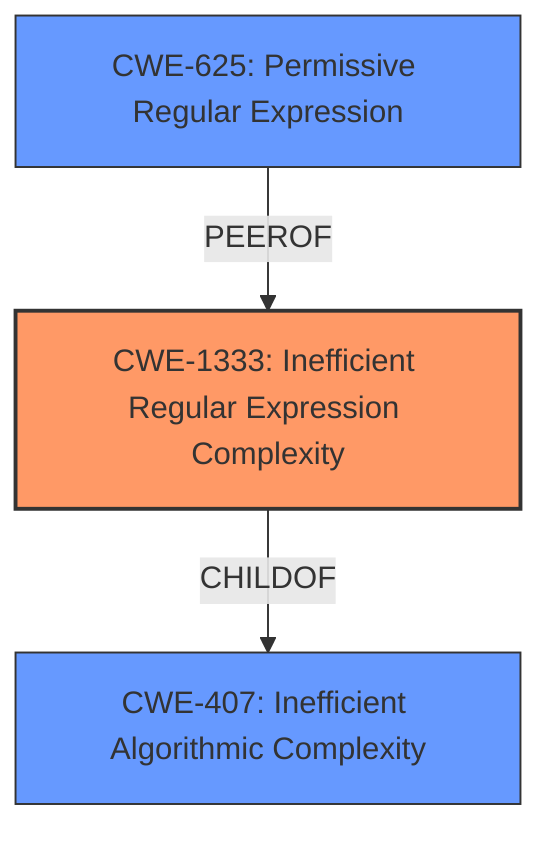

# Enhanced Analysis for CVE-2021-23343

# Summary
| CWE ID | CWE Name | Confidence | CWE Abstraction Level | CWE Vulnerability Mapping Label | CWE-Vulnerability Mapping Notes |
|---|---|---|---|---|---|
| CWE-1333 | Inefficient Regular Expression Complexity | 1.0 | Base | Allowed | Primary CWE |
| CWE-407 | Inefficient Algorithmic Complexity | 0.7 | Class | Allowed-with-Review | Secondary Candidate |
| CWE-625 | Permissive Regular Expression | 0.6 | Base | Allowed | Secondary Candidate |

## Evidence and Confidence

*   **Confidence Score:** 0.9
*   **Evidence Strength:** HIGH

## Relationship Analysis
The primary CWE is CWE-1333, which is a child of CWE-407. This indicates a hierarchical relationship where CWE-1333 is a specific type of CWE-407. We selected CWE-1333 because it is more specific to the vulnerability described, involving inefficient regular expression complexity.
CWE-625 is a peer of CWE-187, CWE-184, and CWE-183, representing alternative classifications related to regular expression issues. However, CWE-1333 more directly addresses the **root cause** of the denial-of-service vulnerability.



## Vulnerability Chain
The chain of events is as follows:
1.  **Root Cause:** Inefficient Regular Expression Complexity (CWE-1333) in `splitDeviceRe`, `splitTailRe`, and `splitPathRe` regular expressions.
2.  **Weakness:** Regular expressions exhibit polynomial worst-case time complexity leading to catastrophic backtracking.
3.  **Impact:** Denial of Service (DoS) due to excessive CPU consumption when processing crafted input strings.

## Summary of Analysis
The initial analysis strongly points to CWE-1333 as the primary weakness. The **Vulnerability Description Key Phrases** explicitly mention "**regular expression denial of service**" and the **CVE Reference Links Content Summary** details "**inefficient regular expressions**" leading to "**catastrophic backtracking**". The Retriever Results also list CWE-1333 as the top match.

The decision is primarily based on the provided evidence, specifically:

*   "All versions of package path-parse are vulnerable to Regular Expression Denial of Service (ReDoS) via splitDeviceRe, splitTailRe, and splitPathRe regular expressions."
*   "The vulnerability stems from inefficient regular expressions used in the `path-parse` library."
*   "The vulnerable regular expressions exhibit polynomial worst-case time complexity, making them susceptible to ReDoS attacks."

CWE-1333 is selected as the optimal level of specificity because it directly addresses the **root cause** of the ReDoS vulnerability, which stems from the inefficient complexity of the regular expressions used.

Relevant CWE Information:

# Enhanced Context (25 CWEs)
The following CWEs were identified as potentially relevant to this vulnerability:

## CWE-625: Permissive Regular Expression
**Abstraction Level**: Base
**Similarity Score**: 0.76
**Source**: dense

**Description**:
The product uses a regular expression that does not sufficiently restrict the set of allowed values.

**Mapping Guidance**:
- Usage: Allowed
- Rationale: This CWE entry is at the Base level of abstraction, which is a preferred level of abstraction for mapping to the root causes of vulnerabilities.

## CWE-184: Incomplete List of Disallowed Inputs
**Abstraction Level**: Base
**Similarity Score**: 0.75
**Source**: dense

**Description**:
The product implements a protection mechanism that relies on a list of inputs (or properties of inputs) that are not allowed by policy or otherwise require other action to neutralize before additional processing takes place, but the list is incomplete.

**Mapping Guidance**:
- Usage: Allowed
- Rationale: This CWE entry is at the Base level of abstraction, which is a preferred level of abstraction for mapping to the root causes of vulnerabilities.

## CWE-407: Inefficient Algorithmic Complexity
**Abstraction Level**: Class
**Similarity Score**: 0.75
**Source**: dense

**Description**:
An algorithm in a product has an inefficient worst-case computational complexity that may be detrimental to system performance and can be triggered by an attacker, typically using crafted manipulations that ensure that the worst case is being reached.

**Mapping Guidance**:
- Usage: Allowed-with-Review
- Rationale: This CWE entry is a Class and might have Base-level children that would be more appropriate

## CWE-41: Improper Resolution of Path Equivalence
**Abstraction Level**: Base
**Similarity Score**: 0.75
**Source**: dense

**Description**:
The product is vulnerable to file system contents disclosure through path equivalence. Path equivalence involves the use of special characters in file and directory names. The associated manipulations are intended to generate multiple names for the same object.

**Mapping Guidance**:
- Usage: Allowed
- Rationale: This CWE entry is at the Base level of abstraction, which is a preferred level of abstraction for mapping to the root causes of vulnerabilities.

## CWE-74: Improper Neutralization of Special Elements in Output Used by a Downstream Component ('Injection')
**Abstraction Level**: Class
**Similarity Score**: 0.75
**Source**: dense

**Description**:
The product constructs all or part of a command, data structure, or record using externally-influenced input from an upstream component, but it does not neutralize or incorrectly neutralizes special elements that could modify how it is parsed or interpreted when it is sent to a downstream component.

**Mapping Guidance**:
- Usage: Discouraged
- Rationale: CWE-74 is high-level and often misused when lower-level weaknesses are more appropriate.

## CWE-212: Improper Removal of Sensitive Information Before Storage or Transfer
**Abstraction Level**: Base
**Similarity Score**: 0.75
**Source**: dense

**Description**:
The product stores, transfers, or shares a resource that contains sensitive information, but it does not properly remove that information before the product makes the resource available to unauthorized actors.

**Mapping Guidance**:
- Usage: Allowed
- Rationale: This CWE entry is at the Base level of abstraction, which is a preferred level of abstraction for mapping to the root causes of vulnerabilities.

## CWE-158: Improper Neutralization of Null Byte or NUL Character
**Abstraction Level**: Variant
**Similarity Score**: 0.75
**Source**: dense

**Description**:
The product receives input from an upstream component, but it does not neutralize or incorrectly neutralizes NUL characters or null bytes when they are sent to a downstream component.

**Mapping Guidance**:
- Usage: Allowed
- Rationale: This CWE entry is at the Variant level of abstraction, which is a preferred level of abstraction for mapping to the root causes of vulnerabilities.

## CWE-185: Incorrect Regular Expression
**Abstraction Level**: Class
**Similarity Score**: 0.75
**Source**: dense

**Description**:
The product specifies a regular expression in a way that causes data to be improperly matched or compared.

**Mapping Guidance**:
- Usage: Allowed-with-Review
- Rationale: This CWE entry is a Class and might have Base-level children that would be more appropriate

## CWE-138: Improper Neutralization of Special Elements
**Abstraction Level**: Class
**Similarity Score**: 0.75
**Source**: dense

**Description**:
The product receives input from an upstream component, but it does not neutralize or incorrectly neutralizes special elements that could be interpreted as control elements or syntactic markers when they are sent to a downstream component.

**Mapping Guidance**:
- Usage: Discouraged
- Rationale: This CWE entry is a level-1 Class (i.e., a child of a Pillar). It might have lower-level children that would be more appropriate

## CWE-703: Improper Check or Handling of Exceptional Conditions
**Abstraction Level**: Pillar
**Similarity Score**: 0.75
**Source**: dense

**Description**:
The product does not properly anticipate or handle exceptional conditions that rarely occur during normal operation of the product.

**Mapping Guidance**:
- Usage: Discouraged
- Rationale: This CWE entry is extremely high-level, a Pillar.

## CWE-1333: Inefficient Regular Expression Complexity
**Abstraction Level**: Base
**Similarity Score**: 5398.75
**Source**: sparse

**Description**:
The product uses a regular expression with an inefficient, possibly exponential worst-case computational complexity that consumes excessive CPU cycles


## CWE Relationship Analysis

Current CWEs represent these abstraction levels: .


### Vulnerability Chain Analysis

**Chain starting from CWE-185:**
- 185 (Incorrect Regular Expression) - ROOT


**Chain starting from CWE-187:**
- 187 (Partial String Comparison) - ROOT


### CWE Relationship Diagram

```mermaid
graph TD
    classDef primary fill:#f96,stroke:#333,stroke-width:2px
    classDef secondary fill:#69f,stroke:#333
    classDef tertiary fill:#9e9,stroke:#333
```