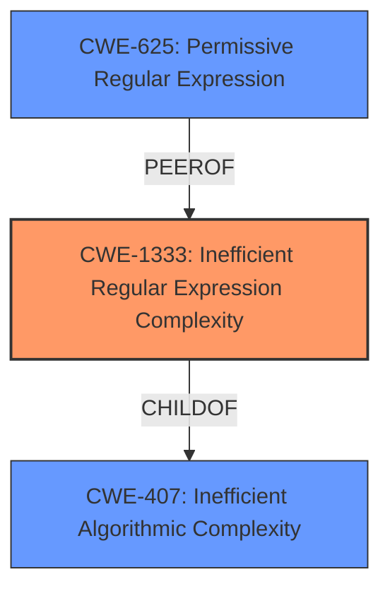

# Analysis for CVE-2021-23343

# Summary
| CWE ID | CWE Name | Confidence | CWE Abstraction Level | CWE Vulnerability Mapping Label | CWE-Vulnerability Mapping Notes |
|---|---|---|---|---|---|
| CWE-1333 | Inefficient Regular Expression Complexity | 1.0 | Base | Allowed | Primary CWE |
| CWE-407 | Inefficient Algorithmic Complexity | 0.7 | Class | Allowed-with-Review | Secondary Candidate |
| CWE-625 | Permissive Regular Expression | 0.6 | Base | Allowed | Secondary Candidate |

## Evidence and Confidence

*   **Confidence Score:** 0.9
*   **Evidence Strength:** HIGH

## Relationship Analysis
The primary CWE is CWE-1333, which is a child of CWE-407. This indicates a hierarchical relationship where CWE-1333 is a specific type of CWE-407. We selected CWE-1333 because it is more specific to the vulnerability described, involving inefficient regular expression complexity.
CWE-625 is a peer of CWE-187, CWE-184, and CWE-183, representing alternative classifications related to regular expression issues. However, CWE-1333 more directly addresses the **root cause** of the denial-of-service vulnerability.

## Vulnerability Chain
The chain of events is as follows:
1.  **Root Cause:** Inefficient Regular Expression Complexity (CWE-1333) in `splitDeviceRe`, `splitTailRe`, and `splitPathRe` regular expressions.
2.  **Weakness:** Regular expressions exhibit polynomial worst-case time complexity leading to catastrophic backtracking.
3.  **Impact:** Denial of Service (DoS) due to excessive CPU consumption when processing crafted input strings.

## Summary of Analysis
The initial analysis strongly points to CWE-1333 as the primary weakness. The **Vulnerability Description Key Phrases** explicitly mention "**regular expression denial of service**" and the **CVE Reference Links Content Summary** details "**inefficient regular expressions**" leading to "**catastrophic backtracking**". The Retriever Results also list CWE-1333 as the top match.

The decision is primarily based on the provided evidence, specifically:

*   "All versions of package path-parse are vulnerable to Regular Expression Denial of Service (ReDoS) via splitDeviceRe, splitTailRe, and splitPathRe regular expressions."
*   "The vulnerability stems from inefficient regular expressions used in the `path-parse` library."
*   "The vulnerable regular expressions exhibit polynomial worst-case time complexity, making them susceptible to ReDoS attacks."

CWE-1333 is selected as the optimal level of specificity because it directly addresses the **root cause** of the ReDoS vulnerability, which stems from the inefficient complexity of the regular expressions used.

Relevant CWE Information:

# Enhanced Context (25 CWEs)
The following CWEs were identified as potentially relevant to this vulnerability:

## CWE-625: Permissive Regular Expression
**Abstraction Level**: Base
**Similarity Score**: 0.76
**Source**: dense

**Description**:
The product uses a regular expression that does not sufficiently restrict the set of allowed values.

**Mapping Guidance**:
- Usage: Allowed
- Rationale: This CWE entry is at the Base level of abstraction, which is a preferred level of abstraction for mapping to the root causes of vulnerabilities.

## CWE-184: Incomplete List of Disallowed Inputs
**Abstraction Level**: Base
**Similarity Score**: 0.75
**Source**: dense

**Description**:
The product implements a protection mechanism that relies on a list of inputs (or properties of inputs) that are not allowed by policy or otherwise require other action to neutralize before additional processing takes place, but the list is incomplete.

**Mapping Guidance**:
- Usage: Allowed
- Rationale: This CWE entry is at the Base level of abstraction, which is a preferred level of abstraction for mapping to the root causes of vulnerabilities.

## CWE-407: Inefficient Algorithmic Complexity
**Abstraction Level**: Class
**Similarity Score**: 0.75
**Source**: dense

**Description**:
An algorithm in a product has an inefficient worst-case computational complexity that may be detrimental to system performance and can be triggered by an attacker, typically using crafted manipulations that ensure that the worst case is being reached.

**Mapping Guidance**:
- Usage: Allowed-with-Review
- Rationale: This CWE entry is a Class and might have Base-level children that would be more appropriate

## CWE-41: Improper Resolution of Path Equivalence
**Abstraction Level**: Base
**Similarity Score**: 0.75
**Source**: dense

**Description**:
The product is vulnerable to file system contents disclosure through path equivalence. Path equivalence involves the use of special characters in file and directory names. The associated manipulations are intended to generate multiple names for the same object.

**Mapping Guidance**:
- Usage: Allowed
- Rationale: This CWE entry is at the Base level of abstraction, which is a preferred level of abstraction for mapping to the root causes of vulnerabilities.

## CWE-74: Improper Neutralization of Special Elements in Output Used by a Downstream Component ('Injection')
**Abstraction Level**: Class
**Similarity Score**: 0.75
**Source**: dense

**Description**:
The product constructs all or part of a command, data structure, or record using externally-influenced input from an upstream component, but it does not neutralize or incorrectly neutralizes special elements that could modify how it is parsed or interpreted when it is sent to a downstream component.

**Mapping Guidance**:
- Usage: Discouraged
- Rationale: CWE-74 is high-level and often misused when lower-level weaknesses are more appropriate.

## CWE-212: Improper Removal of Sensitive Information Before Storage or Transfer
**Abstraction Level**: Base
**Similarity Score**: 0.75
**Source**: dense

**Description**:
The product stores, transfers, or shares a resource that contains sensitive information, but it does not properly remove that information before the product makes the resource available to unauthorized actors.

**Mapping Guidance**:
- Usage: Allowed
- Rationale: This CWE entry is at the Base level of abstraction, which is a preferred level of abstraction for mapping to the root causes of vulnerabilities.

## CWE-158: Improper Neutralization of Null Byte or NUL Character
**Abstraction Level**: Variant
**Similarity Score**: 0.75
**Source**: dense

**Description**:
The product receives input from an upstream component, but it does not neutralize or incorrectly neutralizes NUL characters or null bytes when they are sent to a downstream component.

**Mapping Guidance**:
- Usage: Allowed
- Rationale: This CWE entry is at the Variant level of abstraction, which is a preferred level of abstraction for mapping to the root causes of vulnerabilities.

## CWE-185: Incorrect Regular Expression
**Abstraction Level**: Class
**Similarity Score**: 0.75
**Source**: dense

**Description**:
The product specifies a regular expression in a way that causes data to be improperly matched or compared.

**Mapping Guidance**:
- Usage: Allowed-with-Review
- Rationale: This CWE entry is a Class and might have Base-level children that would be more appropriate

## CWE-138: Improper Neutralization of Special Elements
**Abstraction Level**: Class
**Similarity Score**: 0.75
**Source**: dense

**Description**:
The product receives input from an upstream component, but it does not neutralize or incorrectly neutralizes special elements that could be interpreted as control elements or syntactic markers when they are sent to a downstream component.

**Mapping Guidance**:
- Usage: Discouraged
- Rationale: This CWE entry is a level-1 Class (i.e., a child of a Pillar). It might have lower-level children that would be more appropriate

## CWE-703: Improper Check or Handling of Exceptional Conditions
**Abstraction Level**: Pillar
**Similarity Score**: 0.75
**Source**: dense

**Description**:
The product does not properly anticipate or handle exceptional conditions that rarely occur during normal operation of the product.

**Mapping Guidance**:
- Usage: Discouraged
- Rationale: This CWE entry is extremely high-level, a Pillar.

## CWE-1333: Inefficient Regular Expression Complexity
**Abstraction Level**: Base
**Similarity Score**: 5398.75
**Source**: sparse

**Description**:
The product uses a regular expression with an inefficient, possibly exponential worst-case computational complexity that consumes excessive CPU cycles

# Enhanced Query for CVE-2021-23343

## Vulnerability Description
All versions of package path-parse are vulnerable to Regular Expression Denial of Service (ReDoS) via splitDeviceRe, splitTailRe, and splitPathRe regular expressions. ReDoS exhibits polynomial worst-case time complexity.

### Vulnerability Description Key Phrases
- **weakness:** **regular expression denial of service**
- **product:** path-parse
- **version:** all versions
- **component:** splitDeviceRe and splitTailRe and splitPathRe

## CVE Reference Links Content Summary
Based on the provided content, here's a breakdown of the vulnerability:

**CVE ID:** CVE-2021-23343

**Root Cause:**
The vulnerability stems from inefficient regular expressions used in the `path-parse` library. Specifically, the regular expressions `splitDeviceRe`, `splitTailRe`, and `splitPathRe` are vulnerable to catastrophic backtracking, a condition that can lead to a Regular Expression Denial of Service (ReDoS).

**Weaknesses/Vulnerabilities:**
- **ReDoS:** The vulnerable regular expressions exhibit polynomial worst-case time complexity, making them susceptible to ReDoS attacks.
- **Catastrophic Backtracking:** The regex engine may try many combinations to match a string which leads to excessive CPU consumption.

**Impact of Exploitation:**
- **Denial of Service (DoS):** By providing specially crafted input strings, an attacker can force the vulnerable regular expressions to consume excessive CPU resources, potentially leading to a denial of service. This could make the affected application or service unresponsive or unavailable to legitimate users.

**Attack Vectors:**
- **Network:** The vulnerability is remotely exploitable over the network.
- **Input String:** The attacker crafts a specific input string that triggers catastrophic backtracking in the vulnerable regular expressions.

**Required Attacker Capabilities/Position:**
- **No privileges required:** The attacker doesn't need any prior access to the system.
- **No user interaction:** The attack doesn't require any user interaction to be successful.
- **Network access:** The attacker must be able to send requests with malicious input strings to the vulnerable system.

**Additional Details:**
- The vulnerability exists in versions of `path-parse` prior to 1.0.7.
- The vulnerability was introduced on February 19, 2021.
- A proof-of-concept (PoC) is available, demonstrating how to exploit the vulnerability.
- The fix for this vulnerability is to update `path-parse` to version 1.0.7 or higher.
- The vulnerability has been assigned a CVSS score of 7.5 (High) by NVD.

The provided content provides a detailed explanation of ReDoS vulnerabilities, including a code example to reproduce the vulnerability, and describes how regular expressions can cause performance issues when they have to perform many backtracks.

## Retriever Results

### Top Combined Results

| Rank | CWE ID | Name | Abstraction | Usage  | Retrievers | Individual Scores |
|------|--------|------|-------------|-------|------------|-------------------|
| 1 | 1333 | Inefficient Regular Expression Complexity | Base | Allowed | alternate_terms | 1.000 |
| 2 | 407 | Inefficient Algorithmic Complexity | Class | Allowed-with-Review | sparse | 0.206 |
| 3 | 617 | Reachable Assertion | Base | Allowed | sparse | 0.178 |
| 4 | 185 | Incorrect Regular Expression | Class | Allowed-with-Review | sparse | 0.162 |
| 5 | 186 | Overly Restrictive Regular Expression | Base | Allowed | sparse | 0.161 |
| 6 | 625 | Permissive Regular Expression | Base | Allowed | dense | 0.506 |
| 7 | 187 | Partial String Comparison | Variant | Allowed | graph | 0.003 |
| 8 | 674 | Uncontrolled Recursion | Class | Allowed-with-Review | sparse | 0.152 |
| 9 | 777 | Regular Expression without Anchors | Variant | Allowed | sparse | 0.148 |
| 10 | 626 | Null Byte Interaction Error (Poison Null Byte) | Variant | Allowed | sparse | 0.144 |

# Complete CWE Specifications

## CWE-1333: Inefficient Regular Expression Complexity
**Abstraction:** Base
**Status:** Draft

### Description
The product uses a regular expression with an inefficient, possibly exponential worst-case computational complexity that consumes excessive CPU cycles.

### Extended Description
Some regular expression engines have a feature called "backtracking". If the token cannot match, the engine "backtracks" to a position that may result in a different token that can match.
 Backtracking becomes a weakness if all of these conditions are met:

  - The number of possible backtracking attempts are exponential relative to the length of the input.

  - The input can fail to match the regular expression.

  - The input can be long enough.

 Attackers can create crafted inputs that intentionally cause the regular expression to use excessive backtracking in a way that causes the CPU consumption to spike. 

### Alternative Terms
ReDoS: ReDoS is an abbreviation of "Regular expression Denial of Service".
Regular Expression Denial of Service: While this term is attack-focused, this is commonly used to describe the weakness.
Catastrophic backtracking: This term is used to describe the behavior of the regular expression as a negative technical impact.

### Relationships
ChildOf -> CWE-407
ChildOf -> CWE-407

### Mapping Guidance
**Usage:** Allowed
**Rationale:** This CWE entry is at the Base level of abstraction, which is a preferred level of abstraction for mapping to the root causes of vulnerabilities.
**Comments:** Carefully read both the name and description to ensure that this mapping is an appropriate fit. Do not try to 'force' a mapping to a lower-level Base/Variant simply to comply with this preferred level of abstraction.
**Reasons:**
- Acceptable-Use

### Observed Examples
- **CVE-2020-5243:** server allows ReDOS with crafted User-Agent strings, due to overlapping capture groups that cause excessive backtracking.
- **CVE-2021-21317:** npm package for user-agent parser prone to ReDoS due to overlapping capture groups
- **CVE-2019-16215:** Markdown parser uses inefficient regex when processing a message, allowing users to cause CPU consumption and delay preventing processing of other messages.

## CWE-407: Inefficient Algorithmic Complexity
**Abstraction:** Class
**Status:** Incomplete

### Description
An algorithm in a product has an inefficient worst-case computational complexity that may be detrimental to system performance and can be triggered by an attacker, typically using crafted manipulations that ensure that the worst case is being reached.

### Extended Description
Not provided

### Alternative Terms
Quadratic Complexity: Used when the algorithmic complexity is related to the square of the number of inputs (N^2)

### Relationships
ChildOf -> CWE-405

### Mapping Guidance
**Usage:** Allowed-with-Review
**Rationale:** This CWE entry is a Class and might have Base-level children that would be more appropriate
**Comments:** Examine children of this entry to see if there is a better fit
**Reasons:**
- Abstraction

### Observed Examples
- **CVE-2021-32617:** C++ library for image metadata has "quadratic complexity" issue with unnecessarily repetitive parsing each time an invalid character is encountered
- **CVE-2020-10735:** Python has "quadratic complexity" issue when converting string to int with many digits in unexpected bases
- **CVE-2020-5243:** server allows ReDOS with crafted User-Agent strings, due to overlapping capture groups that cause excessive backtracking.

## CWE-617: Reachable Assertion
**Abstraction:** Base
**Status:** Draft

### Description
The product contains an assert() or similar statement that can be triggered by an attacker, which leads to an application exit or other behavior that is more severe than necessary.

### Extended Description

While assertion is good for catching logic errors and reducing the chances of reaching more serious vulnerability conditions, it can still lead to a denial of service.

For example, if a server handles multiple simultaneous connections, and an assert() occurs in one single connection that causes all other connections to be dropped, this is a reachable assertion that leads to a denial of service.

### Alternative Terms
assertion failure

### Relationships
ChildOf -> CWE-670
ChildOf -> CWE-670

### Mapping Guidance
**Usage:** Allowed
**Rationale:** This CWE entry is at the Base level of abstraction, which is a preferred level of abstraction for mapping to the root causes of vulnerabilities.
**Comments:** Carefully read both the name and description to ensure that this mapping is an appropriate fit. Do not try to 'force' a mapping to a lower-level Base/Variant simply to comply with this preferred level of abstraction.
**Reasons:**
- Acceptable-Use

### Observed Examples
- **CVE-2023-49286:** Chain: function in web caching proxy does not correctly check a return value (CWE-253) leading to a reachable assertion (CWE-617)
- **CVE-2006-6767:** FTP server allows remote attackers to cause a denial of service (daemon abort) via crafted commands which trigger an assertion failure.
- **CVE-2006-6811:** Chat client allows remote attackers to cause a denial of service (crash) via a long message string when connecting to a server, which causes an assertion failure.

## CWE-185: Incorrect Regular Expression
**Abstraction:** Class
**Status:** Draft

### Description
The product specifies a regular expression in a way that causes data to be improperly matched or compared.

### Extended Description
When the regular expression is used in protection mechanisms such as filtering or validation, this may allow an attacker to bypass the intended restrictions on the incoming data.

### Alternative Terms
None

### Relationships
ChildOf -> CWE-697
CanPrecede -> CWE-187
CanPrecede -> CWE-182

### Mapping Guidance
**Usage:** Allowed-with-Review
**Rationale:** This CWE entry is a Class and might have Base-level children that would be more appropriate
**Comments:** Examine children of this entry to see if there is a better fit
**Reasons:**
- Abstraction

### Additional Notes
**[Relationship]** While there is some overlap with allowlist/denylist problems, this entry is intended to deal with incorrectly written regular expressions, regardless of their intended use. Not every regular expression is intended for use as an allowlist or denylist. In addition, allowlists and denylists can be implemented using other mechanisms besides regular expressions.

**[Research Gap]** Regexp errors are likely a primary factor in many MFVs, especially those that require multiple manipulations to exploit. However, they are rarely diagnosed at this level of detail.

### Observed Examples
- **CVE-2002-2109:** Regexp isn't "anchored" to the beginning or end, which allows spoofed values that have trusted values as substrings.
- **CVE-2005-1949:** Regexp for IP address isn't anchored at the end, allowing appending of shell metacharacters.
- **CVE-2001-1072:** Bypass access restrictions via multiple leading slash, which causes a regular expression to fail.

## CWE-186: Overly Restrictive Regular Expression
**Abstraction:** Base
**Status:** Draft

### Description
A regular expression is overly restrictive, which prevents dangerous values from being detected.

### Extended Description
This weakness is not about regular expression complexity. Rather, it is about a regular expression that does not match all values that are intended. Consider the use of a regexp to identify acceptable values or to spot unwanted terms. An overly restrictive regexp misses some potentially security-relevant values leading to either false positives *or* false negatives, depending on how the regexp is being used within the code. Consider the expression /[0-8]/ where the intention was /[0-9]/. This expression is not "complex" but the value "9" is not matched when maybe the programmer planned to check for it.

### Alternative Terms
None

### Relationships
ChildOf -> CWE-185
CanAlsoBe -> CWE-184
CanAlsoBe -> CWE-183

### Mapping Guidance
**Usage:** Allowed
**Rationale:** This CWE entry is at the Base level of abstraction, which is a preferred level of abstraction for mapping to the root causes of vulnerabilities.
**Comments:** Carefully read both the name and description to ensure that this mapping is an appropriate fit. Do not try to 'force' a mapping to a lower-level Base/Variant simply to comply with this preferred level of abstraction.
**Reasons:**
- Acceptable-Use

### Additional Notes
**[Relationship]** Can overlap allowlist/denylist errors (CWE-183/CWE-184)

### Observed Examples
- **CVE-2005-1604:** MIE. ".php.ns" bypasses ".php$" regexp but is still parsed as PHP by Apache. (manipulates an equivalence property under Apache)

## CWE-625: Permissive Regular Expression
**Abstraction:** Base
**Status:** Draft

### Description
The product uses a regular expression that does not sufficiently restrict the set of allowed values.

### Extended Description

This effectively causes the regexp to accept substrings that match the pattern, which produces a partial comparison to the target. In some cases, this can lead to other weaknesses. Common errors include:

  - not identifying the beginning and end of the target string

  - using wildcards instead of acceptable character ranges

  - others

### Alternative Terms
None

### Relationships
ChildOf -> CWE-185
PeerOf -> CWE-187
PeerOf -> CWE-184
PeerOf -> CWE-183

### Mapping Guidance
**Usage:** Allowed
**Rationale:** This CWE entry is at the Base level of abstraction, which is a preferred level of abstraction for mapping to the root causes of vulnerabilities.
**Comments:** Carefully read both the name and description to ensure that this mapping is an appropriate fit. Do not try to 'force' a mapping to a lower-level Base/Variant simply to comply with this preferred level of abstraction.
**Reasons:**
- Acceptable-Use

### Observed Examples
- **CVE-2021-22204:** Chain: regex in EXIF processor code does not correctly determine where a string ends (CWE-625), enabling eval injection (CWE-95), as exploited in the wild per CISA KEV.
- **CVE-2006-1895:** ".*" regexp leads to static code injection
- **CVE-2002-2175:** insertion of username into regexp results in partial comparison, causing wrong database entry to be updated when one username is a substring of another.

## CWE-187: Partial String Comparison
**Abstraction:** Variant
**Status:** Incomplete

### Description
The product performs a comparison that only examines a portion of a factor before determining whether there is a match, such as a substring, leading to resultant weaknesses.

### Extended Description
For example, an attacker might succeed in authentication by providing a small password that matches the associated portion of the larger, correct password.

### Alternative Terms
None

### Relationships
ChildOf -> CWE-1023

### Mapping Guidance
**Usage:** Allowed
**Rationale:** This CWE entry is at the Variant level of abstraction, which is a preferred level of abstraction for mapping to the root causes of vulnerabilities.
**Comments:** Carefully read both the name and description to ensure that this mapping is an appropriate fit. Do not try to 'force' a mapping to a lower-level Base/Variant simply to comply with this preferred level of abstraction.
**Reasons:**
- Acceptable-Use

### Additional Notes
**[Relationship]** This is conceptually similar to other weaknesses, such as insufficient verification and regular expression errors. It is primary to some weaknesses.

### Observed Examples
- **CVE-2014-6394:** Product does not prevent access to restricted directories due to partial string comparison with a public directory
- **CVE-2004-1012:** Argument parser of an IMAP server treats a partial command "body[p" as if it is "body.peek", leading to index error and out-of-bounds corruption.
- **CVE-2004-0765:** Web browser only checks the hostname portion of a certificate when the hostname portion of the URI is not a fully qualified domain name (FQDN), which allows remote attackers to spoof trusted certificates.

## CWE-674: Uncontrolled Recursion
**Abstraction:** Class
**Status:** Draft

### Description
The product does not properly control the amount of recursion that takes place,  consuming excessive resources, such as allocated memory or the program stack.

### Extended Description
Not provided

### Alternative Terms
Stack Exhaustion

### Relationships
ChildOf -> CWE-834

### Mapping Guidance
**Usage:** Allowed-with-Review
**Rationale:** This CWE entry is a Class and might have Base-level children that would be more appropriate
**Comments:** Examine children of this entry to see if there is a better fit
**Reasons:**
- Abstraction

### Observed Examples
- **CVE-2007-1285:** Deeply nested arrays trigger stack exhaustion.
- **CVE-2007-3409:** Self-referencing pointers create infinite loop and resultant stack exhaustion.
- **CVE-2016-10707:** Javascript application accidentally changes input in a way that prevents a recursive call from detecting an exit condition.

## CWE-777: Regular Expression without Anchors
**Abstraction:** Variant
**Status:** Incomplete

### Description
The product uses a regular expression to perform neutralization, but the regular expression is not anchored and may allow malicious or malformed data to slip through.

### Extended Description
When performing tasks such as validating against a set of allowed inputs (allowlist), data is examined and possibly modified to ensure that it is well-formed and adheres to a list of safe values. If the regular expression is not anchored, malicious or malformed data may be included before or after any string matching the regular expression. The type of malicious data that is allowed will depend on the context of the application and which anchors are omitted from the regular expression.

### Alternative Terms
None

### Relationships
ChildOf -> CWE-625

### Mapping Guidance
**Usage:** Allowed
**Rationale:** This CWE entry is at the Variant level of abstraction, which is a preferred level of abstraction for mapping to the root causes of vulnerabilities.
**Comments:** Carefully read both the name and description to ensure that this mapping is an appropriate fit. Do not try to 'force' a mapping to a lower-level Base/Variant simply to comply with this preferred level of abstraction.
**Reasons:**
- Acceptable-Use

### Observed Examples
- **CVE-2022-30034:** Chain: Web UI for a Python RPC framework does not use regex anchors to validate user login emails (CWE-777), potentially allowing bypass of OAuth (CWE-1390).

## CWE-626: Null Byte Interaction Error (Poison Null Byte)
**Abstraction:** Variant
**Status:** Draft

### Description
The product does not properly handle null bytes or NUL characters when passing data between different representations or components.

### Extended Description

A null byte (NUL character) can have different meanings across representations or languages. For example, it is a string terminator in standard C libraries, but Perl and PHP strings do not treat it as a terminator. When two representations are crossed - such as when Perl or PHP invokes underlying C functionality - this can produce an interaction error with unexpected results. Similar issues have been reported for ASP. Other interpreters written in C might also be affected.

The poison null byte is frequently useful in path traversal attacks by terminating hard-coded extensions that are added to a filename. It can play a role in regular expression processing in PHP.

### Alternative Terms
None

### Relationships
ChildOf -> CWE-147
ChildOf -> CWE-436

### Mapping Guidance
**Usage:** Allowed
**Rationale:** This CWE entry is at the Variant level of abstraction, which is a preferred level of abstraction for mapping to the root causes of vulnerabilities.
**Comments:** Carefully read both the name and description to ensure that this mapping is an appropriate fit. Do not try to 'force' a mapping to a lower-level Base/Variant simply to comply with this preferred level of abstraction.
**Reasons:**
- Acceptable-Use

### Additional Notes
**[Terminology]** Current usage of "poison null byte" is typically related to this C/Perl/PHP interaction error, but the original term in 1998 was applied to an off-by-one buffer overflow involving a null byte.

**[Research Gap]** There are not many CVE examples, because the poison NULL byte is a design limitation, which typically is not included in CVE by itself. It is typically used as a facilitator manipulation to widen the scope of potential attacks against other vulnerabilities.

### Observed Examples
- **CVE-2005-4155:** NUL byte bypasses PHP regular expression check
- **CVE-2005-3153:** inserting SQL after a NUL byte bypasses allowlist regexp, enabling SQL injection

