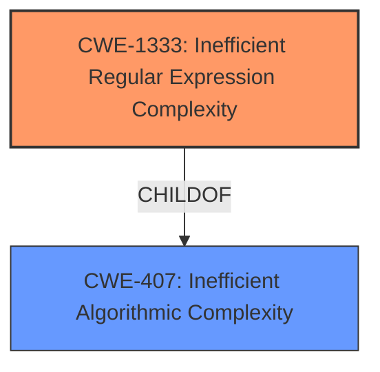

# Raw Analyzer Response for CVE-2021-23353

# Summary
| CWE ID    | CWE Name                                                                         | Confidence | CWE Abstraction Level | CWE Vulnerability Mapping Label | CWE-Vulnerability Mapping Notes |
| :-------- | :------------------------------------------------------------------------------- | :--------- | :-------------------- | :------------------------------ | :------------------------------ |
| CWE-1333  | Inefficient Regular Expression Complexity                                        | 1          | Base                  | Primary CWE                     | Allowed                       |

## Evidence and Confidence

*   **Confidence Score:** 1
*   **Evidence Strength:** HIGH

## Relationship Analysis
The primary CWE is CWE-1333. It's a child of CWE-407 (Inefficient Algorithmic Complexity). The vulnerability directly relates to the use of an inefficient regular expression, making CWE-1333 the more specific and appropriate choice.

## Vulnerability Chain
The vulnerability chain starts with the use of an inefficient regular expression (CWE-1333), which leads to excessive CPU consumption and, ultimately, a denial-of-service condition.

## Summary of Analysis
The initial analysis indicates that the vulnerability is due to an inefficient regular expression used in the `addImage` function of the `jsPDF` library. This regular expression is vulnerable to Regular Expression Denial of Service (ReDoS). The provided information clearly points to **CWE-1333: Inefficient Regular Expression Complexity**.

The evidence is strong, with specific details about the vulnerable regex, its location within the `addimage.js` file, and the fix implemented in version 2.3.1. The "Vulnerability Description Key Phrases" includes the term "**regular expression denial of service**," further supporting this classification.

The graph relationships confirm that CWE-1333 is a specific type of algorithmic inefficiency, making it a more precise choice than its parent CWE-407.

Relevant CWE Information:

# Enhanced Context (25 CWEs)

## CWE-407: Inefficient Algorithmic Complexity
**Abstraction Level**: Class
**Similarity Score**: 0.78
**Source**: dense

**Description**:
An algorithm in a product has an inefficient worst-case computational complexity that may be detrimental to system performance and can be triggered by an attacker, typically using crafted manipulations that ensure that the worst case is being reached.

**Mapping Guidance**:
- Usage: Allowed-with-Review
- Rationale: This CWE entry is a Class and might have Base-level children that would be more appropriate

## CWE-1333: Inefficient Regular Expression Complexity
**Abstraction Level**: Base
**Similarity Score**: 1.00
**Source**: alternate_terms

**Description**:
The product uses a regular expression with an inefficient, possibly exponential worst-case computational complexity that consumes excessive CPU cycles.

**Mapping Guidance**:
- Usage: Allowed
- Rationale: This CWE entry is at the Base level of abstraction, which is a preferred level of abstraction for mapping to the root causes of vulnerabilities.

### Alternatives Considered:

*   **CWE-407: Inefficient Algorithmic Complexity:** While this is a parent of CWE-1333, the description specifically mentions regular expressions, making CWE-1333 a better fit.
*   **CWE-79: Improper Neutralization of Input During Web Page Generation ('Cross-site Scripting'):** This is not relevant as the vulnerability is not directly related to web page generation or neutralization of input.
*   **CWE-625: Permissive Regular Expression:** This is not relevant as the issue is not that the regular expression allows too many inputs but that it is inefficient.

I am confident that **CWE-1333: Inefficient Regular Expression Complexity** is the most appropriate classification, given the provided information.