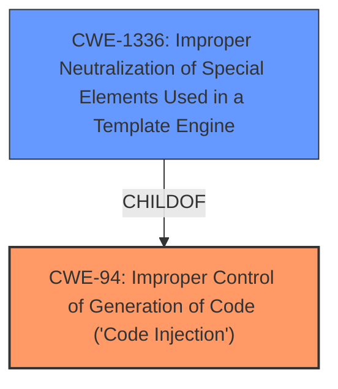

# Raw Analyzer Response for CVE-2021-23358

# Summary
| CWE ID  | CWE Name                                                                         | Confidence | CWE Abstraction Level | CWE Vulnerability Mapping Label | CWE-Vulnerability Mapping Notes |
|---------|------------------------------------------------------------------------------------|------------|-----------------------|-----------------------------------|-----------------------------------|
| CWE-94  | Improper Control of Generation of Code ('Code Injection')                         | 0.9        | Base                  | Allowed-with-Review               | Primary CWE                       |
| CWE-1336 | Improper Neutralization of Special Elements Used in a Template Engine           | 0.7        | Base                  | Allowed                         | Secondary Candidate             |

## Evidence and Confidence

*   **Confidence Score:** 0.8
*   **Evidence Strength:** HIGH

## Relationship Analysis
The primary relationship is that CWE-1336 is a child of CWE-94. The vulnerability involves the `template` function and the `variable` property within `_.templateSettings` which are not properly sanitized, leading to arbitrary code injection. While CWE-94 is a more general case of code injection, CWE-1336 specifically addresses template engine vulnerabilities. However, the evidence points more directly to CWE-94 as the code is being directly generated without control, and the usage of the template is a code generation activity.

## Vulnerability Chain
The chain of events in this vulnerability is as follows:
1.  Lack of sanitization of the `variable` property in `_.templateSettings`.
2.  Use of this unsanitized input in the `template` function.
3.  **Arbitrary Code Injection** (CWE-94) due to the improper control of code generation.
The root cause is the missing sanitization, leading directly to code injection.

## Summary of Analysis
Initially, CWE-1336 seemed like a strong candidate due to the mention of the `template` function. However, upon closer inspection and consideration of the provided information, CWE-94 more accurately represents the core issue. The **weakness** lies in the **improper control of code generation**, as the code is directly generated from the unsanitized input. The evidence for this is clearly stated in the "CVE Reference Links Content Summary" section: "The primary **weakness** is the ability to inject arbitrary code due to the lack of sanitization." The proof of concept also demonstrates direct code injection using `_.templateSettings.variable`.

CWE-94 is at the Base level of abstraction, which is a preferred level. Although CWE-94's mapping guidance suggests "Allowed-with-Review" and warns against misuse for vulnerabilities with code execution impacts, the context clearly points to **improper control of code generation** rather than just a generic code execution issue.

CWE-1336 could be considered a secondary weakness, as the template engine is the mechanism through which the code injection occurs. However, the root cause is more directly tied to the lack of control over the code being generated, making CWE-94 the primary and more appropriate classification.

Relevant CWE Information:

# Enhanced Context (25 CWEs)
The following CWEs were identified as potentially relevant to this vulnerability:

## CWE-113: Improper Neutralization of CRLF Sequences in HTTP Headers ('HTTP Request/Response Splitting')
**Abstraction Level**: Variant
**Similarity Score**: 0.77
**Source**: dense

**Description**:
The product receives data from an HTTP agent/component (e.g., web server, proxy, browser, etc.), but it does not neutralize or incorrectly neutralizes CR and LF characters before the data is included in outgoing HTTP headers.

**Mapping Guidance**:
- Usage: Allowed
- Rationale: This CWE entry is at the Variant level of abstraction, which is a preferred level of abstraction for mapping to the root causes of vulnerabilities.

**My Analysis**: This CWE is not relevant because the vulnerability is not related to HTTP headers or CRLF sequences.

## CWE-74: Improper Neutralization of Special Elements in Output Used by a Downstream Component ('Injection')
**Abstraction Level**: Class
**Similarity Score**: 0.75
**Source**: dense

**Description**:
The product constructs all or part of a command, data structure, or record using externally-influenced input from an upstream component, but it does not neutralize or incorrectly neutralizes special elements that could modify how it is parsed or interpreted when it is sent to a downstream component.

**Mapping Guidance**:
- Usage: Discouraged
- Rationale: CWE-74 is high-level and often misused when lower-level weaknesses are more appropriate.

**My Analysis**: This is a very broad injection category. It is not as precise as CWE-94.

## CWE-93: Improper Neutralization of CRLF Sequences ('CRLF Injection')
**Abstraction Level**: Base
**Similarity Score**: 0.74
**Source**: dense

**Description**:
The product uses CRLF (carriage return line feeds) as a special element, e.g. to separate lines or records, but it does not neutralize or incorrectly neutralizes CRLF sequences from inputs.

**Mapping Guidance**:
- Usage: Allowed
- Rationale: This CWE entry is at the Base level of abstraction, which is a preferred level of abstraction for mapping to the root causes of vulnerabilities.

**My Analysis**: This CWE is not relevant because the vulnerability is not related to CRLF injection.

## CWE-80: Improper Neutralization of Script-Related HTML Tags in a Web Page (Basic XSS)
**Abstraction Level**: Variant
**Similarity Score**: 0.73
**Source**: dense

**Description**:
The product receives input from an upstream component, but it does not neutralize or incorrectly neutralizes special characters such as "<", ">", and "&" that could be interpreted as web-scripting elements when they are sent to a downstream component that processes web pages.

**Mapping Guidance**:
- Usage: Allowed
- Rationale: This CWE entry is at the Variant level of abstraction, which is a preferred level of abstraction for mapping to the root causes of vulnerabilities.

**My Analysis**: This CWE is not relevant because the vulnerability is not related to XSS.

## CWE-138: Improper Neutralization of Special Elements
**Abstraction Level**: Class
**Similarity Score**: 0.72
**Source**: dense

**Description**:
The product receives input from an upstream component, but it does not neutralize or incorrectly neutralizes special elements that could be interpreted as control elements or syntactic markers when they are sent to a downstream component.

**Mapping Guidance**:
- Usage: Discouraged
- Rationale: This CWE entry is a level-1 Class (i.e., a child of a Pillar). It might have lower-level children that would be more appropriate

**My Analysis**: This CWE is too general and doesn't precisely describe the vulnerability.

## CWE-1289: Improper Validation of Unsafe Equivalence in Input
**Abstraction Level**: Base
**Similarity Score**: 0.72
**Source**: dense

**Description**:
The product receives an input value that is used as a resource identifier or other type of reference, but it does not validate or incorrectly validates that the input is equivalent to a potentially-unsafe value.

**Mapping Guidance**:
- Usage: Allowed
- Rationale: This CWE entry is at the Base level of abstraction, which is a preferred level of abstraction for mapping to the root causes of vulnerabilities.

**My Analysis**: This CWE is not a good fit because the vulnerability does not involve validating equivalence to an unsafe value.

## CWE-184: Incomplete List of Disallowed Inputs
**Abstraction Level**: Base
**Similarity Score**: 0.72
**Source**: dense

**Description**:
The product implements a protection mechanism that relies on a list of inputs (or properties of inputs) that are not allowed by policy or otherwise require other action to neutralize before additional processing takes place, but the list is incomplete.

**Mapping Guidance**:
- Usage: Allowed
- Rationale: This CWE entry is at the Base level of abstraction, which is a preferred level of abstraction for mapping to the root causes of vulnerabilities.

**My Analysis**: This CWE is not relevant because the issue isn't about an incomplete list of disallowed inputs, but rather about missing sanitization.

## CWE-41: Improper Resolution of Path Equivalence
**Abstraction Level**: Base
**Similarity Score**: 0.72
**Source**: dense

**Description**:
The product is vulnerable to file system contents disclosure through path equivalence. Path equivalence involves the use of special characters in file and directory names. The associated manipulations are intended to generate multiple names for the same object.

**Mapping Guidance**:
- Usage: Allowed
- Rationale: This CWE entry is at the Base level of abstraction, which is a preferred level of abstraction for mapping to the root causes of vulnerabilities.

**My Analysis**: This CWE is not relevant as it is not about path