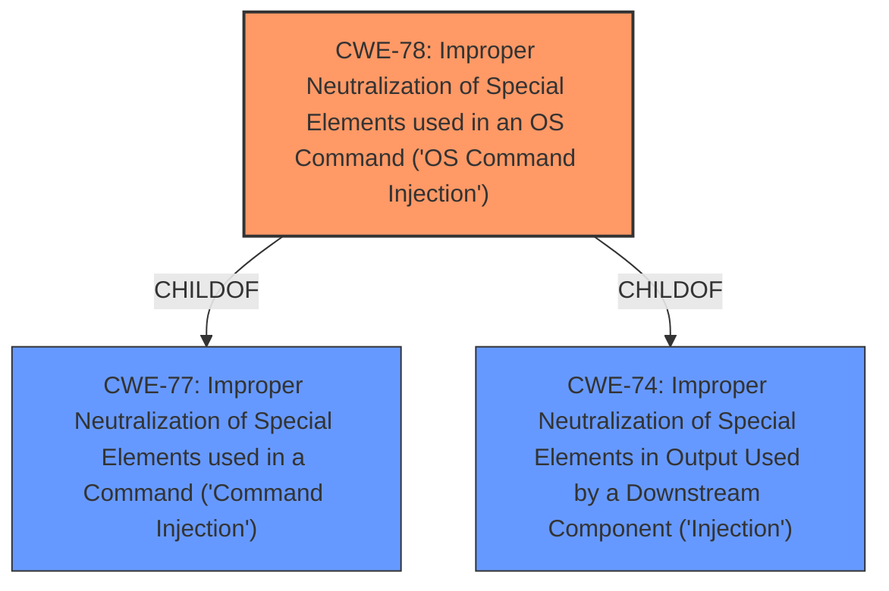

# Enhanced Analysis for CVE-2021-23363

# Summary
| CWE ID | CWE Name | Confidence | CWE Abstraction Level | CWE Vulnerability Mapping Label | CWE-Vulnerability Mapping Notes |
|---|---|---|---|---|---|
| CWE-78 | Improper Neutralization of Special Elements used in an OS Command ('OS Command Injection') | 1 | Base | Allowed | Primary CWE |

## Evidence and Confidence

*   **Confidence Score:** 1
*   **Evidence Strength:** HIGH

## Relationship Analysis
The primary relationship that influenced the selection of CWE-78 is its role as a base-level weakness, which is the preferred level of abstraction. While other CWEs like CWE-74 (Improper Neutralization of Special Elements in Output Used by a Downstream Component ('Injection')) and CWE-77 (Improper Neutralization of Special Elements used in a Command ('Command Injection')) are related, CWE-78 provides a more specific classification directly addressing OS command injection.


## Vulnerability Chain
The vulnerability chain starts with user-controlled input being passed to the `killByPort` function. This input is then used without sanitization in the `child_process.exec` function, leading to the execution of arbitrary commands on the system. The chain can be represented as: User Input -> **Improper Neutralization (CWE-78)** -> Arbitrary Command Execution.

## Summary of Analysis
The assessment is based on the vulnerability description, which clearly states that user input given to the `killByPort` function allows an attacker to execute arbitrary commands due to the use of `child_process exec` without input sanitization. This aligns directly with CWE-78, which describes the **improper neutralization** of special elements used in an OS command.

The "CVE Reference Links Content Summary" explicitly mentions:
*   **Root Cause:** The vulnerability stems from the use of the `child_process.exec` function within the `killByPort` function of the `kill-by-port` package **without proper sanitization** of user-controlled input.
*   **Arbitrary Command Injection (CWE-77):** The `killByPort` function takes a port number as input. This input is then directly embedded into a shell command executed using `child_process.exec`. Because there is **no sanitization**, an attacker can inject arbitrary shell commands by providing malicious input.

The graph relationships support the choice of CWE-78 due to its base-level abstraction, which is preferred for direct mapping. The vulnerability description and the provided content summary strongly support this classification.

The selected CWE is at the optimal level of specificity because it directly addresses the root cause of the vulnerability: the **improper neutralization** of special elements in an OS command, leading to arbitrary command execution.

Relevant CWE Information:

# Enhanced Context (25 CWEs)

## CWE-78: Improper Neutralization of Special Elements used in an OS Command ('OS Command Injection')
**Abstraction:** Base
**Status:** Stable

### Description
The product constructs all or part of an OS command using externally-influenced input from an upstream component, but it does not neutralize or incorrectly neutralizes special elements that could modify the intended OS command when it is sent to a downstream component.

### Extended Description
This weakness can lead to a vulnerability in environments in which the attacker does not have direct access to the operating system, such as in web applications. Alternately, if the weakness occurs in a privileged program, it could allow the attacker to specify commands that normally would not be accessible, or to call alternate commands with privileges that the attacker does not have. The problem is exacerbated if the compromised process does not follow the principle of least privilege, because the attacker-controlled commands may run with special system privileges that increases the amount of damage.

There are at least two subtypes of OS command injection:

  - The application intends to execute a single, fixed program that is under its own control. It intends to use externally-supplied inputs as arguments to that program. For example, the program might use system("nslookup [HOSTNAME]") to run nslookup and allow the user to supply a HOSTNAME, which is used as an argument. Attackers cannot prevent nslookup from executing. However, if the program does not remove command separators from the HOSTNAME argument, attackers could place the separators into the arguments, which allows them to execute their own program after nslookup has finished executing.

  - The application accepts an input that it uses to fully select which program to run, as well as which commands to use. The application simply redirects this entire command to the operating system. For example, the program might use "exec([COMMAND])" to execute the [COMMAND] that was supplied by the user. If the COMMAND is under attacker control, then the attacker can execute arbitrary commands or programs. If the command is being executed using functions like exec() and CreateProcess(), the attacker might not be able to combine multiple commands together in the same line.

From a weakness standpoint, these variants represent distinct programmer errors. In the first variant, the programmer clearly intends that input from untrusted parties will be part of the arguments in the command to be executed. In the second variant, the programmer does not intend for the command to be accessible to any untrusted party, but the programmer probably has not accounted for alternate ways in which malicious attackers can provide input.

### Alternative Terms
Shell injection
Shell metacharacters
OS Command Injection

### Relationships
ChildOf -> CWE-77
ChildOf -> CWE-74
ChildOf -> CWE-77
ChildOf -> CWE-77
CanAlsoBe -> CWE-88

### Mapping Guidance
**Usage:** Allowed
**Rationale:** This CWE entry is at the Base level of abstraction, which is a preferred level of abstraction for mapping to the root causes of vulnerabilities.
**Comments:** Carefully read both the name and description to ensure that this mapping is an appropriate fit. Do not try to 'force' a mapping to a lower-level Base/Variant simply to comply with this preferred level of abstraction.
**Reasons:**
- Acceptable-Use

### Observed Examples
- **CVE-2020-10987:** OS command injection in Wi-Fi router, as exploited in the wild per CISA KEV.
- **CVE-2020-10221:** Template functionality in network configuration management tool allows OS command injection, as exploited in the wild per CISA KEV.
- **CVE-2020-9054:** Chain: improper input validation (CWE-20) in username parameter, leading to OS command injection (CWE-78), as exploited in the wild per CISA KEV.

## Other CWEs Considered:

*   **CWE-77 (Improper Neutralization of Special Elements used in a Command ('Command Injection')):** While related, CWE-77 is a broader category. Since the vulnerability involves OS commands, CWE-78 is more specific and appropriate.
*   **CWE-74 (Improper Neutralization of Special Elements in Output Used by a Downstream Component ('Injection')):** This is a higher-level class related to injection vulnerabilities, but CWE-78 more accurately describes the specific type of injection.
*   **CWE-88 (Improper Neutralization of Argument Delimiters in a Command ('Argument Injection')):** This CWE is related to how arguments are handled in commands, but the primary issue here is the lack of sanitization leading to arbitrary command execution, making CWE-78 the better fit.
*   **CWE-94 (Improper Control of Generation of Code ('Code Injection')) and CWE-95 (Improper Neutralization of Directives in Dynamically Evaluated Code ('Eval Injection')):** These CWEs are related to code injection, but the vulnerability is specifically related to OS command injection, making CWE-78 more accurate.
*   **CWE-20 (Improper Input Validation):** While input validation is missing, CWE-78 describes the specific consequence of the missing validation (OS command injection). CWE-20 is too general.
*   **CWE-138 (Improper Neutralization of Special Elements):** This CWE is a Class and is too general.


## CWE Relationship Analysis

Current CWEs represent these abstraction levels: .


### Vulnerability Chain Analysis

**Chain starting from CWE-88:**
- 88 (Improper Neutralization of Argument Delimiters in a Command ('Argument Injection')) - ROOT


**Chain starting from CWE-78:**
- 78 (Improper Neutralization of Special Elements used in an OS Command ('OS Command Injection')) - ROOT


### CWE Relationship Diagram

```mermaid
graph TD
    classDef primary fill:#f96,stroke:#333,stroke-width:2px
    classDef secondary fill:#69f,stroke:#333
    classDef tertiary fill:#9e9,stroke:#333
```