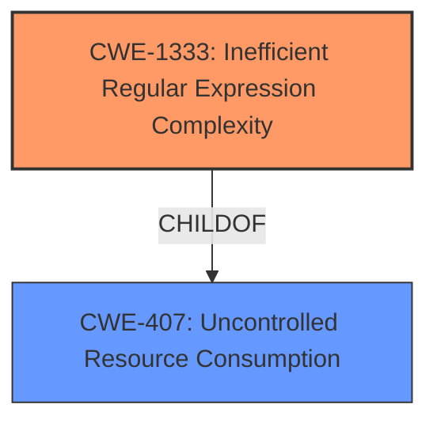

# Analysis Report for CVE-2021-23368

# Vulnerability Analysis Report: CVE-2021-23368

## Description


## Analysis (with Relationship Data)

# Summary
| CWE ID | CWE Name | Confidence | CWE Abstraction Level | CWE Vulnerability Mapping Label | CWE-Vulnerability Mapping Notes |
|---|---|---|---|---|---|
| CWE-1333 | Inefficient Regular Expression Complexity | 1.0 | Base | Allowed | Primary CWE |

## Evidence and Confidence

*   **Confidence Score:** 1.0
*   **Evidence Strength:** HIGH

## Relationship Analysis
The primary CWE identified is CWE-1333 (Inefficient Regular Expression Complexity), which is a Base level CWE. It is a child of CWE-407 (Uncontrolled Resource Consumption). No other relationships significantly impacted the decision, as CWE-1333 directly and accurately describes the vulnerability.



## Vulnerability Chain
The vulnerability chain starts with the use of an inefficient regular expression in the `postcss` package during source map parsing. This **weakness** leads to excessive CPU consumption when processing specially crafted input, resulting in a denial-of-service condition.

## Summary of Analysis
The analysis is based on the provided evidence, which clearly indicates a Regular Expression Denial of Service (ReDoS) vulnerability. The "CVE Reference Links Content Summary" section explicitly states that the root cause is a ReDoS **vulnerability** due to a vulnerable regular expression. The regular expression `/\/\\*\s\*# sourceMappingURL=(.\*)\s\*\\*\//` is susceptible to catastrophic backtracking.

The choice of CWE-1333 is justified by the following:

*   The vulnerability description mentions "**regular expression denial of service**" as the **weakness**.
*   The "CVE Reference Links Content Summary" confirms that the root cause is a regular expression vulnerable to catastrophic backtracking.
*   CWE-1333's description perfectly matches the scenario: "The product uses a regular expression with an inefficient, possibly exponential worst-case computational complexity that consumes excessive CPU cycles."
*   CWE-1333 is a Base level CWE, which is preferred for root cause analysis.
*   The Retriever Results list CWE-1333 as the top candidate with a score of 1.000.

Other CWEs Considered but Not Used:

*   CWE-674 (Uncontrolled Recursion): While ReDoS can involve recursion, CWE-1333 is more specific to the regular expression complexity issue.
*   CWE-617 (Reachable Assertion): This CWE is about assertions that can be triggered by an attacker, which is not the case here.
*   CWE-777 (Regular Expression without Anchors): The issue is not the absence of anchors but the inefficiency of the expression itself.
*   CWE-185 (Incorrect Regular Expression): While the regex is incorrect in the sense that it's inefficient, CWE-1333 better captures the complexity aspect.

Relevant CWE Information:

# Enhanced Context (25 CWEs)
The following CWEs were identified as potentially relevant to this vulnerability:

## CWE-917: Improper Neutralization of Special Elements used in an Expression Language Statement ('Expression Language Injection')
**Abstraction Level**: Base
**Similarity Score**: 0.80
**Source**: dense

**Description**:
The product constructs all or part of an expression language (EL) statement in a framework such as a Java Server Page (JSP) using externally-influenced input from an upstream component, but it does not neutralize or incorrectly neutralizes special elements that could modify the intended EL statement before it is executed.

**Mapping Guidance**:
- Usage: Allowed
- Rationale: This CWE entry is at the Base level of abstraction, which is a preferred level of abstraction for mapping to the root causes of vulnerabilities.
**Reasons For Not Using**: This CWE is related to expression language injection, which is not the case in this vulnerability.

## CWE-1289: Improper Validation of Unsafe Equivalence in Input
**Abstraction Level**: Base
**Similarity Score**: 0.76
**Source**: dense

**Description**:
The product receives an input value that is used as a resource identifier or other type of reference, but it does not validate or incorrectly validates that the input is equivalent to a potentially-unsafe value.

**Mapping Guidance**:
- Usage: Allowed
- Rationale: This CWE entry is at the Base level of abstraction, which is a preferred level of abstraction for mapping to the root causes of vulnerabilities.
**Reasons For Not Using**: This CWE is not the primary cause, as the issue is with the regular expression itself and not the validation of the input equivalence.

## CWE-625: Permissive Regular Expression
**Abstraction Level**: Base
**Similarity Score**: 0.76
**Source**: dense

**Description**:
The product uses a regular expression that does not sufficiently restrict the set of allowed values.

**Mapping Guidance**:
- Usage: Allowed
- Rationale: This CWE entry is at the Base level of abstraction, which is a preferred level of abstraction for mapping to the root causes of vulnerabilities.
**Reasons For Not Using**: While the regular expression is permissive in some sense, CWE-1333 directly addresses the complexity issue.

## CWE-74: Improper Neutralization of Special Elements in Output Used by a Downstream Component ('Injection')
**Abstraction Level**: Class
**Similarity Score**: 0.75
**Source**: dense

**Description**:
The product constructs all or part of a command, data structure, or record using externally-influenced input from an upstream component, but it does not neutralize or incorrectly neutralizes special elements that could modify how it is parsed or interpreted when it is sent to a downstream component.

**Mapping Guidance**:
- Usage: Discouraged
- Rationale: CWE-74 is high-level and often misused when lower-level weaknesses are more appropriate.
**Reasons For Not Using**: This is a high-level injection CWE and not applicable here.

## CWE-185: Incorrect Regular Expression
**Abstraction Level**: Class
**Similarity Score**: 0.75
**Source**: dense

**Description**:
The product specifies a regular expression in a way that causes data to be improperly matched or compared.

**Mapping Guidance**:
- Usage: Allowed-with-Review
- Rationale: This CWE entry is a Class and might have Base-level children that would be more appropriate
**Reasons For Not Using**: While the regular expression is incorrect, CWE-1333 is more specific to the performance issue.

## CWE-1333: Inefficient Regular Expression Complexity
**Abstraction Level**: Base
**Similarity Score**: 0.75
**Source**: dense

**Description**:
The product uses a regular expression with an inefficient, possibly exponential worst-case computational complexity that consumes excessive CPU cycles.

**Mapping Guidance**:
- Usage: Allowed
- Rationale: This CWE entry is at the Base level of abstraction, which is a preferred level of abstraction for mapping to the root causes of vulnerabilities.
**Reasons For Using**: This is the primary cause, as the issue is with the regular expression itself and its inefficient complexity.

## CWE-184: Incomplete List of Disallowed Inputs
**Abstraction Level**: Base
**Similarity Score**: 0.75
**Source**: dense

**Description**:
The product implements a protection mechanism that relies on a list of inputs (or properties of inputs) that are not allowed by policy or otherwise require other action to neutralize before additional processing takes place, but the list is incomplete.

**Mapping Guidance**:
- Usage: Allowed
- Rationale: This CWE entry is at the Base level of abstraction, which is a preferred level of abstraction for mapping to the root causes of vulnerabilities.
**Reasons For Not Using**: This CWE is not applicable, as the issue is not with an incomplete list of disallowed inputs.

## CWE-138: Improper Neutralization of Special Elements
**Abstraction Level**: Class
**Similarity Score**: 0.75
**Source**: dense

**Description**:
The product receives input from an upstream component, but it does not neutralize or incorrectly neutralizes special elements that could be interpreted as control elements or syntactic markers when they are sent to a downstream component.

**Mapping Guidance**:
- Usage: Discouraged
- Rationale: This CWE entry is a level-1 Class (i.e., a child of a Pillar). It might have lower-level children that would be more appropriate
**Reasons For Not Using**: This CWE is too general and not specific to the ReDoS issue.

## CWE-668: Exposure of Resource to Wrong Sphere
**Abstraction Level**: Class
**Similarity Score**: 0.75
**Source**: dense

**Description**:
The product exposes a resource to the wrong control sphere, providing unintended actors with inappropriate access to the resource.

**Mapping Guidance**:
- Usage: Discouraged
- Rationale: CWE-668 is high


## CWE Relationship Analysis

Current CWEs represent these abstraction levels: .


### Vulnerability Chain Analysis

**Chain starting from CWE-674:**
- 674 (Uncontrolled Recursion) - ROOT


**Chain starting from CWE-185:**
- 185 (Incorrect Regular Expression) - ROOT


### CWE Relationship Diagram

```mermaid
graph TD
    classDef primary fill:#f96,stroke:#333,stroke-width:2px
    classDef secondary fill:#69f,stroke:#333
    classDef tertiary fill:#9e9,stroke:#333
```


*Report generated on 2025-04-02 07:21:19*
