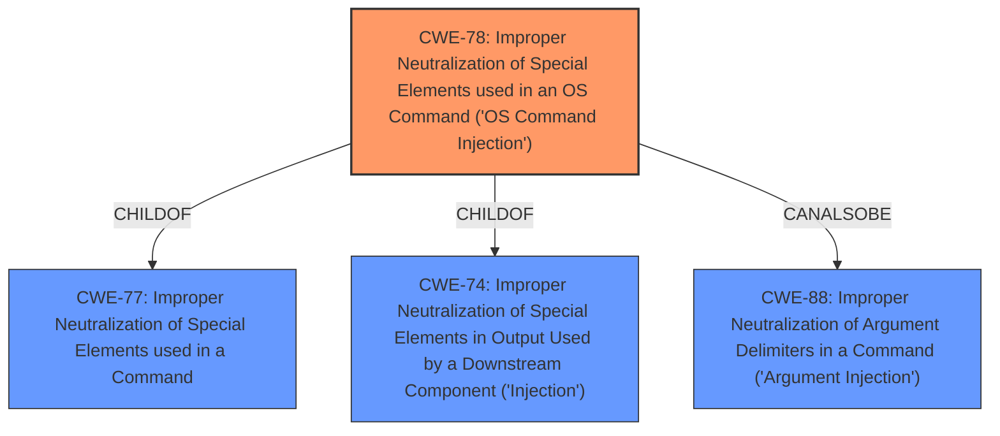

# Raw Analyzer Response for CVE-2021-23375

```markdown
# Summary
| CWE ID | CWE Name | Confidence | CWE Abstraction Level | CWE Vulnerability Mapping Label | CWE-Vulnerability Mapping Notes |
|---|---|---|---|---|---|
| CWE-78 | Improper Neutralization of Special Elements used in an OS Command ('OS Command Injection') | 1.0 | Base | Primary | Allowed |

## Evidence and Confidence

*   **Confidence Score:** 1.0
*   **Evidence Strength:** HIGH

## Relationship Analysis
The primary CWE, CWE-78, is a base-level CWE that directly addresses the **improper neutralization** of special elements used in OS commands. This vulnerability description explicitly states that the `kill` function uses `child_process.exec` without sanitizing user-provided input, leading to command injection.

The retriever results also suggest other CWEs such as CWE-138 (Improper Neutralization of Special Elements), CWE-94 (Improper Control of Generation of Code ('Code Injection')), and CWE-116 (Improper Encoding or Escaping of Output). However, these are Class-level CWEs and less specific than CWE-78, which directly relates to OS Command Injection.

The graph relationship shows that CWE-78 is a ChildOf CWE-77 (Improper Neutralization of Special Elements used in a Command) and CWE-74 (Improper Neutralization of Special Elements in Output Used by a Downstream Component ('Injection')), and also has a CanAlsoBe relationship with CWE-88 (Improper Neutralization of Argument Delimiters in a Command ('Argument Injection')). While these relationships are relevant, CWE-78 remains the most specific and accurate representation of the vulnerability.



## Vulnerability Chain
The vulnerability chain starts with the **lack of input sanitization** in the `kill` function. This allows an attacker to inject arbitrary commands, leading to the execution of those commands on the system.

Root Cause: **Lack of input sanitization** of user-controlled input in the `kill` function.
Weakness: CWE-78 - Improper Neutralization of Special Elements used in an OS Command ('OS Command Injection').
Impact: Arbitrary command execution.

## Summary of Analysis
The initial assessment identified CWE-78 as the primary weakness based on the vulnerability description and CVE reference links content summary. The description explicitly states that the `kill` function in the `psnode` library uses the `child_process.exec` function **without sanitizing user-provided input, leading to command injection**. The CVE Reference Links Content Summary reinforces this by stating the **root cause of the vulnerability** is the `kill` function using `child_process.exec` **without sanitizing user-provided input**.

The graph relationships further support this by placing CWE-78 as a child of more general injection weaknesses (CWE-77, CWE-74), but also highlighting the potential for argument injection (CWE-88). However, the core issue remains the **improper neutralization** of special elements, making CWE-78 the most specific and appropriate classification.

The decision to select CWE-78 is based on:
- Direct evidence from the vulnerability description: "**If attacker-controlled user input is given to the kill function, it is possible for an attacker to execute arbitrary commands. This is due to use of the child_process exec function without input sanitization**."
- The CVE Reference Links Content Summary confirms the **root cause** as the **lack of input sanitization**.

The selected CWE is at the optimal level of specificity because it directly describes the **root cause** of the vulnerability, which is the **improper neutralization** of special elements used in OS commands.

Relevant CWE Information:

# Enhanced Context (25 CWEs)
The following CWEs were identified as potentially relevant to this vulnerability:

## CWE-1289: Improper Validation of Unsafe Equivalence in Input
**Abstraction Level**: Base
**Similarity Score**: 0.75
**Source**: dense

**Description**:
The product receives an input value that is used as a resource identifier or other type of reference, but it does not validate or incorrectly validates that the input is equivalent to a potentially-unsafe value.
**Rationale for not selecting**: While related to input validation, this is not the primary issue. The core issue is that user-provided input is directly passed to an OS command without sanitization.

## CWE-915: Improperly Controlled Modification of Dynamically-Determined Object Attributes
**Abstraction Level**: Base
**Similarity Score**: 0.75
**Source**: dense

**Description**:
The product receives input from an upstream component that specifies multiple attributes, properties, or fields that are to be initialized or updated in an object, but it does not properly control which attributes can be modified.
**Rationale for not selecting**: Not applicable to the vulnerability. The vulnerability is related to OS command injection, not modification of object attributes.

## CWE-138: Improper Neutralization of Special Elements
**Abstraction Level**: Class
**Similarity Score**: 0.75
**Source**: dense

**Description**:
The product receives input from an upstream component, but it does not neutralize or incorrectly neutralizes special elements that could be interpreted as control elements or syntactic markers when they are sent to a downstream component.
**Rationale for not selecting**: While relevant, this is a Class-level CWE. CWE-78 is a more specific, Base-level CWE that is a better fit.

## CWE-74: Improper Neutralization of Special Elements in Output Used by a Downstream Component ('Injection')
**Abstraction Level**: Class
**Similarity Score**: 0.75
**Source**: dense

**Description**:
The product constructs all or part of a command, data structure, or record using externally-influenced input from an upstream component, but it does not neutralize or incorrectly neutralizes special elements that could modify how it is parsed or interpreted when it is sent to a downstream component.
**Rationale for not selecting**: While relevant as a parent of CWE-78, CWE-78 is a more specific and accurate representation of the vulnerability.

## CWE-184: Incomplete List of Disallowed Inputs
**Abstraction Level**: Base
**Similarity Score**: 0.73
**Source**: dense

**Description**:
The product implements a protection mechanism that relies on a list of inputs (or properties of inputs) that are not allowed by policy or otherwise require other action to neutralize before additional processing takes place, but the list is incomplete.
**Rationale for not selecting**: This is not the core issue. The code lacks any input sanitization, not just an incomplete list.

## CWE-807: Reliance on Untrusted Inputs in a Security Decision
**Abstraction Level**: Base
**Similarity Score**: 0.73
**Source**: dense

**Description**:
The product uses a protection mechanism that relies on the existence or values of an input, but the input can be modified by an untrusted actor in a way that bypasses the protection mechanism.
**Rationale for not selecting**: While the vulnerability relies on untrusted input, the specific weakness is the **lack of sanitization** of that input when constructing an OS command, rather than a broader security decision.

## CWE-183: Permissive List of Allowed Inputs
**Abstraction Level**: Base
**Similarity Score**: 0.73
**Source**: dense

**Description**:
The product implements a protection mechanism that relies on a list of inputs (or properties of inputs) that are explicitly allowed by policy because the inputs are assumed to be safe, but the list is too permissive - that is, it allows an input that is unsafe, leading to resultant weaknesses.
**Rationale for not selecting**: There is no evidence that a list of allowed inputs is used. The issue is the complete **lack of sanitization**.

## CWE-653: Improper Isolation or Compartmentalization
**Abstraction Level**: Class
**Similarity Score**: 0.73
**Source**: dense

**Description**:
The product does not properly compartmentalize or isolate functionality, processes, or resources that require different privilege levels, rights, or permissions.
**Rationale for not selecting**: This is not related to the root cause.

## CWE-345: Insufficient Verification of Data Authenticity
**Abstraction Level**: Class
**Similarity Score**: 0.72
**Source**: dense

**Description**:
The product does not sufficiently verify the origin or authenticity of