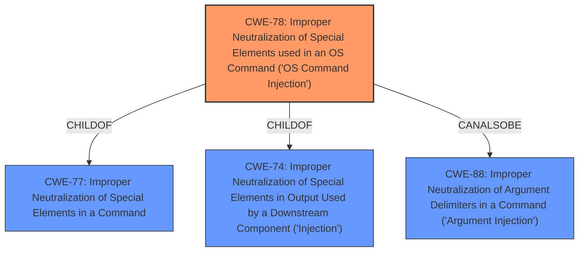

# Analysis for CVE-2021-23376

# Summary
| CWE ID | CWE Name | Confidence | CWE Abstraction Level | CWE Vulnerability Mapping Label | CWE-Vulnerability Mapping Notes |
|---|---|---|---|---|---|
| CWE-78 | Improper Neutralization of Special Elements used in an OS Command ('OS Command Injection') | 1.0 | Base | Allowed | Primary CWE |

## Evidence and Confidence

*   **Confidence Score:** 1.0
*   **Evidence Strength:** HIGH

## Relationship Analysis
The primary relationship that influenced the decision was the ChildOf relationship between CWE-78 and its parents (CWE-77 and CWE-74), which helped to confirm its suitability as a Base-level CWE. The CanAlsoBe relationship to CWE-88 was considered but not deemed applicable. The hierarchical structure guided the selection of the most specific and relevant CWE.

## Vulnerability Chain
The vulnerability chain starts with **attacker-controlled user input** passed to the `trimvideo` function, which then uses `child_process.exec` without sanitization, leading to **arbitrary command execution**.
  - Root Cause: **Missing input sanitization**
  - Weakness: **Improper neutralization of special elements used in an OS command** (CWE-78)
  - Impact: **Arbitrary command execution**

## Summary of Analysis
The initial assessment focused on the **lack of input sanitization** when user-controlled input is passed to the `child_process.exec` function. This aligns directly with the description of CWE-78, "Improper Neutralization of Special Elements used in an OS Command ('OS Command Injection')." The evidence provided in the "CVE Reference Links Content Summary" section explicitly states that the "root cause of vulnerability" is the `trimvideo` function in the `ffmpegdotjs` package uses the `child_process.exec` function **without sanitizing user-provided input**, allowing for command injection. The "Vulnerability Description Key Phrases" also highlights "execute arbitrary commands" as the impact and "attacker-controlled user input" as the vector, further supporting this classification.

The graph relationships confirmed the selection of CWE-78 by showing it as a base-level weakness with clear parent-child relationships to more general injection weaknesses (CWE-77, CWE-74). This ensures the selection is specific and directly relevant.

The selection of CWE-78 is at the optimal level of specificity because it precisely describes the vulnerability: the application fails to neutralize special elements in input used to construct an OS command, enabling an attacker to execute arbitrary commands. This is a base-level weakness, providing a clear and actionable description of the vulnerability's root cause.

Relevant CWE Information:

# Enhanced Context (25 CWEs)
The following CWEs were identified as potentially relevant to this vulnerability:

## CWE-1289: Improper Validation of Unsafe Equivalence in Input
**Abstraction Level**: Base
**Similarity Score**: 0.75
**Source**: dense

**Description**:
The product receives an input value that is used as a resource identifier or other type of reference, but it does not validate or incorrectly validates that the input is equivalent to a potentially-unsafe value.

**Mapping Guidance**:
- Usage: Allowed
- Rationale: This CWE entry is at the Base level of abstraction, which is a preferred level of abstraction for mapping to the root causes of vulnerabilities.

*Rationale for not selecting*: This CWE is too specific; the vulnerability is not about validating equivalence, but about sanitizing input to prevent command injection.

## CWE-138: Improper Neutralization of Special Elements
**Abstraction Level**: Class
**Similarity Score**: 0.75
**Source**: dense

**Description**:
The product receives input from an upstream component, but it does not neutralize or incorrectly neutralizes special elements that could be interpreted as control elements or syntactic markers when they are sent to a downstream component.

**Mapping Guidance**:
- Usage: Discouraged
- Rationale: This CWE entry is a level-1 Class (i.e., a child of a Pillar). It might have lower-level children that would be more appropriate

*Rationale for not selecting*: While this CWE is relevant, it is a Class-level CWE and lacks the specificity of CWE-78. CWE-78 is a more precise match.

## CWE-74: Improper Neutralization of Special Elements in Output Used by a Downstream Component ('Injection')
**Abstraction Level**: Class
**Similarity Score**: 0.75
**Source**: dense

**Description**:
The product constructs all or part of a command, data structure, or record using externally-influenced input from an upstream component, but it does not neutralize or incorrectly neutralizes special elements that could modify how it is parsed or interpreted when it is sent to a downstream component.

**Mapping Guidance**:
- Usage: Discouraged
- Rationale: CWE-74 is high-level and often misused when lower-level weaknesses are more appropriate.

*Rationale for not selecting*: This is a class-level CWE and is less specific than CWE-78.

## CWE-915: Improperly Controlled Modification of Dynamically-Determined Object Attributes
**Abstraction Level**: Base
**Similarity Score**: 0.74
**Source**: dense

**Description**:
The product receives input from an upstream component that specifies multiple attributes, properties, or fields that are to be initialized or updated in an object, but it does not properly control which attributes can be modified.

**Mapping Guidance**:
- Usage: Allowed
- Rationale: This CWE entry is at the Base level of abstraction, which is a preferred level of abstraction for mapping to the root causes of vulnerabilities.

*Rationale for not selecting*: This CWE is not relevant to the vulnerability, as it deals with the modification of object attributes, which is not the case here.

## CWE-184: Incomplete List of Disallowed Inputs
**Abstraction Level**: Base
**Similarity Score**: 0.73
**Source**: dense

**Description**:
The product implements a protection mechanism that relies on a list of inputs (or properties of inputs) that are not allowed by policy or otherwise require other action to neutralize before additional processing takes place, but the list is incomplete.

**Mapping Guidance**:
- Usage: Allowed
- Rationale: This CWE entry is at the Base level of abstraction, which is a preferred level of abstraction for mapping to the root causes of vulnerabilities.

*Rationale for not selecting*: The vulnerability is not due to an incomplete list of disallowed inputs, but a complete lack of input sanitization.

## CWE-807: Reliance on Untrusted Inputs in a Security Decision
**Abstraction Level**: Base
**Similarity Score**: 0.73
**Source**: dense

**Description**:
The product uses a protection mechanism that relies on the existence or values of an input, but the input can be modified by an untrusted actor in a way that bypasses the protection mechanism.

**Mapping Guidance**:
- Usage: Allowed
- Rationale: This CWE entry is at the Base level of abstraction, which is a preferred level of abstraction for mapping to the root causes of vulnerabilities.

*Rationale for not selecting*: This CWE is about relying on untrusted inputs for security decisions, which is not the case here. The vulnerability is due to a lack of sanitization.

## CWE-183: Permissive List of Allowed Inputs
**Abstraction Level**: Base
**Similarity Score**: 0.73
**Source**: dense

**Description**:
The product implements a protection mechanism that relies on a list of inputs (or properties of inputs) that are explicitly allowed by policy because the inputs are assumed to be safe, but the list is too permissive - that is, it allows an input that is unsafe, leading to resultant weaknesses.

**Mapping Guidance**:
- Usage: Allowed
- Rationale: This CWE entry is at the Base level of abstraction, which is a preferred level of abstraction for mapping to the root causes of vulnerabilities.

*Rationale for not selecting*: The vulnerability is not due to a permissive list of allowed inputs, but a lack of input sanitization.

## CWE-653: Improper Isolation or Compartmentalization
**Abstraction Level**: Class
**Similarity Score**: 0.72
**Source**: dense

**Description**:
The product does not properly compartmentalize or isolate functionality, processes, or resources that require different privilege levels, rights, or permissions.

**Mapping Guidance**:
- Usage: Allowed
- Rationale: This CWE entry is at the Base