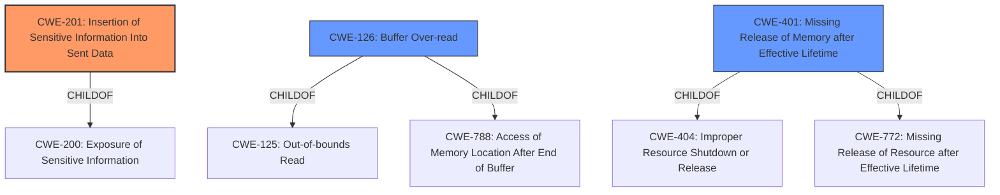

# Analysis for CVE-2021-23386

# Summary
| CWE ID  | CWE Name                                                       | Confidence | CWE Abstraction Level | CWE Vulnerability Mapping Label | CWE-Vulnerability Mapping Notes |
| :-------- | :------------------------------------------------------------- | :--------- | :---------------------- | :------------------------------ | :------------------------------ |
| CWE-201   | Insertion of Sensitive Information Into Sent Data            | 0.9        | Base                    | Primary                         | Allowed                       |
| CWE-126   | Buffer Over-read                                             | 0.7        | Variant                 | Secondary                       | Allowed                       |
| CWE-401   | Missing Release of Memory after Effective Lifetime           | 0.6        | Variant                 | Secondary                       | Allowed                       |

## Evidence and Confidence

*   **Confidence Score:** 0.8
*   **Evidence Strength:** HIGH

## Relationship Analysis
The primary weakness is CWE-201, where internal application memory is exposed over the network. This can occur due to CWE-126 (Buffer Over-read) if the buffer is read past its intended boundary, potentially exposing uninitialized memory. Another potential contributing factor is CWE-401 (Missing Release of Memory after Effective Lifetime), which can lead to memory leaks, making sensitive information more likely to be present in uninitialized memory.

## Vulnerability Chain
The vulnerability chain begins with the use of `allocUnsafe`, which allocates uninitialized memory. If this memory is not completely filled before being used in network packets, it can lead to **memory leaks**, and subsequent **exposure of internal application memory** over the network.

1.  `allocUnsafe` allocates uninitialized memory.
2.  Memory is not completely filled.
3.  CWE-401 (Missing Release of Memory after Effective Lifetime) may contribute to the presence of sensitive data in uninitialized memory.
4.  CWE-126 (Buffer Over-read) may cause reading beyond the intended boundaries.
5.  CWE-201 (Insertion of Sensitive Information Into Sent Data): Sensitive information is exposed over the network.

## Summary of Analysis
The primary CWE is CWE-201 (Insertion of Sensitive Information Into Sent Data) because the vulnerability description explicitly states that internal application memory is exposed over the network. The supporting evidence is "This can expose internal application memory over unencrypted network when querying crafted invalid domain names."

CWE-126 (Buffer Over-read) is considered a secondary CWE because the vulnerability involves reading uninitialized memory, suggesting a potential out-of-bounds read. The reference "These buffers are not always completely filled before being used, leading to the potential exposure of uninitialized memory" supports this.

CWE-401 (Missing Release of Memory after Effective Lifetime) is a possible contributing factor. The vulnerability description mentions a **memory leak**, which is an alternate term for CWE-401. The vulnerability description key phrases also include "**weakness: memory leak**."

The relationships between these CWEs are important. CWE-201 is the ultimate result, while CWE-126 and CWE-401 can contribute to the exposure of sensitive information.

Other CWEs considered:

*   CWE-770 (Allocation of Resources Without Limits or Throttling) and CWE-1325 (Improperly Controlled Sequential Memory Allocation) were considered but not selected as the primary focus is on the exposure of existing memory rather than the allocation process itself.
*   CWE-1284 (Improper Validation of Specified Quantity in Input) was considered, but there's no direct indication of a quantity validation issue from the description.
*   CWE-319 (Cleartext Transmission of Sensitive Information) was considered, but the core weakness is the exposure of sensitive information, not necessarily that it's transmitted in cleartext. The description states "...over unencrypted network...", however, the root cause of the vulnerability is the exposure of memory.

Relevant CWE Information:

# Enhanced Context (25 CWEs)
The following CWEs were identified as potentially relevant to this vulnerability:

## CWE-226: Sensitive Information in Resource Not Removed Before Reuse
**Abstraction Level**: Base
**Similarity Score**: 0.80
**Source**: dense

**Description**:
The product releases a resource such as memory or a file so that it can be made available for reuse, but it does not clear or "zeroize" the information contained in the resource before the product performs a critical state transition or makes the resource available for reuse by other entities.

**Mapping Guidance**:
- Usage: Allowed
- Rationale: This CWE entry is at the Base level of abstraction, which is a preferred level of abstraction for mapping to the root causes of vulnerabilities.

## CWE-212: Improper Removal of Sensitive Information Before Storage or Transfer
**Abstraction Level**: Base
**Similarity Score**: 0.76
**Source**: dense

**Description**:
The product stores, transfers, or shares a resource that contains sensitive information, but it does not properly remove that information before the product makes the resource available to unauthorized actors.

**Mapping Guidance**:
- Usage: Allowed
- Rationale: This CWE entry is at the Base level of abstraction, which is a preferred level of abstraction for mapping to the root causes of vulnerabilities.

## CWE-538: Insertion of Sensitive Information into Externally-Accessible File or Directory
**Abstraction Level**: Base
**Similarity Score**: 0.76
**Source**: dense

**Description**:
The product places sensitive information into files or directories that are accessible to actors who are allowed to have access to the files, but not to the sensitive information.

**Mapping Guidance**:
- Usage: Allowed
- Rationale: This CWE entry is at the Base level of abstraction, which is a preferred level of abstraction for mapping to the root causes of vulnerabilities.

## CWE-404: Improper Resource Shutdown or Release
**Abstraction Level**: Class
**Similarity Score**: 0.76
**Source**: dense

**Description**:
The product does not release or incorrectly releases a resource before it is made available for re-use.

**Mapping Guidance**:
- Usage: Allowed-with-Review
- Rationale: This CWE entry is a Class and might have Base-level children that would be more appropriate

## CWE-668: Exposure of Resource to Wrong Sphere
**Abstraction Level**: Class
**Similarity Score**: 0.76
**Source**: dense

**Description**:
The product exposes a resource to the wrong control sphere, providing unintended actors with inappropriate access to the resource.

**Mapping Guidance**:
- Usage: Discouraged
- Rationale: CWE-668 is high-level and is often misused as a catch-all when lower-level CWE IDs might be applicable. It is sometimes used for low-information vulnerability reports [REF-1287]. It is a level-1 Class (i.e., a child of a Pillar). It is not useful for trend analysis.

## CWE-131: Incorrect Calculation of Buffer Size
**Abstraction Level**: Base
**Similarity Score**: 0.75
**Source**: dense

**Description**:
The product does not correctly calculate the size to be used when allocating a buffer, which could lead to a buffer overflow.

**Mapping Guidance**:
- Usage: Allowed
- Rationale: This CWE entry is at the Base level of abstraction, which is a preferred level of abstraction for mapping to the root causes of vulnerabilities.

## CWE-789: Memory Allocation with Excessive Size Value
**Abstraction Level**: Variant
**Similarity Score**: 0.75
**Source**: dense

**Description**:
The product allocates memory based on an untrusted, large size value, but it does not ensure that the size is within expected limits, allowing arbitrary amounts of memory to be allocated.

**Mapping Guidance**:
- Usage: Allowed
- Rationale: This CWE entry is at the Variant level of abstraction, which is a preferred level of abstraction for mapping to the root causes of vulnerabilities.

## CWE-4