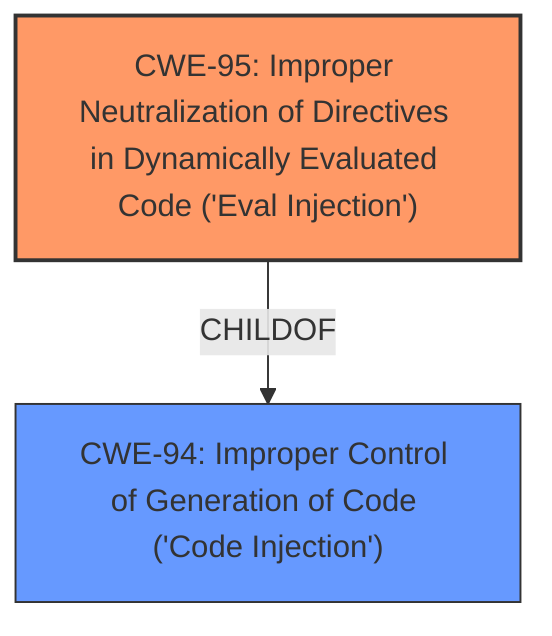

# Analysis Report for CVE-2021-23390

# Vulnerability Analysis Report: CVE-2021-23390

## Description


## Analysis (with Relationship Data)

# Summary
| CWE ID | CWE Name | Confidence | CWE Abstraction Level | CWE Vulnerability Mapping Label | CWE-Vulnerability Mapping Notes |
|---|---|---|---|---|---|
| CWE-95 | Improper Neutralization of Directives in Dynamically Evaluated Code ('Eval Injection') | 0.9 | Variant | Allowed | Primary CWE |
| CWE-94 | Improper Control of Generation of Code ('Code Injection') | 0.7 | Base | Allowed-with-Review | Secondary Candidate |

## Evidence and Confidence

*   **Confidence Score:** 0.8
*   **Evidence Strength:** HIGH

## Relationship Analysis
The primary relationship that influenced my decision was the parent-child relationship between CWE-94 and CWE-95. CWE-95 is a variant of CWE-94, specifically focusing on vulnerabilities involving dynamic evaluation of code. Since the vulnerability description explicitly mentions the use of `U.set()` and `U.get()` functions that dynamically construct and execute JavaScript code, CWE-95 provides a more precise classification.



## Vulnerability Chain
The vulnerability chain starts with the **improper handling of user-supplied input** within the `U.set()` and `U.get()` functions. This leads to **dynamic code generation** using the `Function` constructor, which results in **arbitrary code execution**.

## Summary of Analysis
Initially, the Retriever Results suggested CWE-1321 (Improperly Controlled Modification of Object Prototype Attributes ('Prototype Pollution')) and CWE-94 (Improper Control of Generation of Code ('Code Injection')) as potential candidates, and the "CWE for similar CVE Descriptions" lists CWE-1321 as the primary match for similar vulnerabilities. However, after reviewing the CVE Reference Links Content Summary, it became clear that the root cause is related to **dynamic code evaluation** rather than prototype pollution. The summary explicitly mentions the use of `new Function()` to dynamically execute code based on user input, making CWE-95 (Improper Neutralization of Directives in Dynamically Evaluated Code ('Eval Injection')) a more appropriate classification. The evidence from the CVE Reference Links Content Summary states: "The `U.set()` and `U.get()` functions dynamically construct and execute JavaScript code using the `Function` constructor based on the provided path. This allows an attacker to inject arbitrary JavaScript code by manipulating the path argument, leading to arbitrary code execution." This directly supports the selection of CWE-95.

CWE-94 was considered as a secondary candidate because it represents the broader category of code injection. However, since the vulnerability involves dynamic evaluation of code, CWE-95 provides a more specific and accurate classification.

The selection of CWE-95 is at the optimal level of specificity because it directly addresses the weakness of **improperly neutralizing code syntax** before using it in a dynamic evaluation call. This aligns with the Variant abstraction level, which is preferred when the evidence supports it.

Relevant CWE Information:

# Enhanced Context (25 CWEs)
The following CWEs were identified as potentially relevant to this vulnerability:

## CWE-41: Improper Resolution of Path Equivalence
**Abstraction Level**: Base
**Similarity Score**: 0.76
**Source**: dense

**Description**:
The product is vulnerable to file system contents disclosure through path equivalence. Path equivalence involves the use of special characters in file and directory names. The associated manipulations are intended to generate multiple names for the same object.

**Mapping Guidance**:
- Usage: Allowed
- Rationale: This CWE entry is at the Base level of abstraction, which is a preferred level of abstraction for mapping to the root causes of vulnerabilities.

**Technical Explanation:** This CWE is not relevant because the vulnerability does not involve file system contents disclosure or path equivalence issues.

## CWE-74: Improper Neutralization of Special Elements in Output Used by a Downstream Component ('Injection')
**Abstraction Level**: Class
**Similarity Score**: 0.76
**Source**: dense

**Description**:
The product constructs all or part of a command, data structure, or record using externally-influenced input from an upstream component, but it does not neutralize or incorrectly neutralizes special elements that could modify how it is parsed or interpreted when it is sent to a downstream component.

**Mapping Guidance**:
- Usage: Discouraged
- Rationale: CWE-74 is high-level and often misused when lower-level weaknesses are more appropriate.

**Technical Explanation:** While this CWE is related to injection, it is a more general class. Given the availability of more specific CWEs like CWE-95, this is not the best fit.

## CWE-407: Inefficient Algorithmic Complexity
**Abstraction Level**: Class
**Similarity Score**: 0.75
**Source**: dense

**Description**:
An algorithm in a product has an inefficient worst-case computational complexity that may be detrimental to system performance and can be triggered by an attacker, typically using crafted manipulations that ensure that the worst case is being reached.

**Mapping Guidance**:
- Usage: Allowed-with-Review
- Rationale: This CWE entry is a Class and might have Base-level children that would be more appropriate

**Technical Explanation:** This CWE is not relevant as the vulnerability is not related to algorithmic complexity.

## CWE-138: Improper Neutralization of Special Elements
**Abstraction Level**: Class
**Similarity Score**: 0.75
**Source**: dense

**Description**:
The product receives input from an upstream component, but it does not neutralize or incorrectly neutralizes special elements that could be interpreted as control elements or syntactic markers when they are sent to a downstream component.

**Mapping Guidance**:
- Usage: Discouraged
- Rationale: This CWE entry is a level-1 Class (i.e., a child of a Pillar). It might have lower-level children that would be more appropriate

**Technical Explanation:** This CWE is too general. It doesn't specifically address the dynamic evaluation of code, which is the core of the vulnerability.

## CWE-184: Incomplete List of Disallowed Inputs
**Abstraction Level**: Base
**Similarity Score**: 0.75
**Source**: dense

**Description**:
The product implements a protection mechanism that relies on a list of inputs (or properties of inputs) that are not allowed by policy or otherwise require other action to neutralize before additional processing takes place, but the list is incomplete.

**Mapping Guidance**:
- Usage: Allowed
- Rationale: This CWE entry is at the Base level of abstraction, which is a preferred level of abstraction for mapping to the root causes of vulnerabilities.

**Technical Explanation:** This CWE is not applicable because the vulnerability is not about an incomplete list of disallowed inputs but rather the **improper handling of input** during dynamic code evaluation.

## CWE-1289: Improper Validation of Unsafe Equivalence in Input
**Abstraction Level**: Base
**Similarity Score**: 0.74
**Source**: dense

**Description**:
The product receives an input value that is used as a resource identifier or other type of reference, but it does not validate or incorrectly validates that the input is equivalent to a potentially-unsafe value.

**Mapping Guidance**:
- Usage: Allowed
- Rationale: This CWE entry is at the Base level of abstraction, which is a preferred level of abstraction for mapping to the root causes of vulnerabilities.

**Technical Explanation:** This CWE is not relevant because the vulnerability doesn't involve validating equivalence to unsafe values.

## CWE-23: Relative Path Traversal
**Abstraction Level**: Base
**Similarity Score**: 0.74
**Source**: dense

**Description**:
The product uses external input to construct a pathname that should be within a restricted directory, but it does not properly neutralize sequences such as ".." that can resolve to a location that is outside of that directory.

**Mapping Guidance**:
- Usage: Allowed
- Rationale: This CWE entry is at the Base level of abstraction, which is a preferred level of abstraction for mapping to the root causes of vulnerabilities.

**Technical Explanation:** This CWE is not applicable because the vulnerability is not related to path traversal.

## CWE-668: Exposure of Resource to Wrong Sphere
**Abstraction Level**: Class
**Similarity Score**: 0.74
**Source**: dense

**Description**:
The product exposes a resource to the wrong control sphere, providing unintended actors with inappropriate access to the resource.

**Mapping Guidance**:
- Usage: Discouraged
- Rationale: CWE-668 is high-level and is often misused as a catch-all when lower-level CWE IDs might be applicable. It is sometimes used for low-information vulnerability reports [REF-1287]. It is a level-1 Class (i.e., a child of a Pillar). It is not useful for trend analysis.

**Technical Explanation:** This CWE is too general and not specific to the root cause of the vulnerability.

## CWE-1390: Weak Authentication
**Abstraction Level


## CWE Relationship Analysis

Current CWEs represent these abstraction levels: .


### Vulnerability Chain Analysis

**Chain starting from CWE-41:**
- 41 (Improper Resolution of Path Equivalence) - ROOT


**Chain starting from CWE-1289:**
- 1289 (Improper Validation of Unsafe Equivalence in Input) - ROOT


### CWE Relationship Diagram

```mermaid
graph TD
    classDef primary fill:#f96,stroke:#333,stroke-width:2px
    classDef secondary fill:#69f,stroke:#333
    classDef tertiary fill:#9e9,stroke:#333
```


*Report generated on 2025-04-02 03:27:15*
