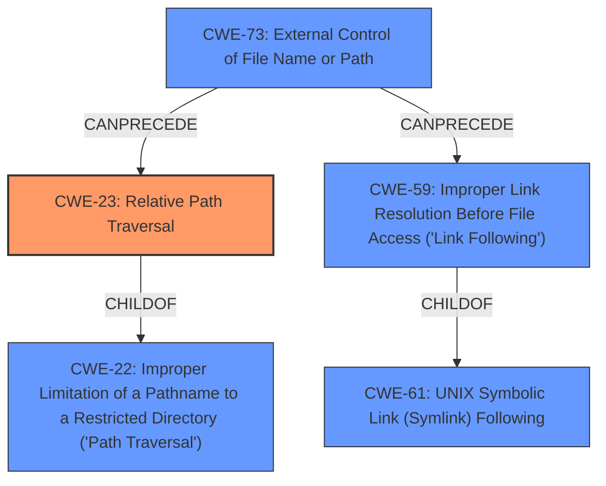

# Raw Analyzer Response for CVE-2021-23391

# Summary
| CWE ID | CWE Name | Confidence | CWE Abstraction Level | CWE Vulnerability Mapping Label | CWE-Vulnerability Mapping Notes |
|---|---|---|---|---|---|
| CWE-23 | Relative Path Traversal | 1.0 | Base | Allowed | Primary CWE |
| CWE-73 | External Control of File Name or Path | 0.7 | Base | Allowed | Secondary Candidate |
| CWE-22 | Improper Limitation of a Pathname to a Restricted Directory ('Path Traversal') | 0.6 | Base | Allowed | Secondary Candidate |
| CWE-59 | Improper Link Resolution Before File Access ('Link Following') | 0.5 | Base | Allowed | Secondary Candidate |

## Evidence and Confidence

*   **Confidence Score:** 0.9
*   **Evidence Strength:** HIGH

## Relationship Analysis
The primary CWE, CWE-23, is a child of CWE-22, indicating a more specific type of path traversal. CWE-73 can precede CWE-59 and CWE-23, suggesting that external control of a filename or path may lead to path traversal or link following vulnerabilities. CWE-59 is also related to CWE-61 (UNIX Symbolic Link Following) as a parent. The abstraction levels influenced the selection, as Base CWEs are preferred when they accurately represent the weakness.

## Vulnerability Chain
The vulnerability chain starts with **external control of the file name or path** (CWE-73), which leads to **improper limitation of a pathname to a restricted directory** (CWE-22). Specifically, it allows for **relative path traversal** (CWE-23), enabling an attacker to **overwrite files** on the system. In some cases, **improper link resolution** (CWE-59) may be involved if symbolic links are present and mishandled.

## Summary of Analysis
Based on the provided evidence, the vulnerability in the `calipso` package is primarily a **relative path traversal** issue (CWE-23). The "CVE Reference Links Content Summary" clearly states: "The `calipso` application **does not properly validate filenames** within a downloaded archive (specifically ZIP files). When extracting the archive, it's possible to use **relative path names** (e.g., `../../../../../../tmp/foo.txt`) to write files outside the intended module directory." This directly aligns with the description of CWE-23: "The product uses external input to construct a pathname that should be within a restricted directory, but it **does not properly neutralize sequences such as ".."** that can resolve to a location that is outside of that directory."

The retriever results also support this, listing CWE-23 and CWE-22 as top candidates. CWE-22 is a parent of CWE-23.

CWE-73 (External Control of File Name or Path) is a reasonable secondary candidate because the **filenames within the archive are externally controlled** by the attacker. The "CVE Reference Links Content Summary" mentions, "An attacker crafts a malicious module in a ZIP archive, which contains files with path traversal sequences in their names." This indicates external control over the file names.

CWE-59 (Improper Link Resolution Before File Access ('Link Following')) is a less likely but potentially relevant weakness. The vulnerability involves writing files to arbitrary locations, and if the system were to contain symbolic links, then the symbolic links can be used to overwrite the files.

I am selecting CWE-23 because it's the most specific weakness described in the vulnerability report, and it clearly outlines the root cause of the vulnerability.

Relevant CWE Information:

# Enhanced Context (25 CWEs)
The following CWEs were identified as potentially relevant to this vulnerability:

## CWE-23: Relative Path Traversal
**Abstraction Level**: Base
**Similarity Score**: 0.75
**Source**: dense

**Description**:
The product uses external input to construct a pathname that should be within a restricted directory, but it does not properly neutralize sequences such as ".." that can resolve to a location that is outside of that directory.

**Mapping Guidance**:
- Usage: Allowed
- Rationale: This CWE entry is at the Base level of abstraction, which is a preferred level of abstraction for mapping to the root causes of vulnerabilities.

## CWE-22: Improper Limitation of a Pathname to a Restricted Directory ('Path Traversal')
**Abstraction Level**: Base
**Similarity Score**: 7902.21
**Source**: sparse

**Description**:
The product uses external input to construct a pathname that is intended to identify a file or directory that is located underneath a restricted parent directory, but the product does not properly neutralize special elements within the pathname that can cause the pathname to resolve to a location that is outside of the restricted directory.

**Mapping Guidance**:
- Usage: Allowed
- Rationale: This CWE entry is at the Base level of abstraction, which is a preferred level of abstraction for mapping to the root causes of vulnerabilities.

## CWE-73: External Control of File Name or Path
**Abstraction Level**: Base
**Similarity Score**: 0.74
**Source**: dense

**Description**:
The product allows user input to control or influence paths or file names that are used in filesystem operations.

**Mapping Guidance**:
- Usage: Allowed
- Rationale: This CWE entry is at the Base level of abstraction, which is a preferred level of abstraction for mapping to the root causes of vulnerabilities.

## CWE-59: Improper Link Resolution Before File Access ('Link Following')
**Abstraction Level**: Base
**Similarity Score**: 0.77
**Source**: dense

**Description**:
The product attempts to access a file based on the filename, but it does not properly prevent that filename from identifying a link or shortcut that resolves to an unintended resource.

**Mapping Guidance**:
- Usage: Allowed
- Rationale: This CWE entry is at the Base level of abstraction, which is a preferred level of abstraction for mapping to the root causes of vulnerabilities.

### Other CWEs Considered but Not Used:

*   **CWE-61: UNIX Symbolic Link (Symlink) Following:** While symlink following could potentially be involved, the core issue is the path traversal, not necessarily the presence and exploitation of symlinks.
*   **CWE-427: Uncontrolled Search Path Element:** This CWE is not applicable because the vulnerability is not related to the search path used to find resources.
*   **CWE-277: Insecure Inherited Permissions:** This CWE is not applicable because the issue is not related to how permissions are inherited.
*   **CWE-94: Improper Control of Generation of Code ('Code Injection'):** This CWE is not applicable, as the vulnerability does not involve the generation of code.
*   **CWE-93: Improper Neutralization of CRLF Sequences ('CRLF Injection'):** CRLF injection is not relevant to this vulnerability.